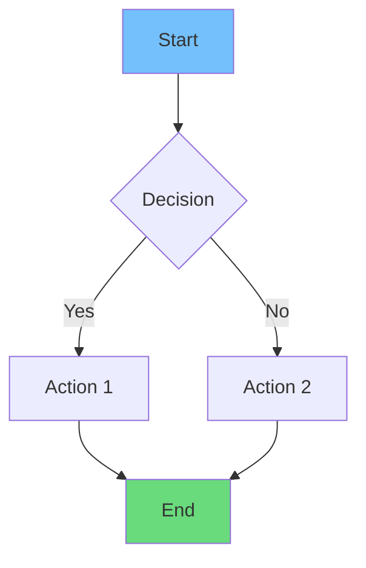
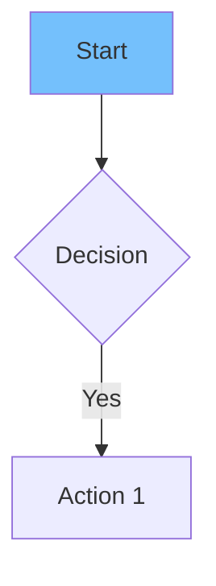
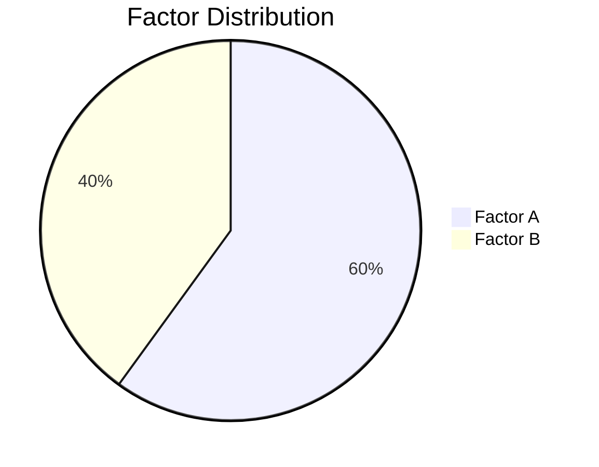

A comprehensive guide for writing MDX blog posts in this Next.js project, including frontmatter schema, available renderers (Mermaid diagrams, KaTeX math, tables), and content patterns.

## Creating a New Blog Post

1. Create a new `.mdx` file in `content/blog/`
2. Use kebab-case naming: `my-new-post.mdx`
3. Include required frontmatter
4. Write content using Markdown + MDX features
5. Test diagrams and math in dev server before finalizing

## Blog Post Frontmatter

```yaml
---
title: "Your Blog Post Title"
excerpt: "Brief description (1-2 sentences)"
coverImage: "/agency.PNG"  # Path to hero image
category: "Development"  # or "Design", "Strategy", etc.
date: "2024-12-12"
readTime: "8 min read"
author:
  name: "Author Name"
  role: "Author Role"
  avatar: "/agency.PNG"
---
```

## Content Structure

```mdx
# Main Title (H1)

Introduction paragraph (2-3 sentences hooking the reader)

## Section Heading (H2)

Content paragraphs...

### Subsection (H3)

More detailed content...
```

## Available Visual Elements

### 1. Mermaid Diagrams

Use for: flowcharts, sequence diagrams, pie charts, state diagrams, Gantt charts



**Syntax:**
```markdown

```

**Available Colors:**
- `#74c0fc` - Light Blue
- `#69db7c` - Green  
- `#ff8787` - Red/Pink
- `#ffd43b` - Yellow
- `#ffa94d` - Orange
- `#e599f7` - Purple

### 2. KaTeX Mathematical Equations

Use for: formulas, calculations, technical metrics

```math
E = mc^2
```

**Syntax:**
```markdown
```math
E = mc^2
```
```

**Common Patterns:**
- Fractions: `\frac{a}{b}`
- Summations: `\sum_{i=1}^{n}`
- Greek letters: `\alpha`, `\beta`, `\gamma`
- Matrices: `\begin{pmatrix} a & b \\ c & d \end{pmatrix}`
- Text in math: `\text{label}`

### 3. Data Tables

Use for: comparisons, matrices, decision tables

```markdown
| Column 1 | Column 2 | Column 3 |
|----------|----------|----------|
| Data A   | Data B   | Data C   |
| Data D   | Data E   | Data F   |
```

**Alignment:**
- Left: `|:---|`
- Center: `:---:`
- Right: `---:|`

## Combining Elements

Best practice: Mix visual elements to tell a complete story

Example structure:
```markdown
## Performance Analysis

**Core Formula:**

```math
Formula = \frac{Numerator}{Denominator}
```

**Impact Breakdown:**

| Factor | Impact | Priority |
|--------|--------|----------|
| A      | High   | P0       |
| B      | Medium | P1       |

**Distribution:**


```

## File Location

```
content/blog/
├── blog1.mdx
├── my-new-post.mdx        <-- Your new post
├── web-performance-guide.mdx
└── ...
```

## Troubleshooting

- **Mermaid not rendering?** Check syntax at mermaid.live, ensure no extra spaces in ` ```mermaid ` tag, restart dev server
- **Math not displaying?** Use ` ```math ` not `$$`, validate KaTeX syntax
- **Tables malformed?** Ensure header separator exists, all rows have same column count

## Quick Reference

| Element | Syntax | File |
|---------|--------|------|
| Flowchart | ` ```mermaid flowchart TD ` | MermaidDiagram.jsx |
| Pie Chart | ` ```mermaid pie ` | MermaidDiagram.jsx |
| Math Block | ` ```math ` | MathRenderer.jsx |
| Table | `\| col \| col \|` | Native MDX |
| Sequence | ` ```mermaid sequenceDiagram ` | MermaidDiagram.jsx |
| State Diagram | ` ```mermaid stateDiagram-v2 ` | MermaidDiagram.jsx |
| Gantt | ` ```mermaid gantt ` | MermaidDiagram.jsx |

## Dependencies

- Mermaid diagrams: `mermaid` library
- Math rendering: `katex` library
- Styling: Tailwind CSS classes apply to rendered output
