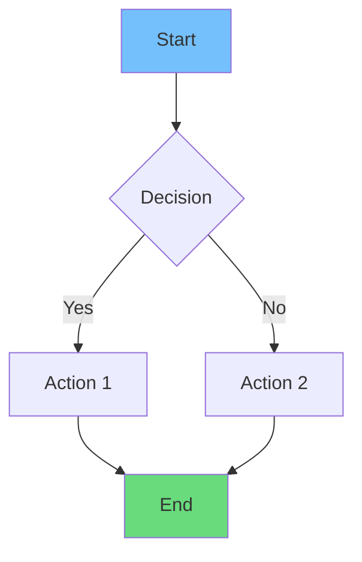
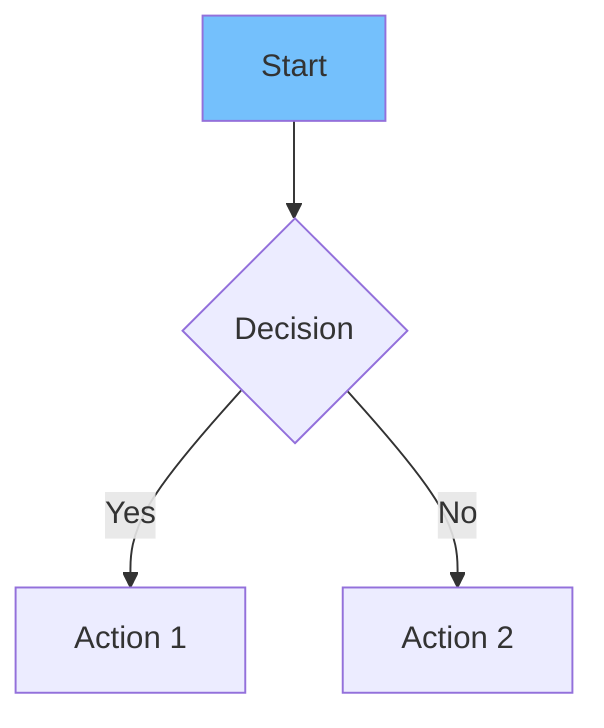
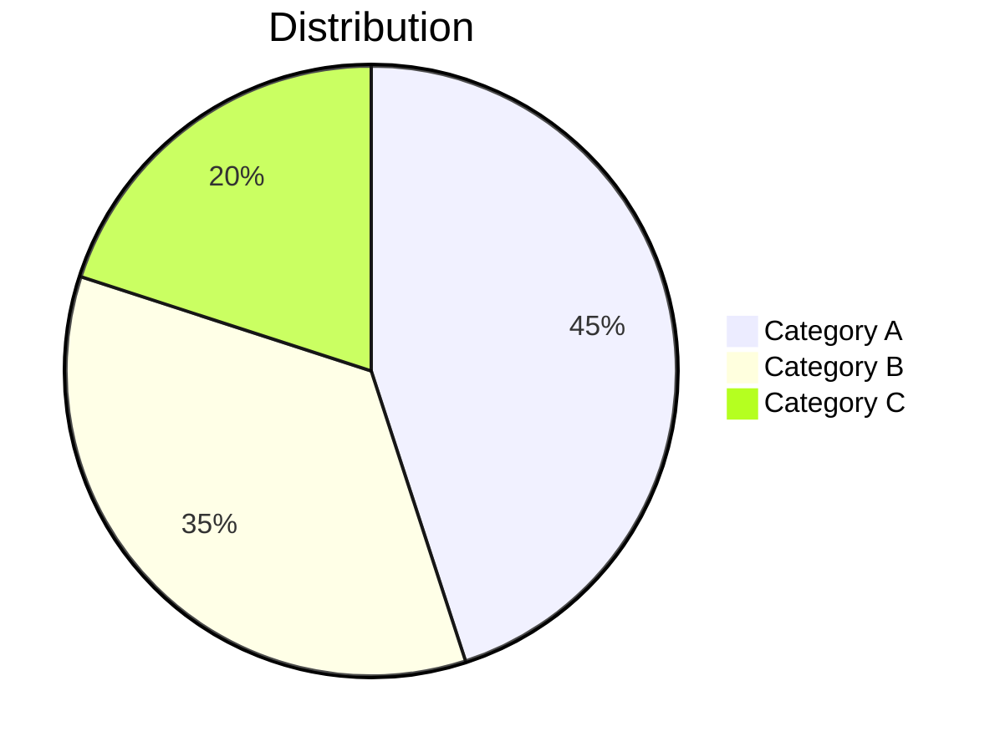
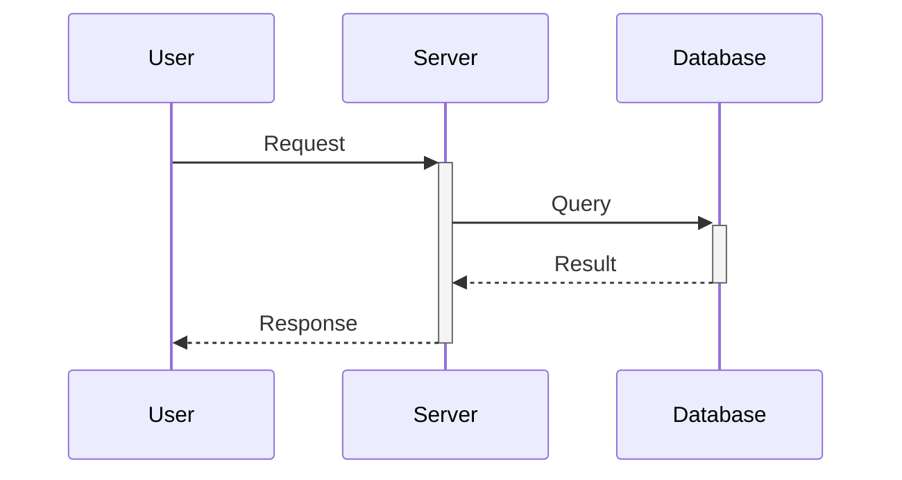
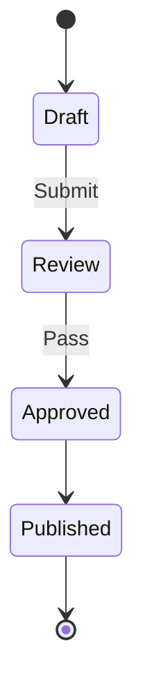
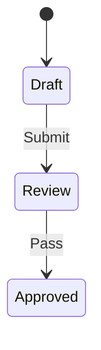
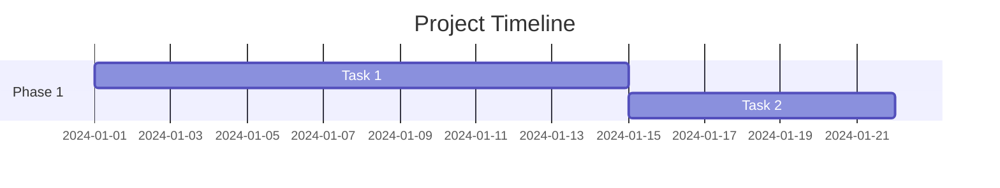
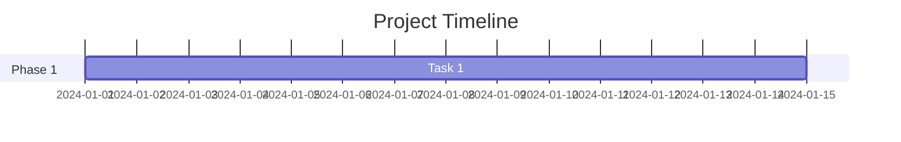
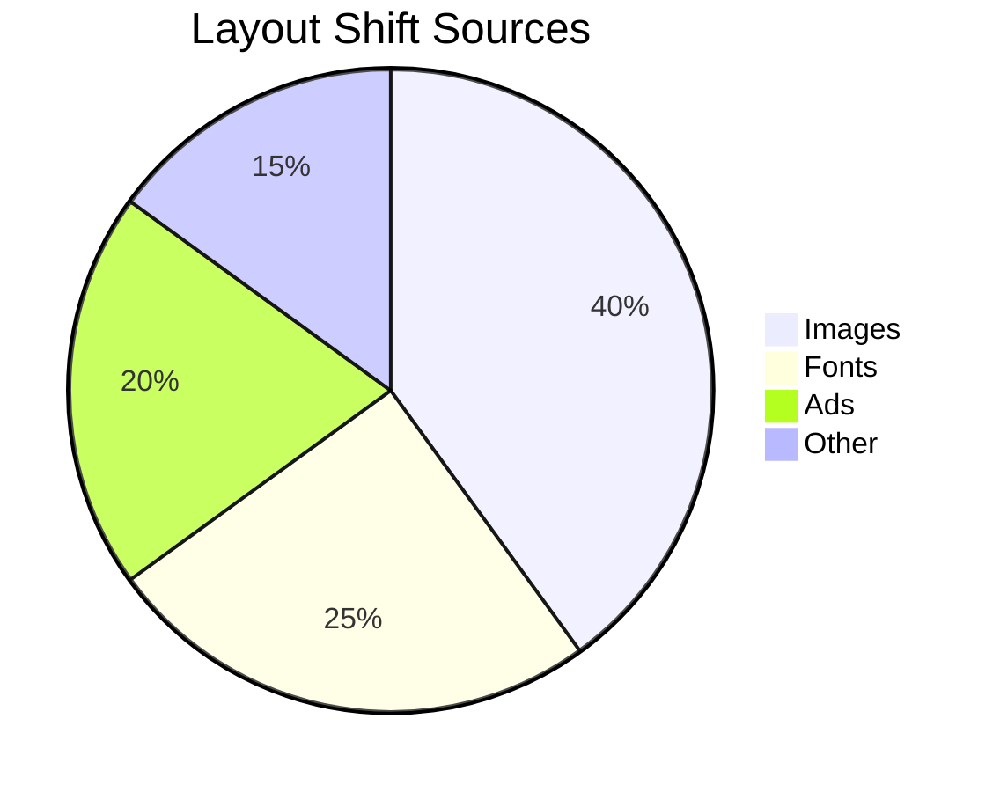

# Advanced MDX Blog Content Guide

This guide shows how to add various advanced visual elements to blog posts in this Next.js + MDX project.

## Available Renderers

The blog supports these advanced content types:

1. **Mermaid Diagrams** - Flowcharts, sequence diagrams, pie charts, state diagrams
2. **KaTeX Math** - Mathematical equations and formulas
3. **Tables/Matrices** - Data tables with styled headers

---

## 1. Mermaid Diagrams

Use Mermaid syntax inside ` ```mermaid ` code blocks.

### Flowchart



**Syntax:**
```markdown

```

### Pie Chart



**Syntax:**
```markdown

```

### Sequence Diagram



**Syntax:**
```markdown

```

### State Diagram



**Syntax:**
```markdown

```

### Gantt Chart



**Syntax:**
```markdown

```

---

## 2. Mathematical Equations (KaTeX)

Use ` ```math ` code blocks for equations.

### Block Equations

```math
E = mc^2
```

**Syntax:**
```markdown
```math
E = mc^2
```
```

### Fractions

```math
\frac{a}{b} + \frac{c}{d} = \frac{ad + bc}{bd}
```

**Syntax:**
```markdown
```math
\frac{a}{b} + \frac{c}{d} = \frac{ad + bc}{bd}
```
```

### Summations

```math
\sum_{i=1}^{n} x_i = x_1 + x_2 + ... + x_n
```

**Syntax:**
```markdown
```math
\sum_{i=1}^{n} x_i = x_1 + x_2 + ... + x_n
```
```

### Greek Letters & Symbols

```math
\alpha + \beta = \gamma \quad \text{and} \quad \pi \approx 3.14159
```

**Syntax:**
```markdown
```math
\alpha + \beta = \gamma \quad \text{and} \quad \pi \approx 3.14159
```
```

### Matrices

```math
\begin{pmatrix} a & b \\ c & d \end{pmatrix}
```

**Syntax:**
```markdown
```math
\begin{pmatrix} a & b \\ c & d \end{pmatrix}
```
```

### Performance Formula Example

```math
Throughput = \frac{N \times Efficiency}{Latency}
```

**Syntax:**
```markdown
```math
Throughput = \frac{N \times Efficiency}{Latency}
```
```

---

## 3. Data Tables / Matrices

Use standard markdown table syntax with `|` delimiters.

### Simple Table

| Column 1 | Column 2 | Column 3 |
|----------|----------|----------|
| Data A   | Data B   | Data C   |
| Data D   | Data E   | Data F   |

**Syntax:**
```markdown
| Column 1 | Column 2 | Column 3 |
|----------|----------|----------|
| Data A   | Data B   | Data C   |
| Data D   | Data E   | Data F   |
```

### Decision Matrix

| Option | Cost | Speed | Quality | Verdict |
|--------|------|-------|---------|---------|
| A      | Low  | Fast  | Good    | ✅ Use  |
| B      | High | Slow  | Best    | ⏳ Later|
| C      | Med  | Med   | Okay    | ❌ Skip |

**Syntax:**
```markdown
| Option | Cost | Speed | Quality | Verdict |
|--------|------|-------|---------|---------|
| A      | Low  | Fast  | Good    | ✅ Use  |
```

### Component Comparison Matrix

| Component | Reuse | Complexity | Status |
|-----------|-------|------------|--------|
| Button    | High  | Low        | ✅ Ready |
| Modal     | High  | High       | 🔄 WIP  |
| Chart     | Low   | Very High  | ⏳ Planned |

---

## 4. Combining Elements

### Example: Performance Analysis Section

```markdown
## Performance Metrics

**Core Formula:**

```math
CLS = \sum (Impact\ Fraction \times Distance\ Fraction)
```

**Impact Sources:**

| Source | Frequency | Severity |
|--------|-----------|----------|
| Images | 40%       | High     |
| Fonts  | 25%       | Medium   |
| Ads    | 20%       | High     |

**Distribution:**


```

---

## 5. Tips & Best Practices

### Colors in Mermaid

Available fill colors for nodes:
- `fill:#74c0fc` - Light Blue
- `fill:#69db7c` - Green  
- `fill:#ff8787` - Red/Pink
- `fill:#ffd43b` - Yellow
- `fill:#ffa94d` - Orange
- `fill:#e599f7` - Purple

### Math Escaping

- Use `\\` for line breaks in matrices
- Use `\text{}` for text inside math
- Use `\quad` or `\qquad` for spacing

### Table Alignment

- Default: Left aligned
- Use `:---:` for center alignment in header separator
- Use `---:` for right alignment

Example:
```markdown
| Left | Center | Right |
|:-----|:------:|------:|
| A    | B      | C     |
```

---

## 6. Project File Structure

```
project/
├── content/blog/           # MDX blog posts
│   ├── blog1.mdx
│   ├── web-performance-guide.mdx
│   ├── ui-ux-mastery.mdx
│   └── fullstack-development-2024.mdx
├── src/
│   ├── components/
│   │   ├── MermaidDiagram.jsx   # Mermaid renderer
│   │   └── MathRenderer.jsx     # KaTeX renderer
│   └── app/blog/[slug]/
│       └── page.jsx              # MDX components config
```

---

## 7. Troubleshooting

**Mermaid diagram not rendering?**
- Check syntax at [Mermaid Live Editor](https://mermaid.live)
- Ensure no extra spaces in ` ```mermaid ` tag
- Restart dev server after adding new diagrams

**Math not displaying?**
- Use ` ```math ` not `$$` for block math
- Check KaTeX syntax is valid
- Ensure no special characters without escaping

**Tables look wrong?**
- Make sure header separator `|---|---|` exists
- Check all rows have same number of columns
- Use `\|` to escape pipe characters in content

---

## Quick Reference

| Element | Syntax | Renderer |
|---------|--------|----------|
| Flowchart | ` ```mermaid flowchart TD ` | MermaidDiagram.jsx |
| Pie Chart | ` ```mermaid pie ` | MermaidDiagram.jsx |
| Math Block | ` ```math ` | MathRenderer.jsx |
| Table | `\| col \| col \|` | Native MDX table |
| Sequence | ` ```mermaid sequenceDiagram ` | MermaidDiagram.jsx |
| State Diagram | ` ```mermaid stateDiagram-v2 ` | MermaidDiagram.jsx |
| Gantt | ` ```mermaid gantt ` | MermaidDiagram.jsx |
