# API Architecture: Designing for Scale and Longevity

APIs are the connective tissue of modern software systems, enabling communication between services, applications, and ecosystems. This comprehensive guide explores the architectural patterns, design principles, and governance practices required to build APIs that scale gracefully and evolve sustainably over time.

## API Paradigm Selection

### Protocol Comparison Matrix

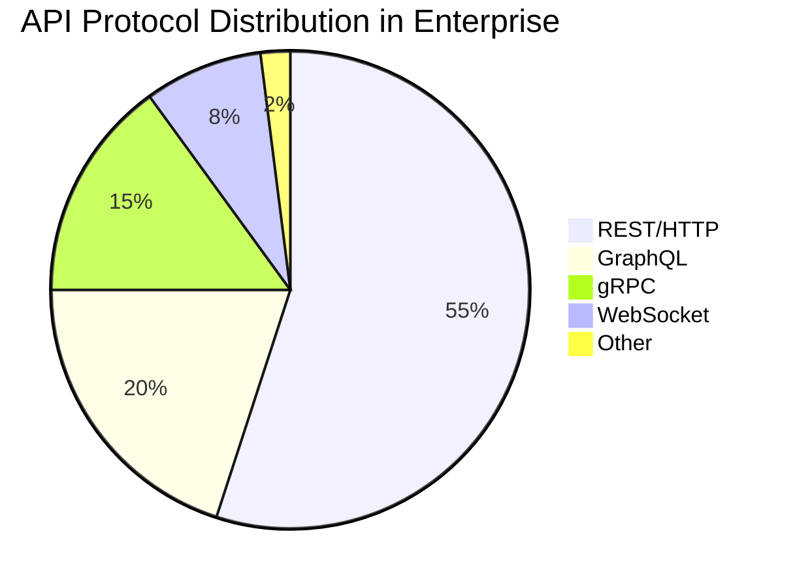

### Protocol Selection Decision Tree

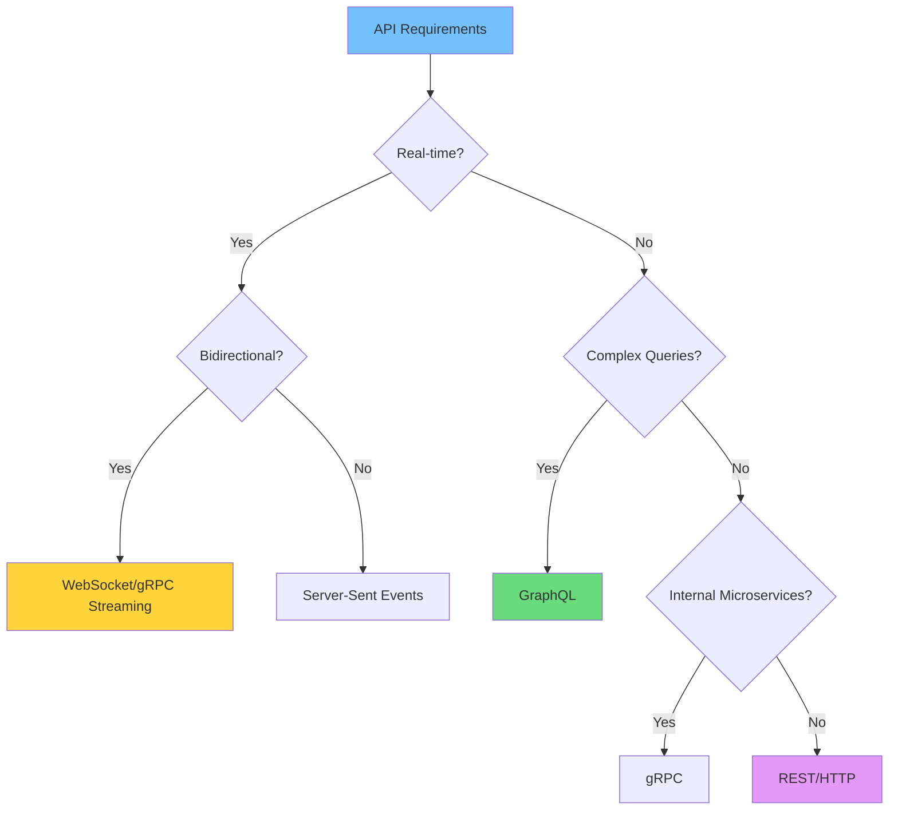

### Protocol Characteristics

| Aspect | REST | GraphQL | gRPC | WebSocket |
|--------|------|---------|------|-----------|
| **Format** | JSON/XML | JSON | Protobuf | Binary/Text |
| **Latency P99** | `&lt; 500ms` | 1% violations | Request timing |
| **Caching** | HTTP native | Custom | Limited | None |
| **Browser** | Native | Native | Via proxy | Native |
| **Streaming** | SSE only | Subscriptions | Bidirectional | Bidirectional |
| **Tooling** | Excellent | Good | Good | Basic |

## REST API Design

### Resource-Oriented Architecture

```mermaid
flowchart TB
    subgraph "API Gateway"
        A[Kong/AWS API GW]
    end
    
    subgraph "Core Resources"
        B1[/users]
        B2[/orders]
        B3[/products]
        B4[/inventory]
    end
    
    subgraph "Sub-resources"
        C1[/users/{id}/orders]
        C2[/orders/{id}/items]
        C3[/products/{id}/reviews]
    end
    
    subgraph "Actions"
        D1[POST /orders/{id}/cancel]
        D2[POST /users/{id}/activate]
    end
    
    A --> B1
    A --> B2
    A --> B3
    A --> B4
    B1 --> C1
    B2 --> C2
    B3 --> C3
    B2 --> D1
    B1 --> D2
    
    style A fill:#74c0fc
    style B2 fill:#69db7c
    style C1 fill:#ffd43b
```

### URL Design Patterns

```math
Hierarchy\ Depth = \frac{\sum Resource\ Nesting}{Total\ Endpoints}
```

**Resource Naming Conventions:**

| Pattern | Example | Use Case |
|---------|---------|----------|
| **Plural nouns** | `/users` | Collections |
| **ID path param** | `/users/{id}` | Individual resources |
| **Sub-resource** | `/users/{id}/orders` | Relationships |
| **Query filter** | `/users?status=active` | Filtering |
| **Action verb** | `/orders/{id}/cancel` | Non-CRUD operations |

### HTTP Method Semantics

| Method | Idempotent | Safe | Body | Typical Use |
|--------|------------|------|------|-------------|
| **GET** | Yes | Yes | No | Retrieve resource |
| **POST** | No | No | Yes | Create resource |
| **PUT** | Yes | No | Yes | Replace resource |
| **PATCH** | No | No | Yes | Partial update |
| **DELETE** | Yes | No | No | Remove resource |
| **HEAD** | Yes | Yes | No | Metadata only |

## GraphQL Schema Design

### Schema Architecture

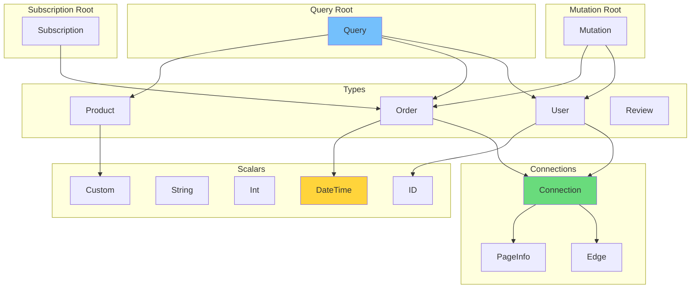

### Pagination Strategy

| Strategy | Pros | Cons | Best For |
|----------|------|------|----------|
| **Offset** | Simple | Inconsistent with updates | Small datasets |
| **Cursor** | Consistent | Complex | Real-time feeds |
| **Connection** | Standard | Verbose | Complex UIs |

**Cursor Pagination Query:**
```graphql
query GetUsers($first: Int, $after: String) {
  users(first: $first, after: $after) {
    edges {
      node {
        id
        name
        email
      }
      cursor
    }
    pageInfo {
      hasNextPage
      endCursor
    }
  }
}
```

## API Versioning Strategies

### Version Lifecycle Management

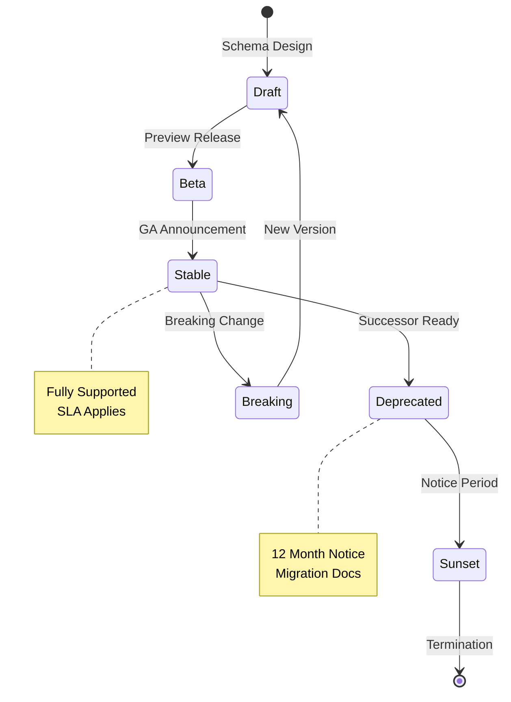

### Versioning Approach Comparison

| Approach | URL Example | Header Example | When to Use |
|----------|-------------|----------------|-------------|
| **URL Path** | `/v1/users` | - | Public APIs, simplicity |
| **Header** | `/users` | `Accept-Version: v1` | Internal APIs, caching |
| **Content Negotiation** | `/users` | `Accept: app/vnd.v1+json` | Hypermedia APIs |
| **Query Param** | `/users?version=v1` | - | Legacy compatibility |

### Breaking Change Detection

```math
Breaking\ Change\ Score = \sum (Removed\ Fields \times 2) + \sum (Type\ Changes \times 3) + \sum (Constraint\ Changes \times 1)
```

**Change Classification Matrix:**

| Change Type | Non-Breaking | Breaking | Version Impact |
|-------------|--------------|----------|----------------|
| **Add field** | Yes | No | Patch |
| **Remove field** | No | Yes | Major |
| **Change type** | No | Yes | Major |
| **Add enum value** | Yes | No | Minor |
| **Remove enum value** | No | Yes | Major |
| **Add required** | No | Yes | Major |
| **Make optional** | Yes | No | Minor |

## API Gateway Architecture

### Gateway Pattern Implementation

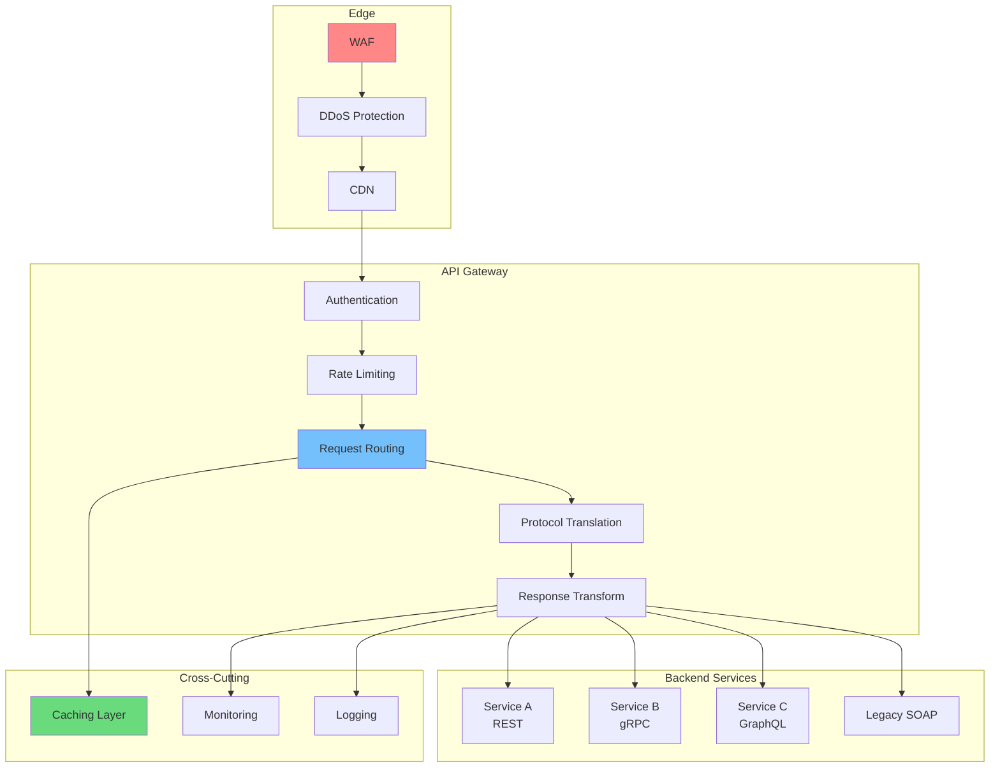

### Rate Limiting Strategies

| Algorithm | Burst Handling | Fairness | Implementation |
|-----------|----------------|----------|----------------|
| **Token Bucket** | Excellent | Good | In-memory |
| **Leaky Bucket** | Poor | Excellent | Queue-based |
| **Fixed Window** | Poor | Poor | Simple counter |
| **Sliding Window** | Good | Good | Redis recommended |

**Rate Limit Configuration:**

| Tier | Requests/Minute | Burst | Quota/Day |
|------|-----------------|-------|-----------|
| **Free** | 60 | 10 | 1,000 |
| **Basic** | 600 | 100 | 10,000 |
| **Pro** | 6,000 | 1,000 | 100,000 |
| **Enterprise** | 60,000 | 10,000 | Unlimited |

## API Security

### Security Layer Architecture

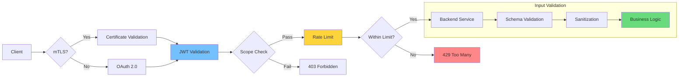

### Authentication Mechanisms

| Mechanism | Use Case | Security Level | Complexity |
|-----------|----------|----------------|------------|
| **API Key** | Internal services | Low | Low |
| **JWT** | Stateless auth | Medium | Low |
| **OAuth 2.0** | Third-party | High | Medium |
| **mTLS** | Service-to-service | Very High | High |
| **HMAC** | Signed requests | High | Medium |

### OAuth 2.0 Grant Type Selection

| Grant Type | Use Case | Refresh Token | PKCE Required |
|------------|----------|---------------|---------------|
| **Authorization Code** | Web apps | Yes | Yes (public) |
| **Client Credentials** | Service-to-service | No | N/A |
| **Device Code** | IoT/limited input | Yes | N/A |
| **Implicit** | Legacy SPAs | No | N/A |
| **Password** | Legacy only | Yes | N/A |

## API Performance Optimization

### Caching Strategy Hierarchy

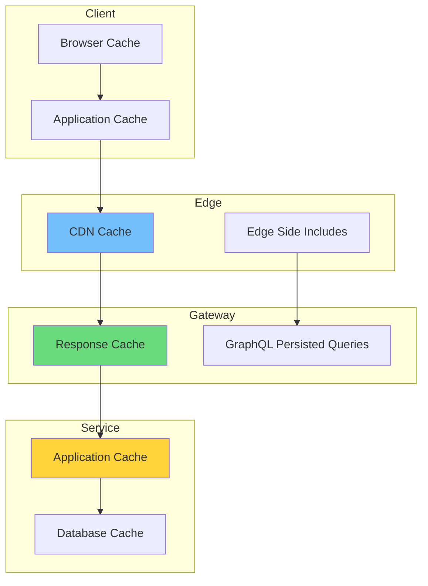

### Cache Control Directives

| Directive | Public APIs | Internal APIs | Private Data |
|-----------|-------------|---------------|--------------|
| **max-age** | 3600s | 300s | 60s |
| **s-maxage** | 3600s | 300s | 60s |
| **no-store** | Never | Sensitive ops | Always |
| **must-revalidate** | Yes | Yes | Yes |
| **immutable** | Static assets | Versioned APIs | Never |

### Response Time Budgets

```math
Total\ Latency = Network + TLS + Auth + Gateway + Service + Database
```

| Layer | P50 Target | P99 Target | Optimization |
|-------|------------|------------|--------------|
| **Network RTT** | 50ms | 200ms | Edge deployment |
| **TLS Handshake** | 20ms | 50ms | Session resumption |
| **Authentication** | 10ms | 50ms | JWT local validation |
| **Gateway Processing** | 5ms | 20ms | Caching, pooling |
| **Service Logic** | 50ms | 200ms | Async processing |
| **Database Query** | 20ms | 100ms | Indexing, caching |
| **Total Budget** | 155ms | 620ms | - |

## API Documentation & Discovery

### Documentation Generation Pipeline

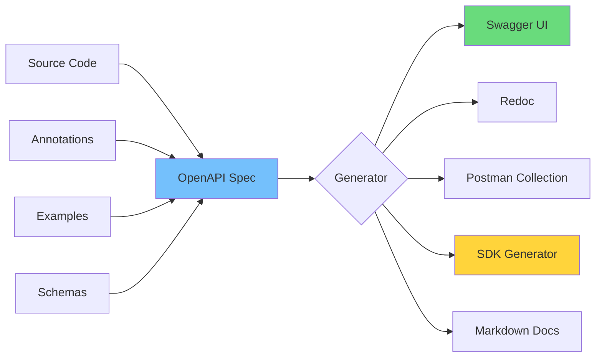

### Documentation Completeness Score

| Element | Weight | Required | Example |
|---------|--------|----------|---------|
| **Endpoint description** | 10% | Yes | Full sentence |
| **Parameter docs** | 15% | Yes | Type, required, constraints |
| **Request/Response examples** | 25% | Yes | Realistic data |
| **Error responses** | 20% | Yes | All status codes |
| **Authentication info** | 15% | Yes | Scopes, flows |
| **Rate limits** | 10% | Yes | Tier details |
| **Changelog** | 5% | Recommended | Version history |

## API Governance

### Design Review Workflow

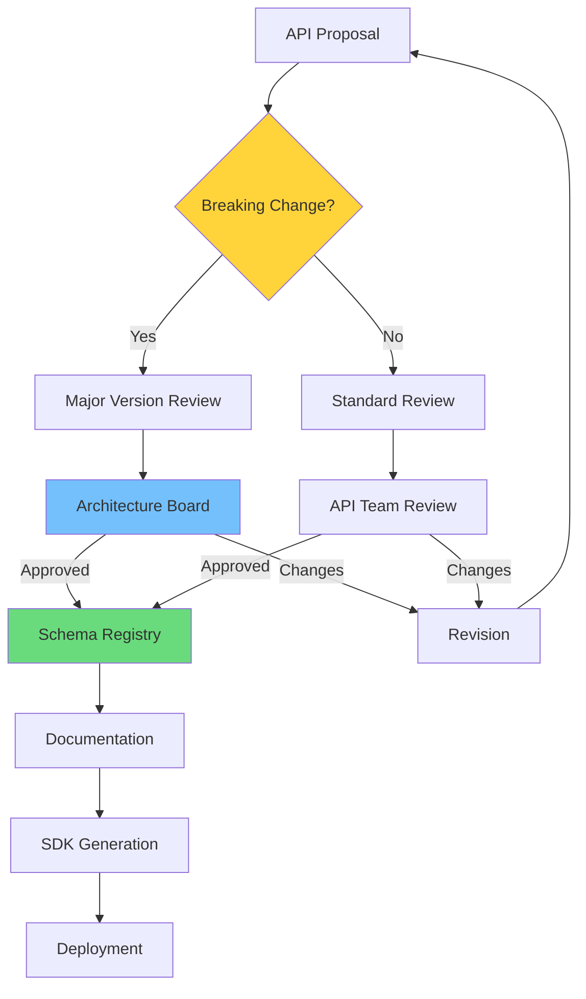

### API Maturity Model

| Level | Name | Characteristics | Investment |
|-------|------|-------------------|------------|
| **0** | Ad-hoc | No standards, inconsistency | Reactive |
| **1** | Defined | Basic guidelines, some tools | Low |
| **2** | Managed | Governance process, registry | Medium |
| **3** | Measured | SLAs, monitoring, optimization | High |
| **4** | Optimized | Auto-scaling, AI-driven | Very High |
| **5** | Predictive | Proactive evolution, ecosystem | Strategic |

## Error Handling & Resilience

### Error Response Standardization

```json
{
  "error": {
    "code": "INSUFFICIENT_FUNDS",
    "message": "Payment could not be processed due to insufficient funds",
    "target": "payment.amount",
    "details": [
      {
        "code": "BALANCE_CHECK_FAILED",
        "message": "Account balance is $50.00, required: $100.00",
        "target": "account.balance"
      }
    ],
    "innererror": {
      "code": "BANK_DECLINED",
      "traceId": "abc123-def456"
    }
  }
}
```

### Circuit Breaker States

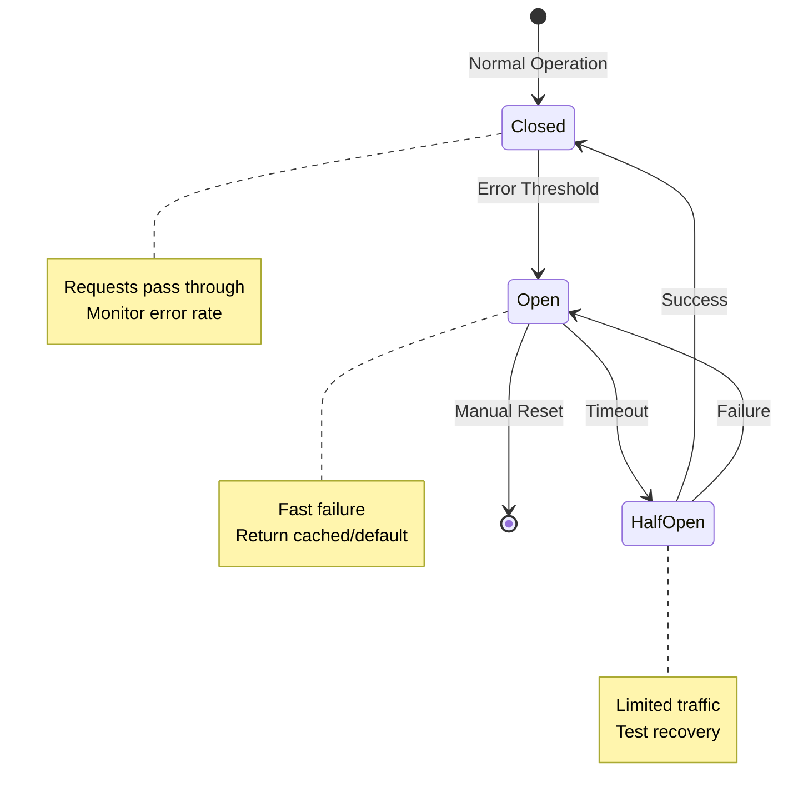

### Retry Strategy Configuration

| Scenario | Max Retries | Backoff | Jitter | Timeout |
|----------|-------------|---------|--------|---------|
| **Idempotent GET** | 3 | Exponential | 100ms | 30s |
| **Idempotent POST** | 3 | Exponential | 100ms | 30s |
| **Non-idempotent** | 0 | N/A | N/A | 30s |
| **Background Job** | 5 | Linear | 500ms | 5m |
| **Real-time** | 1 | Fixed | 0ms | 5s |

## Implementation Roadmap

### API Platform Evolution

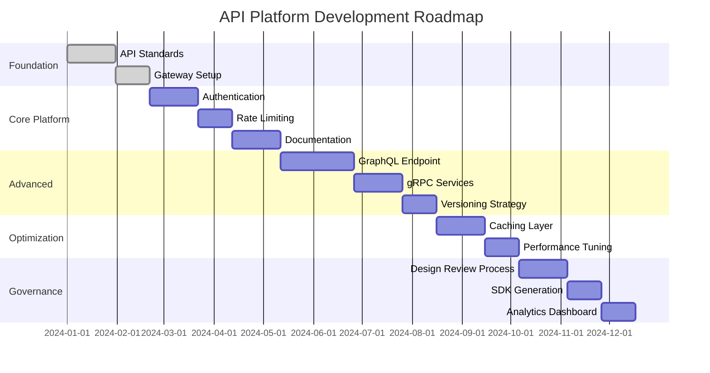

## Conclusion

API architecture is the foundation of modern distributed systems. The choices made in designing APIs—protocol selection, resource modeling, versioning strategy, security mechanisms—have long-lasting implications for system maintainability, scalability, and developer experience.

> "Good APIs are not just technically sound; they are discoverable, consistent, and evolve gracefully with changing requirements."

The key to successful API architecture lies in balancing competing concerns: consistency versus flexibility, performance versus simplicity, security versus usability. By establishing clear governance processes, adopting proven patterns, and investing in tooling, organizations can build API ecosystems that stand the test of time.

As the API landscape continues to evolve with emerging standards and technologies, the fundamentals remain constant: clear contracts, consistent interfaces, comprehensive documentation, and thoughtful evolution strategies. Organizations that master these principles will be well-positioned to build the connected systems that power the digital economy.
