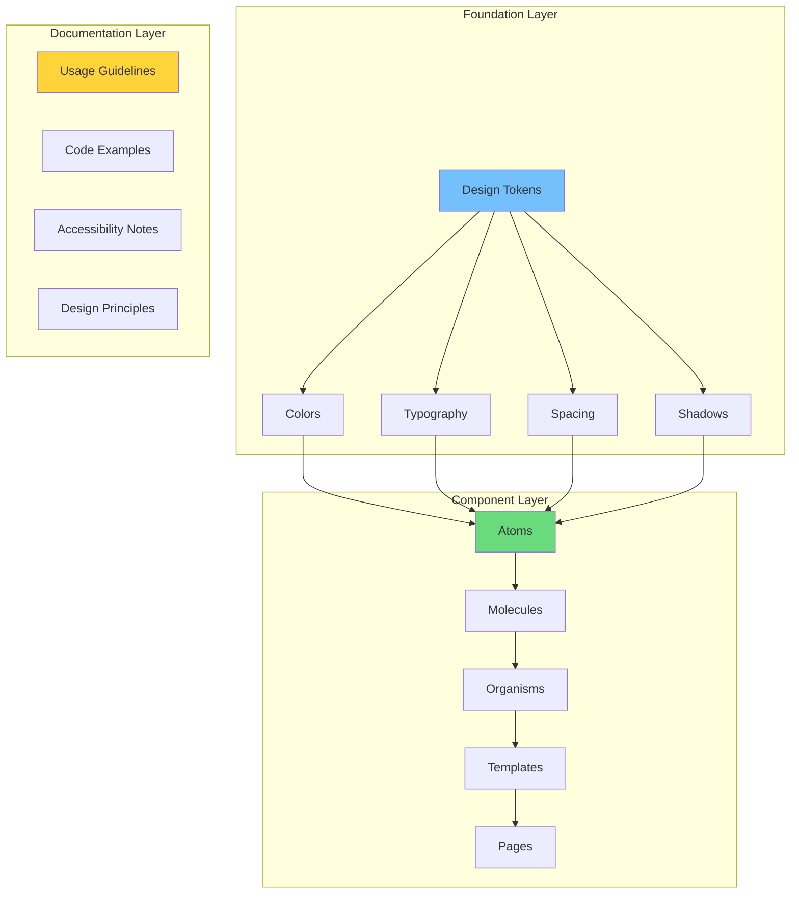
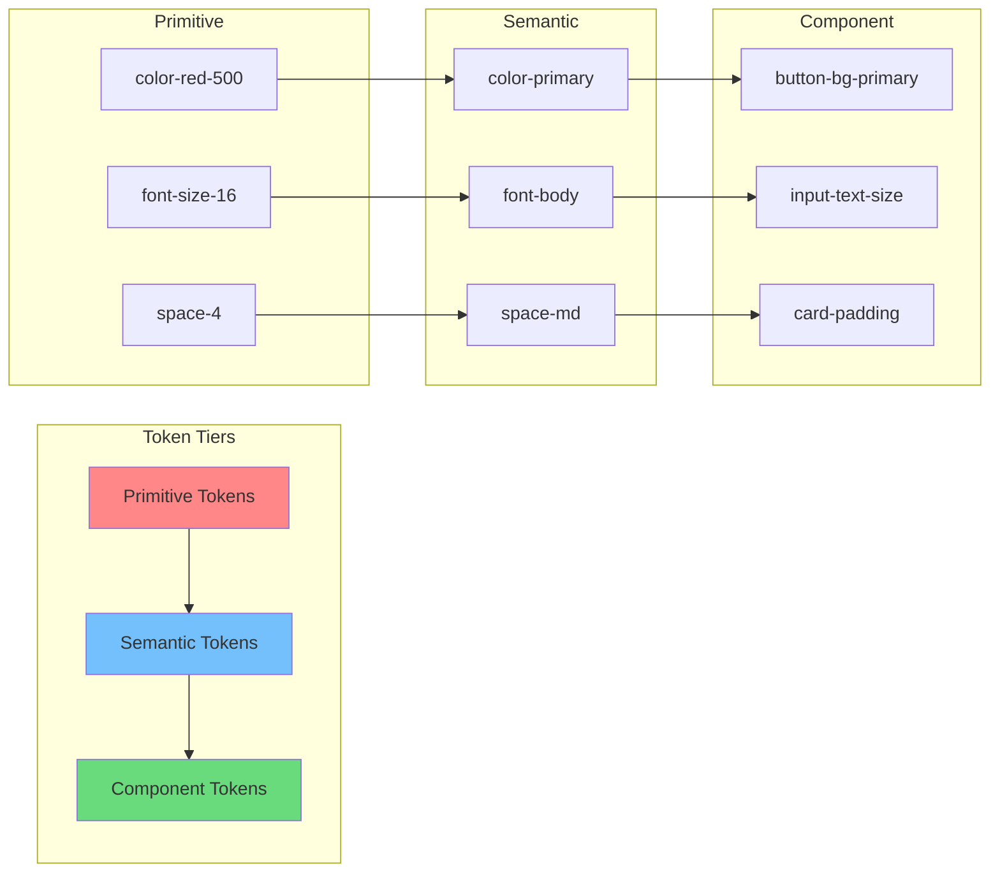
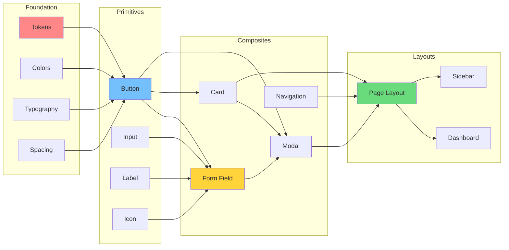
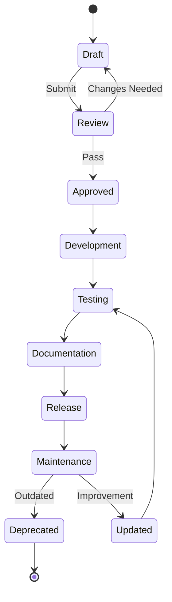
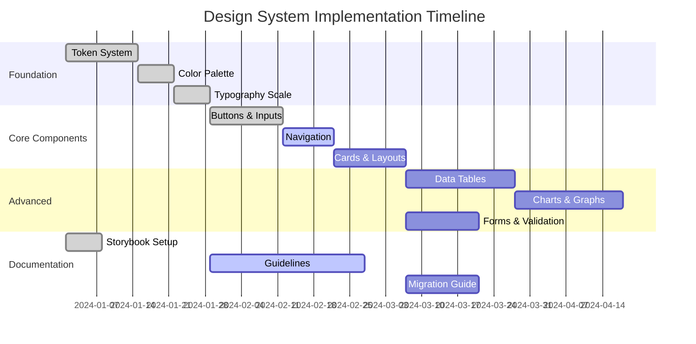
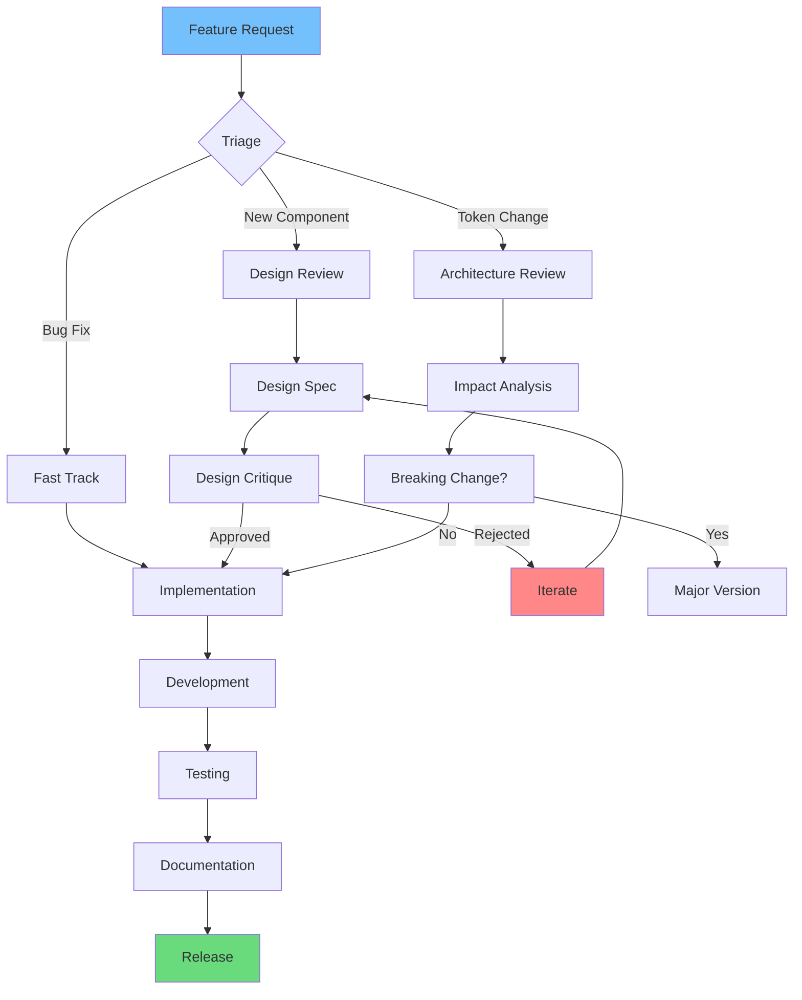

# Building Scalable Design Systems for Enterprise Applications

Design systems are the backbone of modern product development. They provide a single source of truth for your entire organization, ensuring consistency across all touchpoints while enabling teams to move faster. This comprehensive guide explores how to build, implement, and scale design systems in enterprise environments.

## Design System Architecture

### System Component Hierarchy



### Atomic Design Matrix

| Level | Definition | Examples | Team Owner |
|-------|------------|----------|------------|
| **Atoms** | Basic building blocks | Buttons, inputs, labels, icons | Design System |
| **Molecules** | Simple component groups | Search bar, form fields, cards | Product Teams |
| **Organisms** | Complex UI sections | Header, footer, product grid | Product Teams |
| **Templates** | Page layouts | Dashboard, detail page, form | Design System |
| **Pages** | Specific instances | Home page, settings page, profile | Product Teams |

## Why Design Systems Matter

### ROI Calculation Framework

The return on investment for a design system can be calculated using:

```math
ROI = (Time Saved × Hourly Rate) - (System Cost)
```

Where Time Saved includes:
- Reduced design time per feature
- Faster development cycles
- Decreased QA time
- Lower maintenance costs

| Metric | Before DS | After DS | Improvement |
|--------|-----------|----------|-------------|
| Design Time (hours) | 40 | 12 | 70% ↓ |
| Dev Time (hours) | 80 | 24 | 70% ↓ |
| QA Issues | 25 | 5 | 80% ↓ |
| Consistency Score | 45% | 95% | 111% ↑ |

## Core Components of a Design System

### Design Token Architecture



### Component Dependency Graph



### Component Usage Statistics Matrix

| Component | Usage Count | Adoption % | Avg Props | Breaking Changes |
|-----------|-------------|------------|-----------|------------------|
| Button | 1,245 | 98% | 4.2 | 0 |
| Input | 892 | 95% | 6.1 | 1 |
| Card | 756 | 87% | 3.8 | 0 |
| Modal | 423 | 72% | 5.4 | 2 |
| Table | 234 | 45% | 8.9 | 1 |
| Chart | 123 | 23% | 12.3 | 3 |

### Component Complexity Formula

```math
Complexity = (Props × Methods) / (Tests × Documentation)
```

**Target Complexity Scores:**

| Level | Score Range | Action Required |
|-------|-------------|-----------------|
| Simple | 1-5 | None |
| Moderate | 5-15 | Add examples |
| Complex | 15-30 | Add tests |
| Refactor | >30 | Break into smaller components |

### Component Lifecycle Matrix



### Token Value Matrix

| Token Type | Platform A | Platform B | Platform C | Platform D |
|------------|------------|------------|------------|------------|
| `color-primary` | #0066CC (Web) | #0066CC (iOS) | #0066CC (Android) | #0066CC (Desktop) |
| `font-heading` | Inter 700 | SF Pro Bold | Roboto Bold | Segoe UI Bold |
| `space-lg` | 24px | 24pt | 24dp | 24px |
| `radius-md` | 8px | 8pt | 8dp | 8px |

### Component Decision Matrix

| Component | Reuse Priority | Complexity | Dependencies | Status |
|-----------|----------------|------------|----------------|--------|
| **Button** | Critical | Low | None | ✅ Ready |
| **Input** | Critical | Low | None | ✅ Ready |
| **Card** | High | Medium | Button | ✅ Ready |
| **Modal** | High | High | Button, Focus | 🔄 WIP |
| **Data Table** | Medium | High | Input, Button | ⏳ Planned |
| **Charts** | Low | Very High | External Lib | ⏳ Planned |

## Implementation Strategy

### Adoption Roadmap



### Migration Strategy Matrix

| Approach | Speed | Risk | Effort | Best For |
|----------|-------|------|--------|----------|
| **Big Bang** | Fast | High | High | Small products |
| **Incremental** | Slow | Low | Medium | Large legacy apps |
| **Strangler Fig** | Medium | Medium | High | Complex monoliths |
| **Parallel Build** | Fast | Medium | Very High | New initiatives |

## Design System Governance

### Contribution Workflow



### Governance Roles Matrix

| Role | Responsibilities | Skills Required | Time Commitment |
|------|-------------------|-----------------|-----------------|
| **System Owner** | Vision, roadmap, stakeholder mgmt | Leadership, strategy | 20% |
| **Design Lead** | Component design, quality standards | Visual design, systems thinking | 50% |
| **Tech Lead** | Architecture, implementation, tooling | Frontend, CI/CD | 50% |
| **Contributors** | New components, bug fixes | Domain expertise | 10% |
| **Adopters** | Feedback, usage patterns | Product knowledge | 5% |

## Measuring Design System Success

### Key Metrics Dashboard

| Metric | Target | Current | Trend |
|--------|--------|---------|-------|
| **Adoption Rate** | 90% | 65% | Up |
| **Component Usage** | 500/week | 320/week | Up |
| **Design Consistency** | 95% | 78% | Up |
| **Dev Velocity** | +40% | +25% | Up |
| **Bug Reports** | 5/month | 12/month | Down |
| **Documentation Views** | 1000/month | 750/month | Up |

## Advanced Topics

### Multi-Platform Token System

```json
{
  "color": {
    "primary": {
      "value": {
        "web": "#0066CC",
        "ios": "UIColor(red: 0, green: 0.4, blue: 0.8, alpha: 1)",
        "android": "@color/primary_blue",
        "flutter": "Color(0xFF0066CC)"
      }
    }
  },
  "spacing": {
    "md": {
      "value": {
        "web": "16px",
        "ios": "16pt",
        "android": "16dp",
        "flutter": "16.0"
      }
    }
  }
}
```

### Theme Configuration Matrix

| Theme | Primary | Secondary | Background | Text | Use Case |
|-------|---------|-----------|------------|------|----------|
| **Light** | #0066CC | #00CC66 | #FFFFFF | #1A1A1A | Default |
| **Dark** | #4D94FF | #66FF99 | #1A1A1A | #FFFFFF | Night mode |
| **High Contrast** | #0052A3 | #00994D | #FFFFFF | #000000 | Accessibility |
| **Brand** | #FF6B00 | #FFB800 | #FFF5EB | #4A2C00 | Marketing |

## Conclusion

A design system is a living product that requires ongoing maintenance and governance. By following structured architecture, clear governance models, and measurable adoption strategies, you'll create a system that truly scales with your organization.

> "Design systems are not about limiting creativity, but about enabling it at scale."

The investment in a well-architected design system pays dividends through faster delivery, higher quality, and more consistent user experiences across all your products.

Start small, think big, and build incrementally. Your future self (and your team) will thank you.
