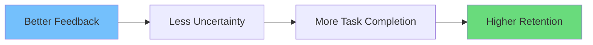

# Boosting User Engagement with Vibe Coding Techniques

Engagement barano মানে শুধু “more features” না। User engaged thake jokhon:

- app easy to use
- actions feel rewarding
- system feels predictable
- user feels in control

In English: engagement is a consequence of trust + clarity + momentum.

Vibe coding helps by building those into UI interactions.

## 1) Remove “dead clicks” with instant feedback

Dead click = user click kore, kichu hoy na.

Fix:

- pressed state
- immediate UI reaction
- disable repeated clicks during loading

## 2) Use progress indicators that reduce anxiety

Progress = confidence.

Use:

- skeletons for page loads
- inline loaders for small actions
- step indicators for multi-step forms

## 3) Design reward loops (without being manipulative)

Reward loop মানে:

- action
- feedback
- sense of progress

Examples:

- saving confirmation
- streak indicator
- completion badge

Keep it honest.

## 4) Make onboarding feel smooth

Onboarding friction kills engagement.

Vibe coding improvements:

- progressive disclosure
- tooltips that don’t block
- empty states with next steps

## 5) Reduce cognitive load with consistent patterns

If every screen behaves differently, user fatigue increases.

Standardize:

- navigation
- button hierarchy
- error messaging
- loading patterns

## 6) Use motion to keep momentum

Motion can maintain context:

- when opening details panel
- when transitioning between steps
- when reordering items

A guideline:

- motion should explain *what changed*

## 7) Personalization that respects users

Personalization can increase engagement:

- remember preferences
- recommend relevant content

But respect privacy.

## Engagement measurement (practical)

Measure:

- activation rate
- time to first value
- retention (D1/D7)
- task completion rate

A simple mapping:

## Quick engagement upgrades (high ROI)

- add empty states with CTA
- add skeletons on slow pages
- add retry on error
- add success confirmation
- reduce layout shift

## Conclusion

Engagement grows when using your product feels smooth and rewarding.

Vibe coding techniques help by:

- improving responsiveness
- clarifying state
- creating consistent patterns
- reducing friction

In English: make progress feel visible, and users keep coming back.
