# Cloud-Native Infrastructure: Scaling Beyond Limits

Cloud-native infrastructure represents a paradigm shift from traditional monolithic deployments to dynamic, scalable, and resilient systems. This comprehensive guide explores the architectural patterns, tooling, and operational practices that enable organizations to build infrastructure that scales seamlessly with demand.

## Cloud Architecture Fundamentals

### Multi-Cloud Strategy Architecture

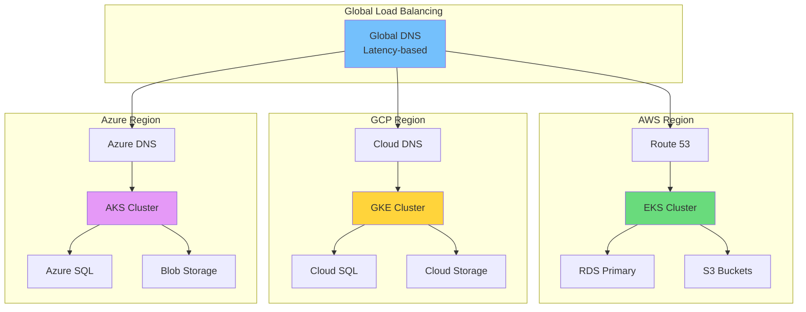

### Cloud Service Selection Matrix

| Service Category | AWS | GCP | Azure | Selection Criteria |
|-----------------|-----|-----|-------|-------------------|
| **Compute** | EC2/Fargate | Compute Engine | VM/Container Apps | Cost, performance |
| **Kubernetes** | EKS | GKE | AKS | Feature parity |
| **Database** | RDS | Cloud SQL | Azure SQL | Migration ease |
| **Storage** | S3 | Cloud Storage | Blob | Pricing tiers |
| **CDN** | CloudFront | Cloud CDN | Front Door | Global presence |

## Kubernetes at Scale

### Cluster Architecture Patterns

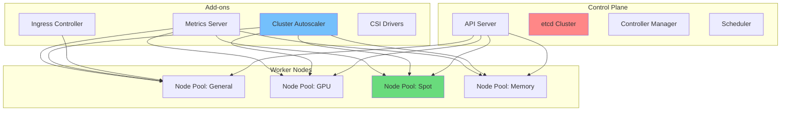

### Resource Allocation Formula

```math
Node\ Capacity = \sum_{i=1}^{n} (Pod_i\ Requests) + Overhead + Buffer
```

**Resource Planning by Workload:**

| Workload Type | CPU Request | Memory Request | Scaling Behavior |
|---------------|-------------|----------------|------------------|
| **Web API** | 500m | 512Mi | Horizontal (RPS) |
| **Background Job** | 1000m | 1Gi | Horizontal (Queue depth) |
| **ML Inference** | 2000m | 4Gi | Horizontal (GPU + CPU) |
| **Database** | 4000m | 16Gi | Vertical (Storage IOPS) |
| **Cache** | 2000m | 8Gi | Vertical (Memory pressure) |

### Pod Disruption Budget Strategy

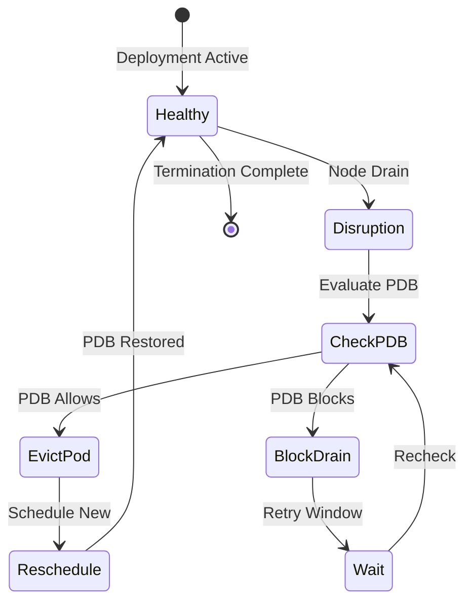

## Infrastructure as Code

### Terraform Module Hierarchy

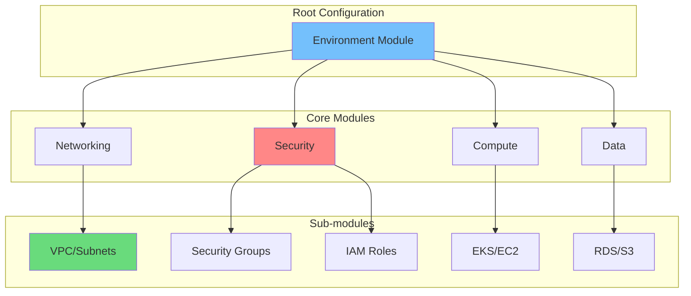

### State Management Strategy

| Environment | State Backend | Locking | Encryption | History |
|-------------|---------------|---------|------------|---------|
| **Development** | Local/S3 | None | SSE-S3 | 7 days |
| **Staging** | S3 | DynamoDB | SSE-KMS | 30 days |
| **Production** | S3 | DynamoDB | SSE-KMS | 90 days |
| **DR** | Cross-region S3 | DynamoDB | SSE-KMS | 90 days |

### Cost Optimization Through IaC

```math
Monthly\ Savings = \sum (OnDemand\ Cost - Reserved\ Cost) \times Utilization\ Rate
```

**Resource Optimization Matrix:**

| Resource | On-Demand | Reserved 1Y | Reserved 3Y | Savings |
|----------|-----------|-------------|-------------|---------|
| **EC2 m5.large** | $70/mo | $44/mo | $28/mo | 40-60% |
| **RDS db.r5.2xl** | $584/mo | $365/mo | $233/mo | 37-60% |
| **EKS Cluster** | $73/mo | $73/mo | $73/mo | 0% |
| **S3 Standard** | $0.023/GB | N/A | N/A | N/A |

## Auto-scaling Strategies

### Horizontal Pod Autoscaler Architecture

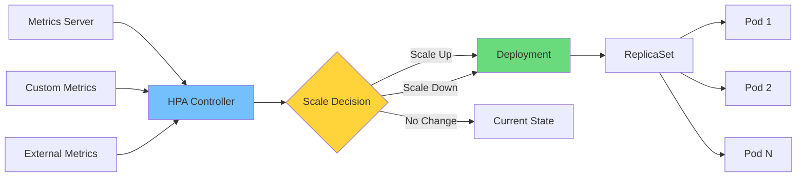

### Scaling Metrics Formulation

```math
Desired\ Replicas = \lceil Current\ Replicas \times \frac{Current\ Metric\ Value}{Target\ Metric\ Value} \rceil
```

**Multi-Metric Scaling Configuration:**

| Metric | Target | Scale Up | Scale Down | Stabilization |
|--------|--------|----------|------------|---------------|
| **CPU %** | 70% | 30s | 5m | 300s |
| **Memory %** | 80% | 60s | 5m | 300s |
| **RPS/Pod** | 1000 | 15s | 5m | 60s |
| **Queue Depth** | 50 | 30s | 2m | 300s |
| **Custom Latency** | P99 < 200ms | 60s | 10m | 300s |

## Service Mesh Implementation

### Istio Traffic Management

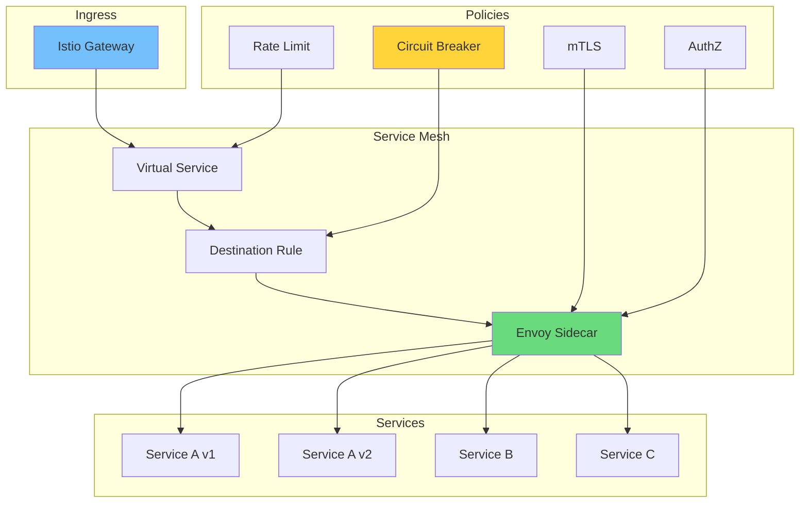

### Circuit Breaker Configuration

| Parameter | Default | Production | Rationale |
|-----------|---------|------------|-----------|
| **Connection Pool Size** | 1024 | 100 | Prevent overload |
| **Max Requests** | 1024 | 32 | Concurrency limit |
| **Consecutive Errors** | 5 | 3 | Fast failure |
| **Interval** | 10s | 30s | Error window |
| **Base Ejection Time** | 30s | 60s | Recovery time |
| **Max Ejection %** | 10% | 50% | Cascade prevention |

## Disaster Recovery & High Availability

### Multi-Region Architecture

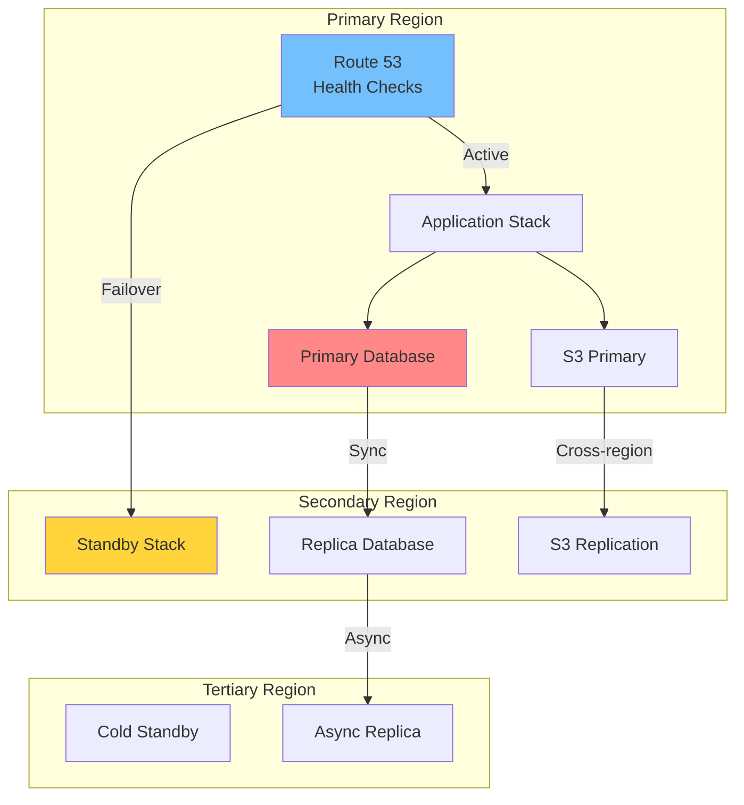

### RTO/RPO Targets by Criticality

| Tier | RTO (Recovery Time) | RPO (Data Loss) | Strategy |
|------|---------------------|-----------------|----------|
| **Tier 1** | `< 5 min` | 0 (zero) | Active-Active |
| **Tier 2** | `< 30 min` | `< 5 min` | Hot Standby |
| **Tier 3** | `< 4 hours` | `< 1 hour` | Warm Standby |
| **Tier 4** | `< 24 hours` | `< 24 hours` | Cold Backup |
| **Tier 5** | `< 1 week` | `< 1 week` | Archive |

### Backup Strategy Formula

```math
Total\ Backup\ Cost = \sum_{i=1}^{n} (Storage_i \times Retention_i \times Frequency_i)
```

## Observability Stack

### Three-Pillar Monitoring Architecture

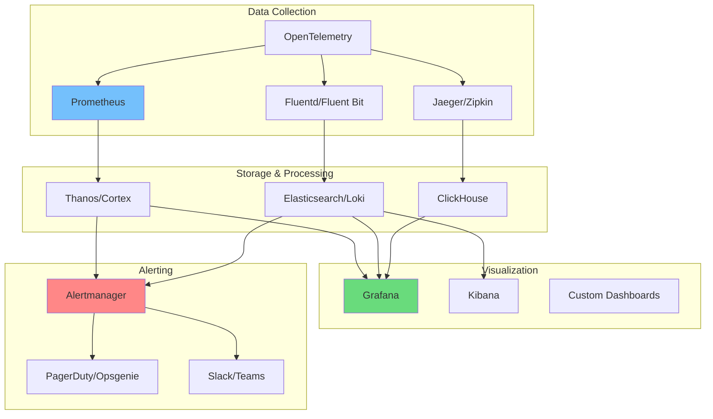

### SLO/SLI Definition Matrix

| Service Level Indicator | SLO Target | Error Budget | Measurement |
|-------------------------|------------|--------------|-------------|
| **Availability** | 99.9% | 0.1%/month | Uptime probe |
| **Latency P99** | `< 500ms` | 1% violations | Request timing |
| **Error Rate** | `< 0.1%` | 43 min/month | 5xx responses |
| **Throughput** | `> 1000 RPS` | 10% variance | Request count |
| **Saturation** | `< 80%` | 20% headroom | Resource usage |

## Security in Cloud-Native Systems

### Zero Trust Architecture

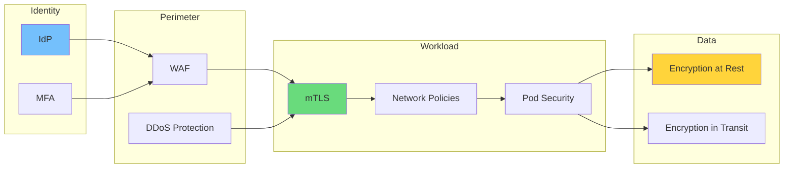

### Security Control Implementation

| Layer | Control | Implementation | Verification |
|-------|---------|----------------|--------------|
| **Network** | Segmentation | VPC/NSGs | Network scanner |
| **Identity** | Least privilege | RBAC/IAM | Access review |
| **Workload** | Image scanning | Trivy/Clair | CI/CD gates |
| **Runtime** | Behavior detection | Falco | Alert analysis |
| **Data** | Encryption | KMS integration | Key rotation |

## Cost Management & FinOps

### Cloud Cost Allocation

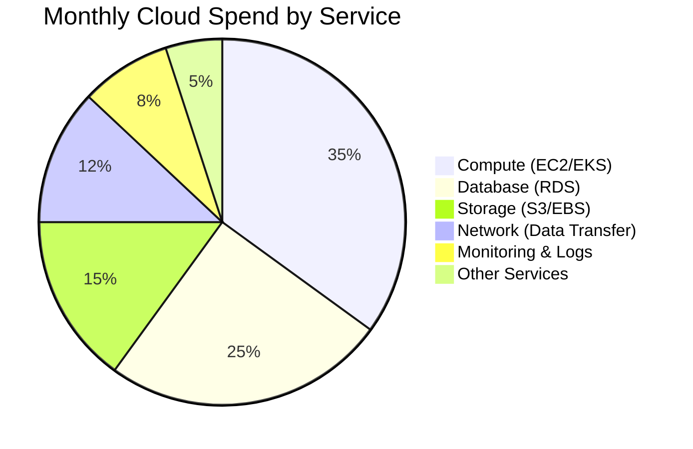

### Cost Optimization Framework

```math
Optimization\ Score = \frac{Actual\ Cost}{OnDemand\ Cost} \times 100
```

**Optimization Recommendations:**

| Finding | Potential Savings | Effort | Priority |
|-----------|-----------------|--------|----------|
| **Idle Resources** | 15-20% | Low | P0 |
| **Right-sizing** | 10-15% | Medium | P1 |
| **Reserved Capacity** | 30-60% | Low | P0 |
| **Spot Instances** | 60-90% | High | P1 |
| **Storage Tiering** | 40-70% | Medium | P2 |

## Implementation Roadmap

### Cloud-Native Journey Timeline

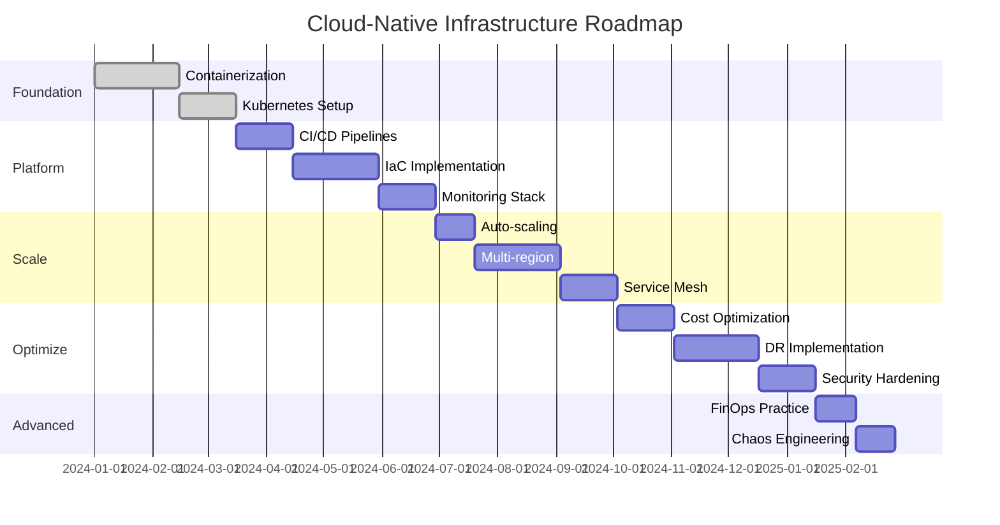

## Conclusion

Cloud-native infrastructure is not a destination but a continuous evolution. The ability to provision resources in minutes rather than weeks, scale automatically with demand, and recover from failures gracefully represents a fundamental shift in how we think about infrastructure.

> "Infrastructure is code, scaling is automatic, and failures are expected."

Organizations that embrace cloud-native principles gain significant competitive advantages: faster time-to-market, reduced operational overhead, improved resilience, and optimized costs. However, these benefits come with complexity that requires investment in tooling, skills, and processes.

The journey to cloud-native maturity is iterative. Start with containerization, adopt Kubernetes for orchestration, implement Infrastructure as Code, then progressively add observability, security, and optimization practices. Each step builds on the previous, creating a robust foundation for future growth.

As cloud technologies continue to evolve, staying current with best practices and emerging patterns will be essential for maintaining a competitive edge in the digital economy.
