# Enterprise Security Architecture: Defense in Depth

In an era of sophisticated cyber threats and stringent regulatory requirements, security can no longer be an afterthought. This comprehensive guide explores the architectural patterns, processes, and technologies required to build resilient, compliant, and secure systems that protect business assets and customer trust.

## Zero Trust Architecture

### Zero Trust Implementation Model

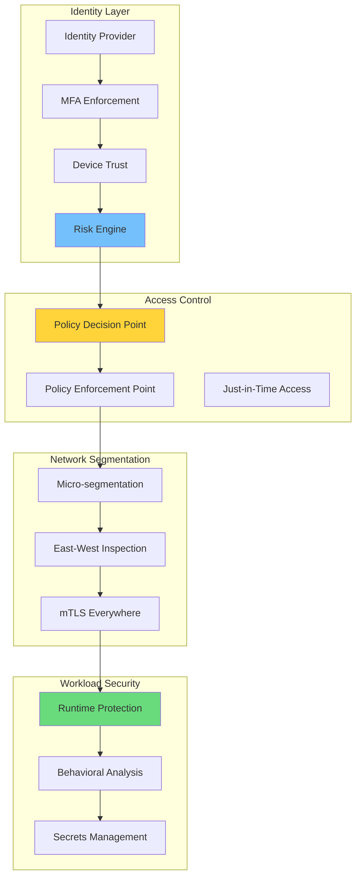

### Trust Verification Matrix

| Layer | Never Trust | Always Verify | Verification Method |
|-------|-------------|---------------|---------------------|
| **Identity** | Implicit credentials | Continuous authentication | MFA + biometric |
| **Device** | Device health | Posture assessment | EDR + MDM |
| **Network** | Location-based trust | Micro-segmentation | Packet inspection |
| **Application** | Code integrity | Runtime attestation | SAST/DAST/IAST |
| **Data** | Clear text | Encryption + DLP | Classification scans |

### Session Risk Scoring

```math
Risk\ Score = \sum (Threat\ Intelligence_i \times Weight_i) + Behavioral\ Anomaly\ Score
```

**Risk Factor Weighting:**

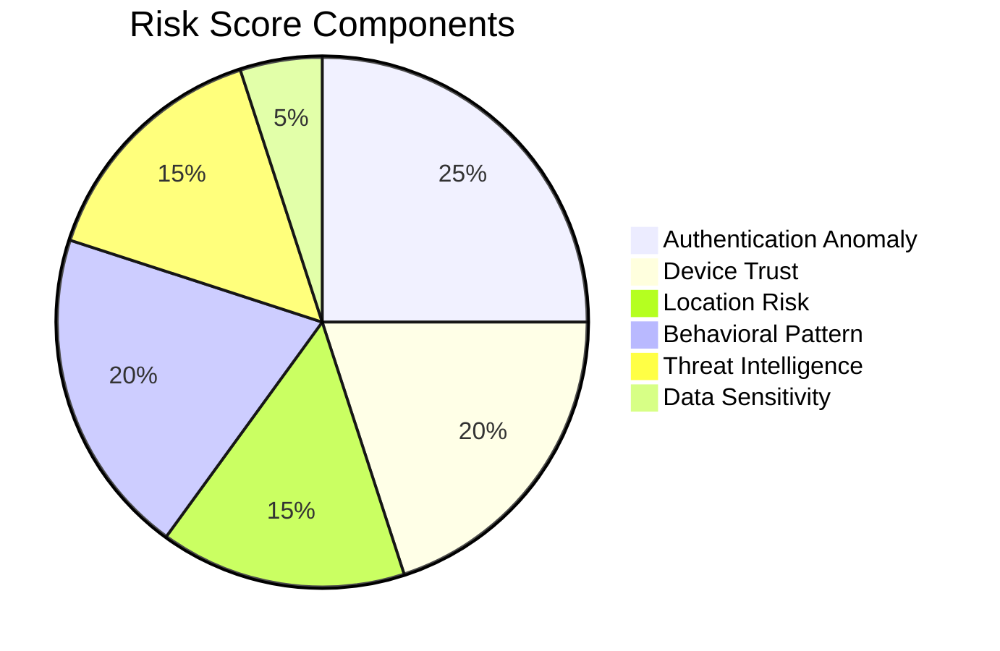

## Threat Modeling Framework

### STRIDE Analysis Process

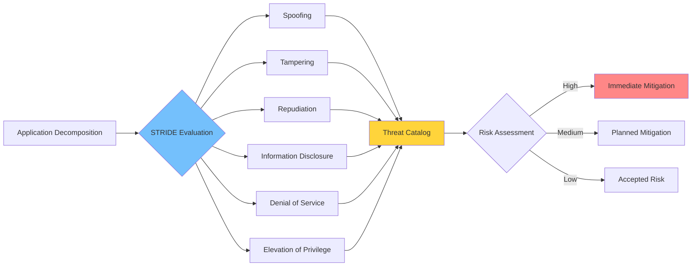

### Threat Severity Matrix

| Threat Category | Likelihood | Impact | Risk Score | Mitigation Priority |
|-----------------|------------|--------|------------|---------------------|
| **SQL Injection** | High | Critical | 12 | P0 |
| **XSS** | High | High | 9 | P0 |
| **Data Breach** | Medium | Critical | 9 | P0 |
| **DDoS** | Medium | Medium | 4 | P1 |
| **Insider Threat** | Low | Critical | 6 | P1 |
| **Supply Chain** | Low | Critical | 6 | P1 |

## Identity and Access Management

### IAM Architecture

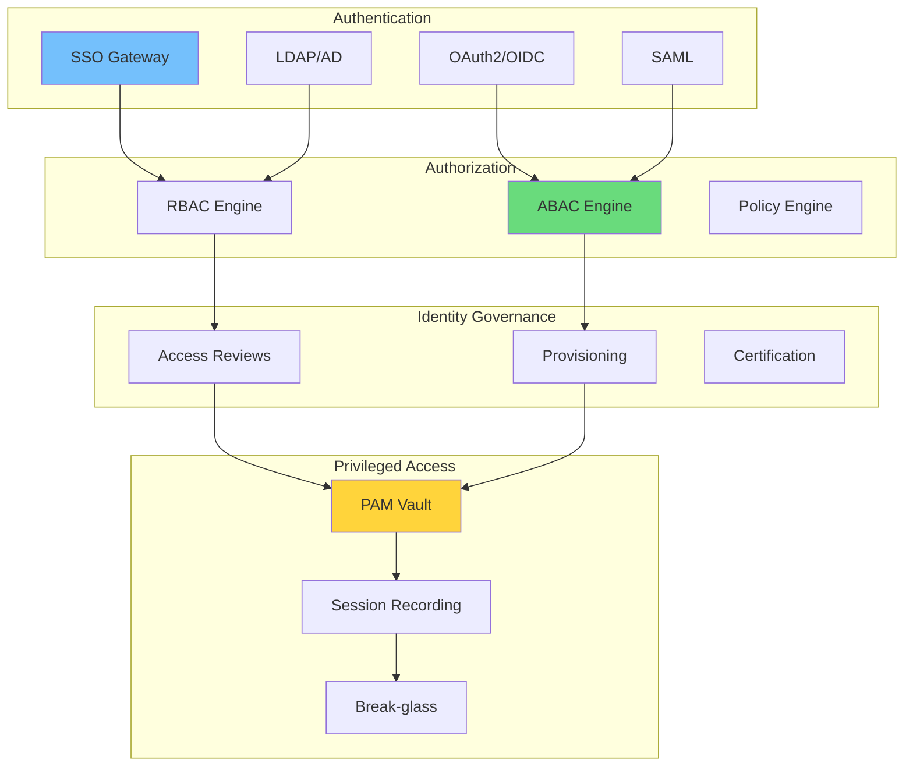

### Access Control Models

| Model | Granularity | Complexity | Use Case |
|-------|-------------|------------|----------|
| **RBAC** | Role-based | Low | General access |
| **ABAC** | Attribute-based | High | Dynamic contexts |
| **PBAC** | Policy-based | Very High | Compliance |
| **ReBAC** | Relationship-based | Medium | Social systems |

### Privileged Access Lifecycle

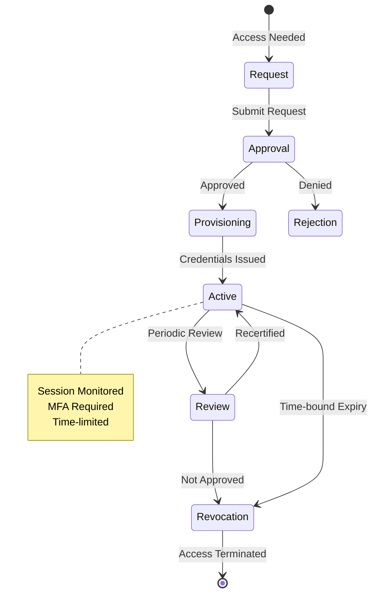

## Data Protection

### Data Classification Framework

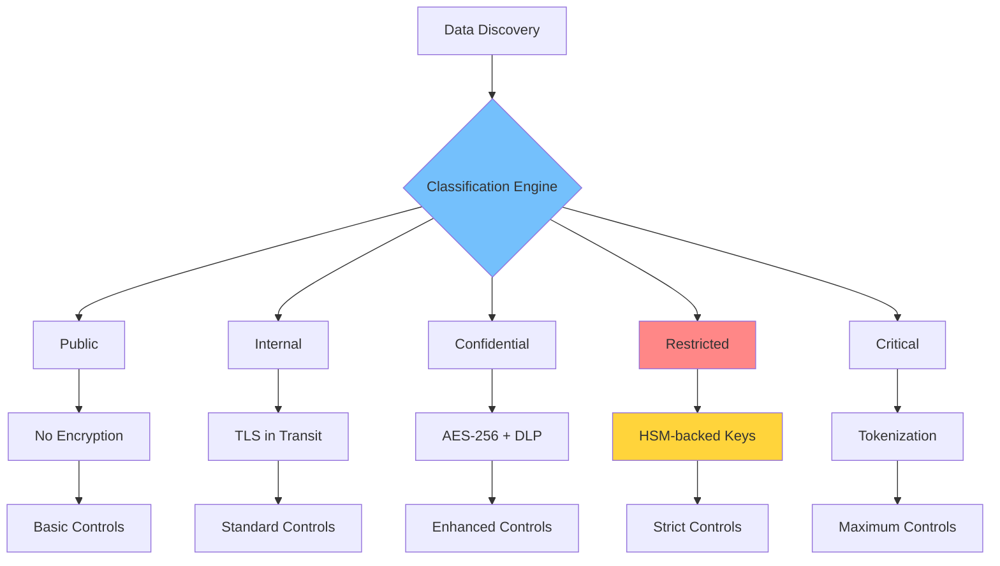

### Encryption Strategy Matrix

| Data State | Algorithm | Key Management | Rotation |
|------------|-----------|----------------|----------|
| **At Rest** | AES-256-GCM | AWS KMS/Azure Key Vault | 90 days |
| **In Transit** | TLS 1.3 | Certificate Authority | 1 year |
| **In Use** | Confidential Computing | TPM/TEE | N/A |
| **Backups** | AES-256-GCM | Separate HSM | 180 days |
| **Archives** | AES-256-GCM | Offline HSM | 365 days |

### DLP Policy Framework

```math
Data\ Risk\ Score = Sensitivity\ Level \times Volume \times Access\ Frequency \times Compliance\ Factor
```

**DLP Enforcement Points:**

| Channel | Policy | Action | Logging |
|---------|--------|--------|---------|
| **Email** | No PII externally | Block + Alert | Full |
| **Web Upload** | Scan all files | Quarantine suspicious | Full |
| **USB** | Require encryption | Block unencrypted | Full |
| **Print** | Watermark sensitive | Log all prints | Full |
| **Cloud Sync** | Approved apps only | Block unapproved | Full |

## Application Security

### Secure SDLC Pipeline

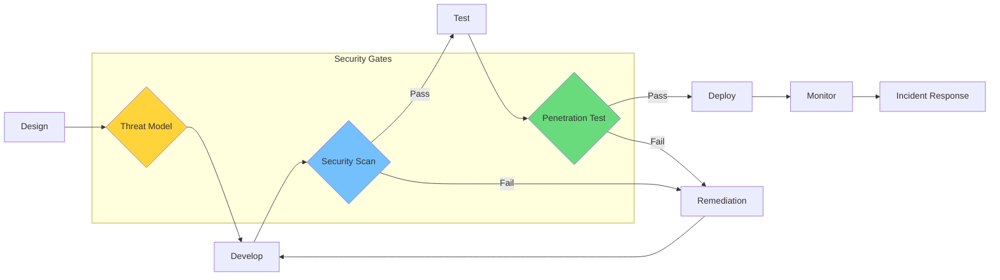

### Security Testing Coverage

| Test Type | Tool Examples | Coverage | Stage | Blocking |
|-----------|---------------|----------|-------|----------|
| **SAST** | SonarQube, Checkmarx | 100% code | Commit | Yes |
| **SCA** | Snyk, Black Duck | All dependencies | PR | Yes |
| **DAST** | OWASP ZAP, Burp | Running app | Staging | Yes |
| **IAST** | Contrast, Seeker | Runtime paths | Production | No |
| **Fuzzing** | AFL, libFuzzer | Input validation | CI | Yes |
| **Container** | Trivy, Clair | Image scan | Build | Yes |

### Vulnerability Management SLA

| Severity | Discovery | Triage | Remediation | Verification |
|----------|-----------|--------|-------------|--------------|
| **Critical** | 24h | 4h | 72h | 24h |
| **High** | 48h | 24h | 7 days | 48h |
| **Medium** | 7 days | 3 days | 30 days | 7 days |
| **Low** | 30 days | 7 days | 90 days | 30 days |

## Cloud Security

### Cloud Security Posture Management

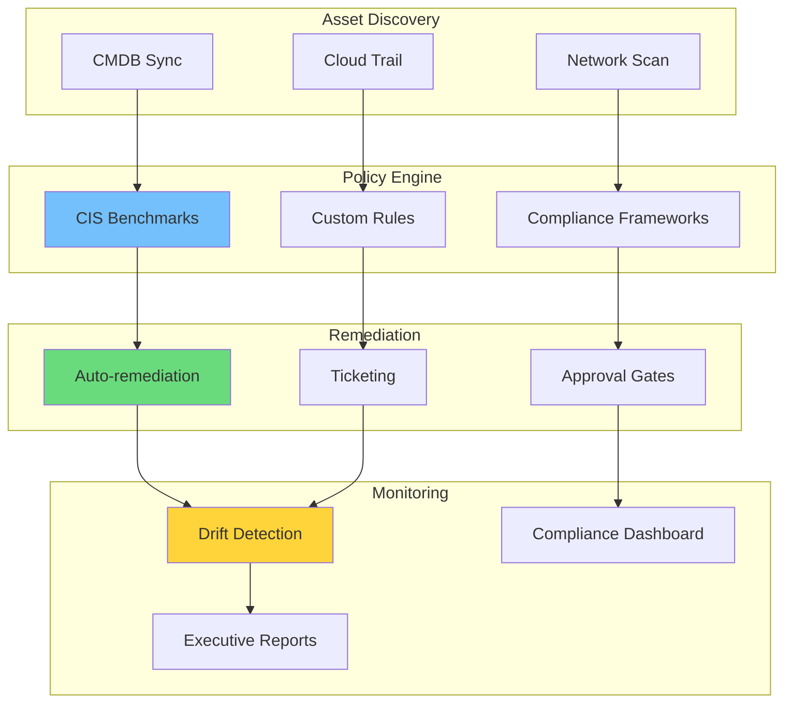

### Cloud Security Controls

| Control Domain | AWS | Azure | GCP | Priority |
|----------------|-----|-------|-----|----------|
| **Network Security** | Security Groups | NSG | VPC Firewall | P0 |
| **IAM** | IAM Policies | RBAC | Cloud IAM | P0 |
| **Encryption** | KMS | Key Vault | Cloud KMS | P0 |
| **Logging** | CloudTrail | Activity Log | Cloud Audit | P0 |
| **Monitoring** | GuardDuty | Defender | Security Command | P1 |
| **Compliance** | Config | Policy | Asset Inventory | P1 |

### Serverless Security

| Risk | Mitigation | Tool | Responsibility |
|------|------------|------|----------------|
| **Function Injection** | Input validation | Runtime protection | Customer |
| **Dependency Vulnerabilities** | SCA scanning | Snyk | Customer |
| **Over-permissive IAM** | Least privilege | IAM Analyzer | Shared |
| **Cold Start Attacks** | VPC configuration | WAF | Shared |
| **Side-channel** | Runtime isolation | Platform controls | Provider |

## Compliance Automation

### Compliance Framework Mapping

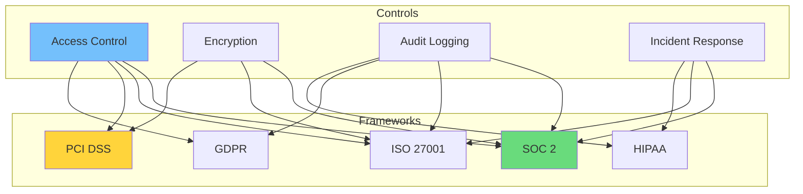

### Compliance Control Matrix

| Control | SOC 2 | ISO 27001 | PCI DSS | GDPR | HIPAA |
|---------|-------|-----------|---------|------|-------|
| **Encryption at Rest** | CC6.1 | A.10.1 | Req 3 | Art 32 | 164.312 |
| **Access Logging** | CC7.2 | A.12.4 | Req 10 | Art 30 | 164.308 |
| **Data Retention** | CC6.2 | A.18.1 | Req 3 | Art 5 | 164.530 |
| **Incident Response** | CC7.3 | A.16.1 | Req 12 | Art 33 | 164.308 |
| **Vendor Management** | CC9.2 | A.15.1 | Req 12 | Art 28 | 164.308 |

### Automated Evidence Collection

```math
Compliance\ Score = \frac{Compliant\ Controls}{Total\ Controls} \times 100
```

**Evidence Sources:**

| Framework | Automated Evidence | Manual Evidence | Collection Frequency |
|-----------|-------------------|-----------------|---------------------|
| **SOC 2** | 85% | 15% | Continuous |
| **ISO 27001** | 70% | 30% | Monthly |
| **PCI DSS** | 60% | 40% | Quarterly |
| **GDPR** | 75% | 25% | Continuous |
| **HIPAA** | 80% | 20% | Monthly |

## Incident Response

### Incident Response Lifecycle

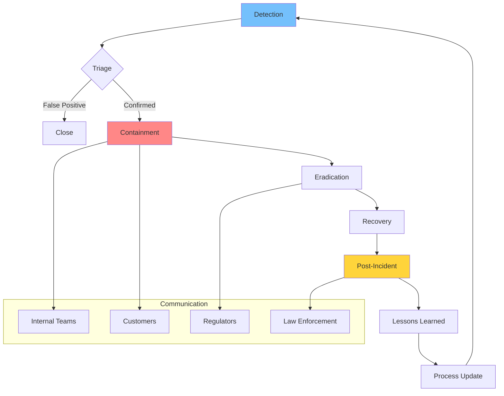

### Response Time Requirements

| Incident Severity | Detection | Response | Containment | Recovery | Notification |
|-------------------|-----------|----------|-------------|----------|--------------|
| **Critical (P0)** | 5 min | 15 min | 1 hour | 4 hours | 24 hours |
| **High (P1)** | 15 min | 1 hour | 4 hours | 24 hours | 48 hours |
| **Medium (P2)** | 1 hour | 4 hours | 24 hours | 72 hours | 72 hours |
| **Low (P3)** | 4 hours | 24 hours | 72 hours | 1 week | 1 week |

### Digital Forensics Process

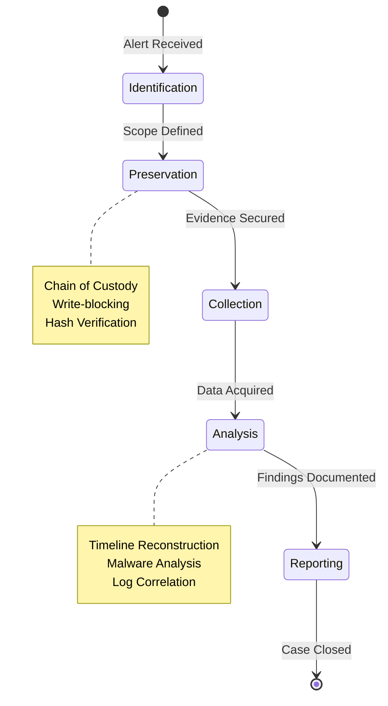

## Security Operations

### SOC Architecture

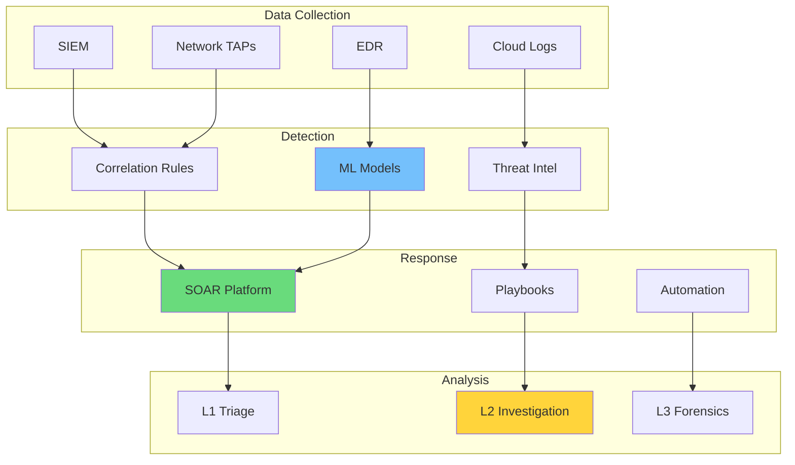

### Detection Engineering

| Detection Type | Coverage | False Positive Rate | Maintenance |
|----------------|----------|---------------------|-------------|
| **Signature-based** | Known threats | Low | High |
| **Behavioral** | Unknown threats | Medium | Medium |
| **Anomaly** | Novel attacks | High | Low |
| **Threat Intel** | IOC matches | Very Low | Medium |
| **Honeypot** | Reconnaissance | Very Low | Low |

### Alert Triage Matrix

```math
Alert\ Priority = Severity \times Confidence \times Asset\ Criticality
```

| Alert Category | Volume/Day | Automated Response | Human Review |
|----------------|------------|-------------------|--------------|
| **Malware Detection** | 500 | 98% | 2% |
| **Phishing** | 2,000 | 95% | 5% |
| **Lateral Movement** | 50 | 20% | 80% |
| **Data Exfiltration** | 10 | 10% | 90% |
| **Insider Threat** | 5 | 0% | 100% |

## Supply Chain Security

### Software Supply Chain Architecture

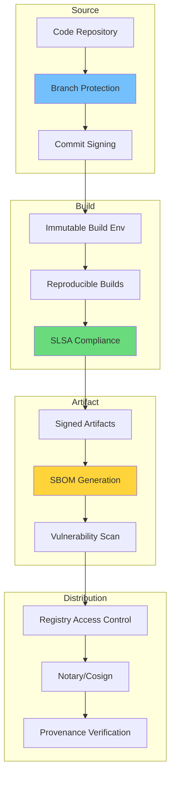

### Supply Chain Security Controls

| Stage | Control | Verification | Risk Mitigation |
|-------|---------|--------------|-----------------|
| **Code** | Signed commits | GPG verification | Tampering |
| **Build** | Reproducible builds | Hash comparison | Injection |
| **Dependencies** | SBOM + SCA | Vulnerability DB | Known vulns |
| **Artifacts** | Digital signatures | Sigstore/Cosign | Substitution |
| **Deployment** | Image verification | Admission controller | Unauthorized |

## Implementation Roadmap

### Security Maturity Timeline

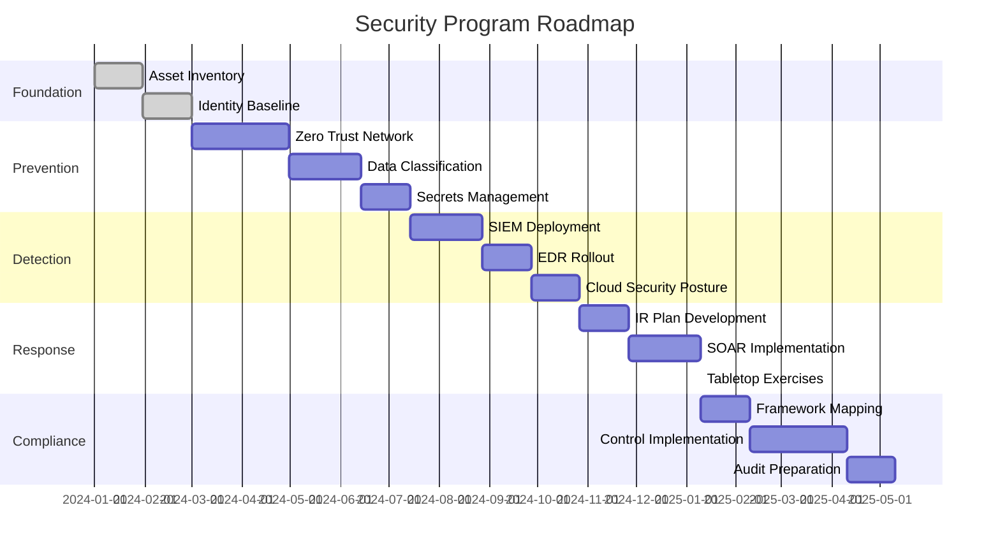

## Conclusion

Security is not a product but a process—a continuous cycle of assessment, implementation, monitoring, and improvement. In today's threat landscape, organizations must adopt a defense-in-depth strategy that assumes breach and focuses on rapid detection and response.

> "Security is like riding a bicycle: to stay balanced, you must keep moving."

The principles outlined in this guide—zero trust architecture, threat-informed defense, automated compliance, and resilient incident response—form the foundation of modern security programs. However, technology alone is insufficient; security requires cultural transformation, executive commitment, and continuous investment in people and processes.

As the threat landscape evolves, so too must our defenses. The organizations that succeed will be those that treat security not as a constraint but as an enabler of business innovation and customer trust.

By building security into every layer of the technology stack and every phase of the development lifecycle, we create resilient systems that can withstand attacks, adapt to new threats, and maintain the trust of our users and stakeholders.
