# Frontend Performance Engineering: Sub-Second Experiences

In today's attention economy, every millisecond matters. Users expect instant responses, seamless interactions, and smooth animations. This comprehensive guide explores the metrics, techniques, and tooling required to build web applications that deliver exceptional performance at scale.

## Core Web Vitals Deep Dive

### Web Vitals Architecture

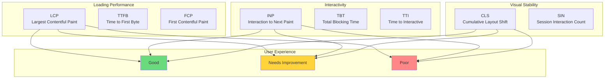

### Core Web Vitals Thresholds

| Metric | Good | Needs Improvement | Poor | Weight |
|--------|------|-------------------|------|--------|
| **LCP** | ≤2.5s | 2.5s-4s | `>4s` | 25% |
| **INP** | ≤200ms | 200ms-500ms | `>500ms` | 30% |
| **CLS** | ≤0.1 | 0.1-0.25 | `>0.25` | 25% |
| **TTFB** | ≤0.8s | 0.8s-1.8s | `>1.8s` | 10% |
| **FCP** | ≤1.8s | 1.8s-3s | `>3s` | 10% |

### Performance Score Calculation

```math
Performance\ Score = \sum_{i=1}^{n} (Metric_i \times Weight_i) \times DampingFactor
```

**Site Performance Distribution:**

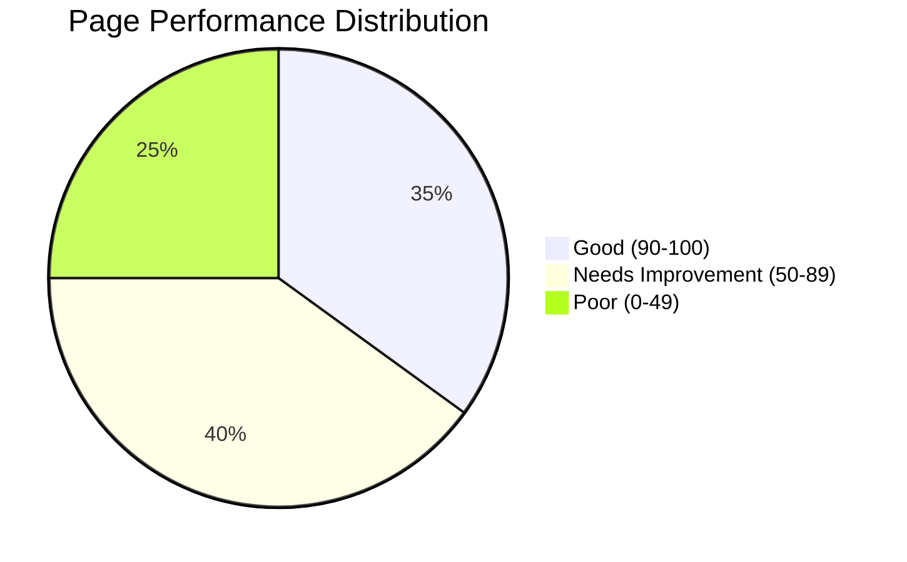

## Rendering Pipeline Optimization

### Critical Rendering Path

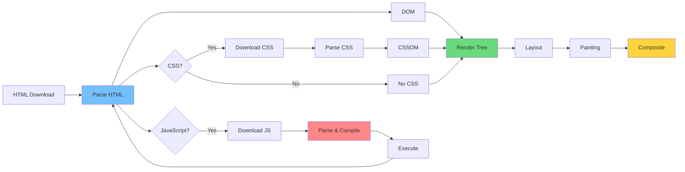

### Resource Loading Priority

| Resource Type | Priority | Loading Strategy | Preload |
|---------------|----------|------------------|---------|
| **Critical CSS** | Highest | Inline `<head>` | No |
| **Above-fold Images** | High | `fetchpriority="high"` | Yes |
| **Web Fonts** | High | `font-display: swap` | Yes |
| **Below-fold Images** | Low | `loading="lazy"` | No |
| **Non-critical JS** | Low | `defer` or `async` | No |
| **Analytics** | Lowest | `async` | No |

## React Performance Patterns

### Component Rendering Optimization

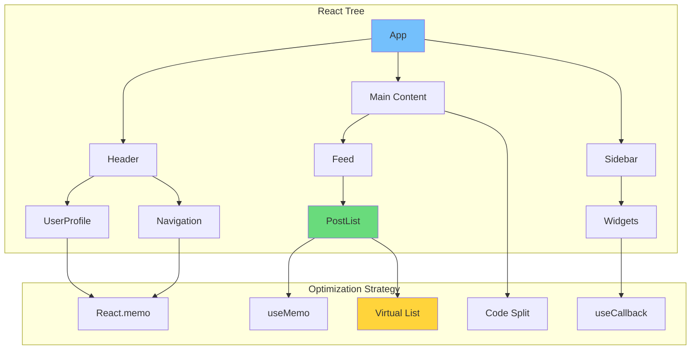

### Re-render Prevention Matrix

| Pattern | Use Case | Complexity | Impact |
|---------|----------|------------|--------|
| **React.memo** | Pure components | Low | Medium |
| **useMemo** | Expensive calculations | Medium | High |
| **useCallback** | Child props stability | Medium | Medium |
| **useTransition** | Non-urgent updates | Medium | High |
| **useDeferredValue** | Slow re-renders | Medium | High |
| **Virtualization** | Long lists | High | Very High |

### State Management Performance

```math
Re-render\ Count = \sum_{i=1}^{n} (Components\ Watching\ State_i \times State\ Update\ Frequency_i)
```

**State Colocation Strategy:**

| State Type | Location | Prop Drilling | Context |
|------------|----------|---------------|---------|
| **Global App** | Redux/Zustand | N/A | Yes |
| **Feature** | Feature slice | 2-3 levels | Maybe |
| **Component** | useState | N/A | No |
| **Server** | React Query | N/A | No |
| **Form** | React Hook Form | N/A | No |

## JavaScript Optimization

### Bundle Analysis Strategy

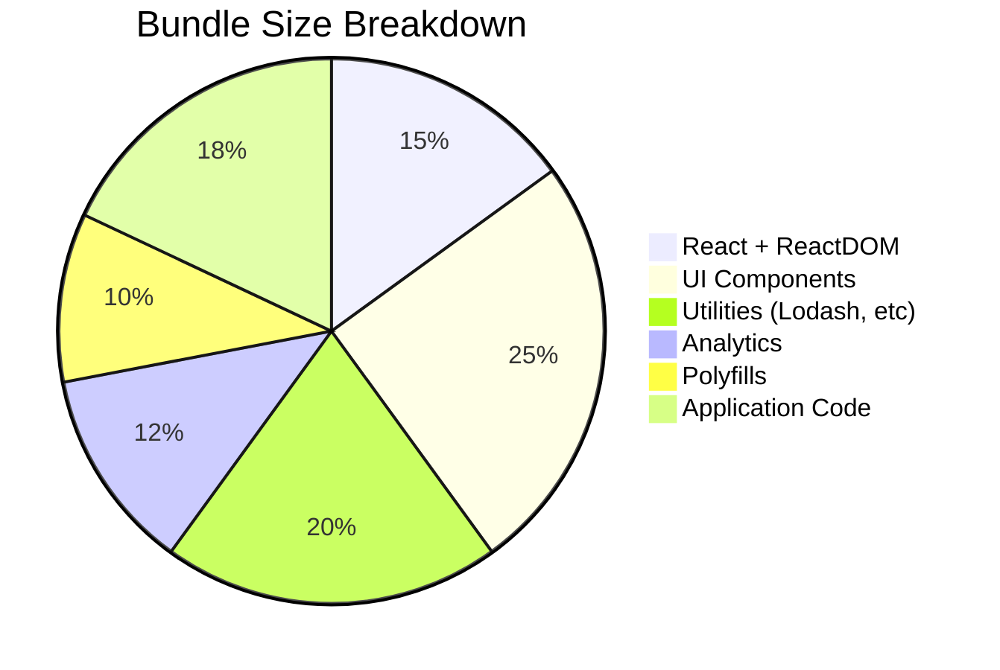

### Code Splitting Patterns

| Split Type | Strategy | Trigger | Size Savings |
|------------|----------|---------|--------------|
| **Route-based** | React.lazy + Suspense | Navigation | 40-60% |
| **Component-based** | Dynamic import | Scroll into view | 15-25% |
| **Library-based** | Separate chunk | On demand | 10-20% |
| **Worker-based** | Web Workers | Heavy computation | N/A |

### JavaScript Parse & Compile Budgets

```math
JS\ Budget = \frac{Device\ Performance\ Score}{Complexity\ Factor}
```

**Device Category Budgets:**

| Device | JS Parse Time | JS Size | Example |
|--------|---------------|---------|---------|
| **High-end** | `<100ms` | `<500KB` | iPhone 14 Pro |
| **Mid-range** | `<200ms` | `<300KB` | Pixel 6 |
| **Low-end** | `<400ms` | `<150KB` | Moto G |

## Image Optimization

### Modern Image Format Strategy

| Format | Browser Support | Size Savings | Use Case |
|--------|-----------------|--------------|----------|
| **AVIF** | 85% | 50-60% | Modern browsers |
| **WebP** | 95% | 30-40% | Universal |
| **JPEG XL** | 15% | 60-70% | Future-proofing |
| **PNG** | 100% | Baseline | Transparency |
| **SVG** | 100% | Variable | Icons/Logos |

### Responsive Image Implementation

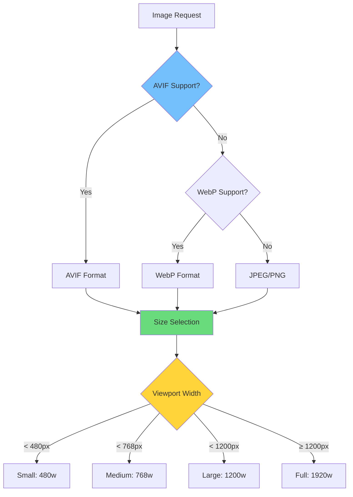

### Image Loading Priority

| Image Type | Loading | Fetchpriority | Format | Size |
|------------|---------|---------------|--------|------|
| **Hero LCP** | Eager | high | AVIF/WebP | ≤100KB |
| **Above fold** | Eager | auto | WebP | ≤50KB |
| **Gallery** | Lazy | low | WebP | ≤30KB |
| **Icons** | Eager | high | SVG | N/A |
| **Thumbnails** | Lazy | low | WebP | ≤10KB |

## CSS Performance

### CSS Architecture Optimization

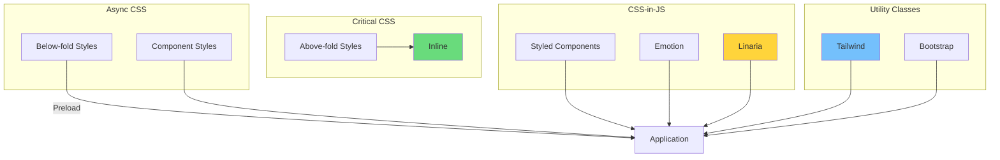

### CSS Performance Rules

| Rule | Target | Measurement | Priority |
|------|--------|-------------|----------|
| **Unused CSS** | `< 20%` | Coverage audit | P0 |
| **CSS Size** | `< 50KB` gzipped | Bundle analyzer | P0 |
| **Selector Complexity** | `< 3` levels | DevTools | P1 |
| **Layout Thrashing** | 0 instances | Performance tab | P0 |
| **Forced Synch Layout** | 0 instances | DevTools | P0 |

## Caching Strategies

### Multi-Layer Caching Architecture

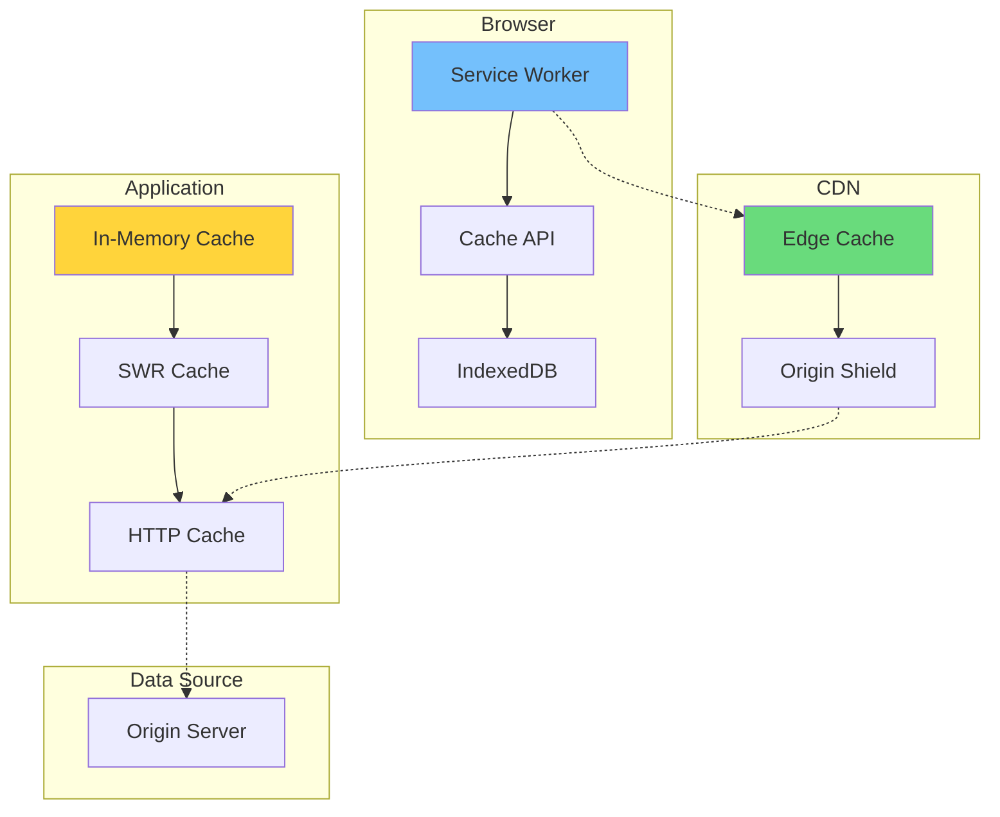

### Cache Control Strategy

| Resource Type | Max-Age | Stale-While-Revalidate | Immutable |
|---------------|---------|------------------------|-----------|
| **HTML** | 0 | N/A | No |
| **App Shell** | 1 year | 1 day | Yes |
| **Static Assets** | 1 year | 7 days | Yes |
| **API Data** | 60s | 1 hour | No |
| **User Data** | 0 | N/A | No |

## Network Optimization

### HTTP/3 and Protocol Optimization

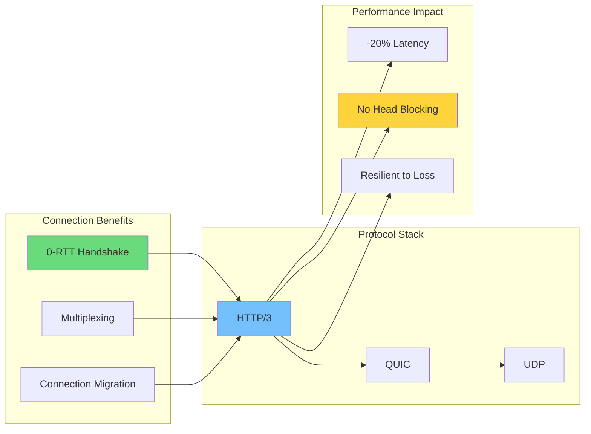

### Resource Hints Implementation

| Hint | Purpose | Impact | Usage |
|------|---------|--------|-------|
| **preconnect** | Early connection | -100-300ms | External domains |
| **dns-prefetch** | DNS resolution | -50-100ms | Many domains |
| **prefetch** | Next navigation | Cache warm | Likely click |
| **preload** | Critical resources | -100-500ms | Fonts, hero images |
| **prerender** | Full page load | Full page | High confidence |

## Web Workers & Multithreading

### Worker Thread Architecture

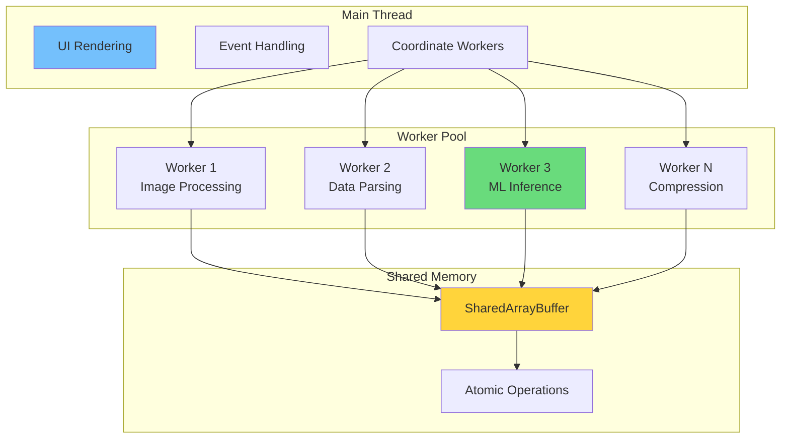

### Worker Usage Guidelines

| Task Type | Thread | Transfer Time | Benefit |
|-----------|--------|---------------|---------|
| **Image compression** | Worker | 5-50ms | Non-blocking |
| **JSON parsing** | Worker | 1-10ms | Non-blocking |
| **Data sorting** | Worker | 10-100ms | Non-blocking |
| **Canvas rendering** | Worker | N/A | Offscreen |
| **ML inference** | Worker | 50-500ms | Non-blocking |

## Real User Monitoring (RUM)

### Performance Data Collection

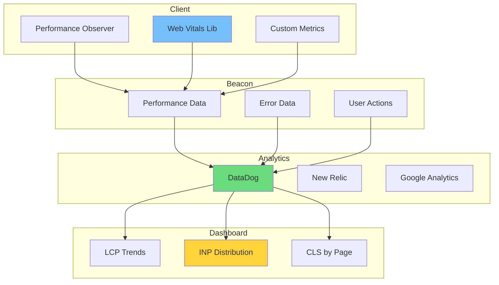

### RUM Metrics Distribution

| Metric | P50 | P75 | P95 | Target |
|--------|-----|-----|-----|--------|
| **LCP** | 1.8s | 2.4s | 3.8s | 2.5s |
| **INP** | 120ms | 180ms | 350ms | 200ms |
| **CLS** | 0.05 | 0.12 | 0.28 | 0.1 |
| **TTFB** | 0.4s | 0.6s | 1.2s | 0.8s |
| **FCP** | 1.2s | 1.6s | 2.5s | 1.8s |

## Build Optimization

### Bundle Optimization Pipeline

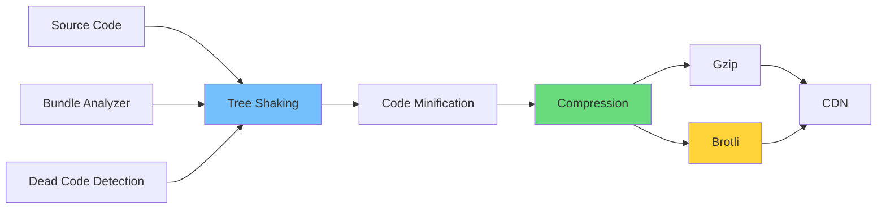

### Compression Efficiency

| Content Type | Original | Gzip | Brotli | Savings |
|--------------|----------|------|--------|---------|
| **JavaScript** | 500KB | 150KB | 120KB | 70-76% |
| **CSS** | 100KB | 20KB | 16KB | 80-84% |
| **HTML** | 50KB | 10KB | 8KB | 80-84% |
| **JSON** | 200KB | 60KB | 50KB | 70-75% |

## Implementation Roadmap

### Performance Optimization Timeline

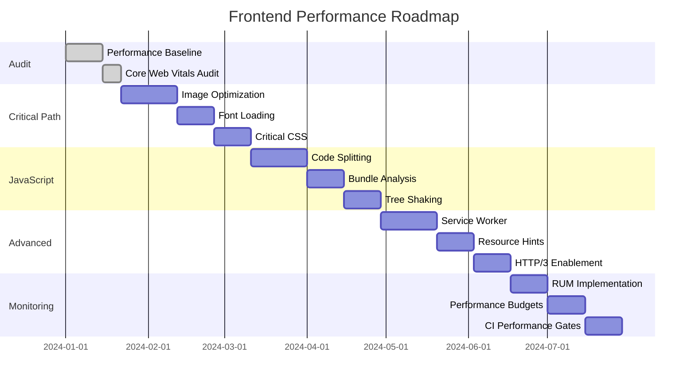

## Conclusion

Frontend performance is not a one-time optimization but a continuous discipline. The landscape of web technologies evolves rapidly, but the fundamental principles remain constant: deliver critical content quickly, minimize main thread work, and respect user device constraints.

> "Performance is a feature, not a bug. Users vote with their attention—and slow sites lose."

The Core Web Vitals initiative has fundamentally changed how we measure and optimize web performance, shifting focus from synthetic benchmarks to real user experiences. By adopting the patterns and practices outlined in this guide, teams can build applications that delight users while meeting business objectives.

Remember that performance optimization follows the Pareto principle: 80% of gains come from 20% of efforts. Focus on the critical rendering path, optimize your largest contentful paint element, and eliminate layout shifts before diving into micro-optimizations. The result will be faster, more engaging experiences that keep users coming back.
