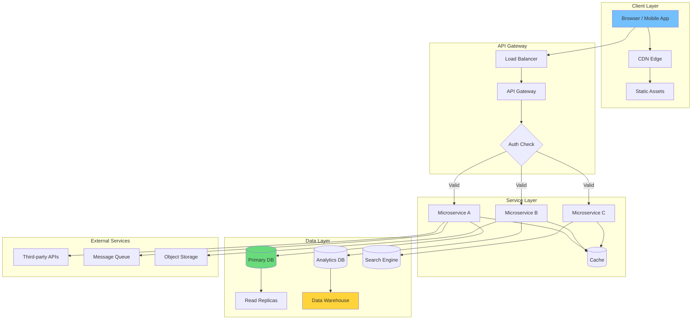
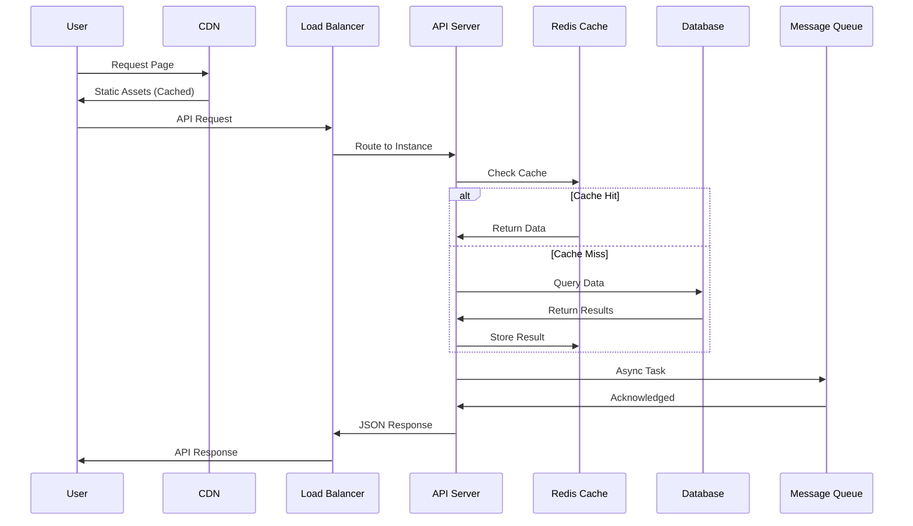
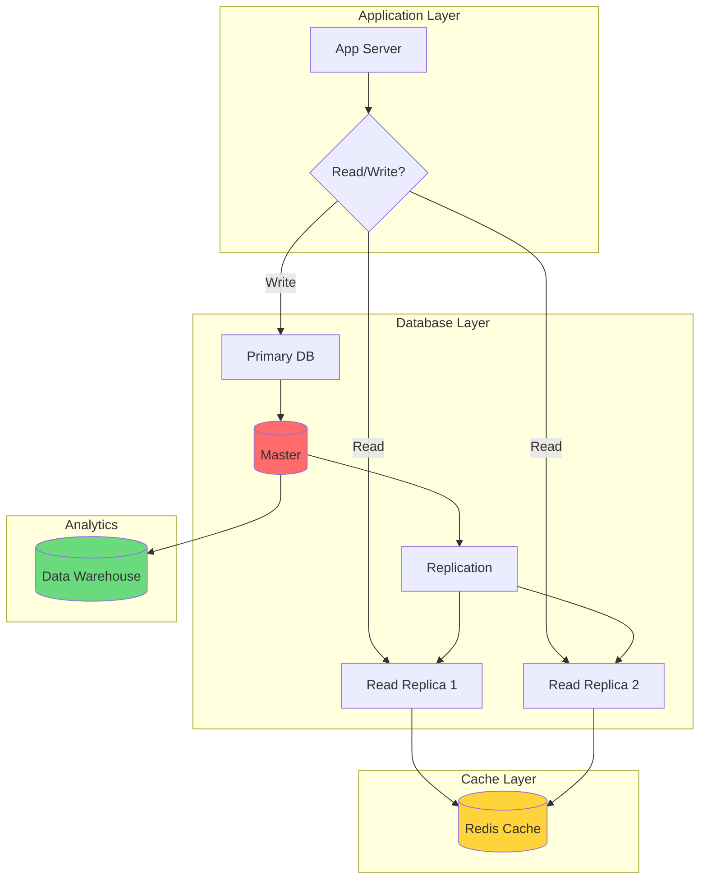
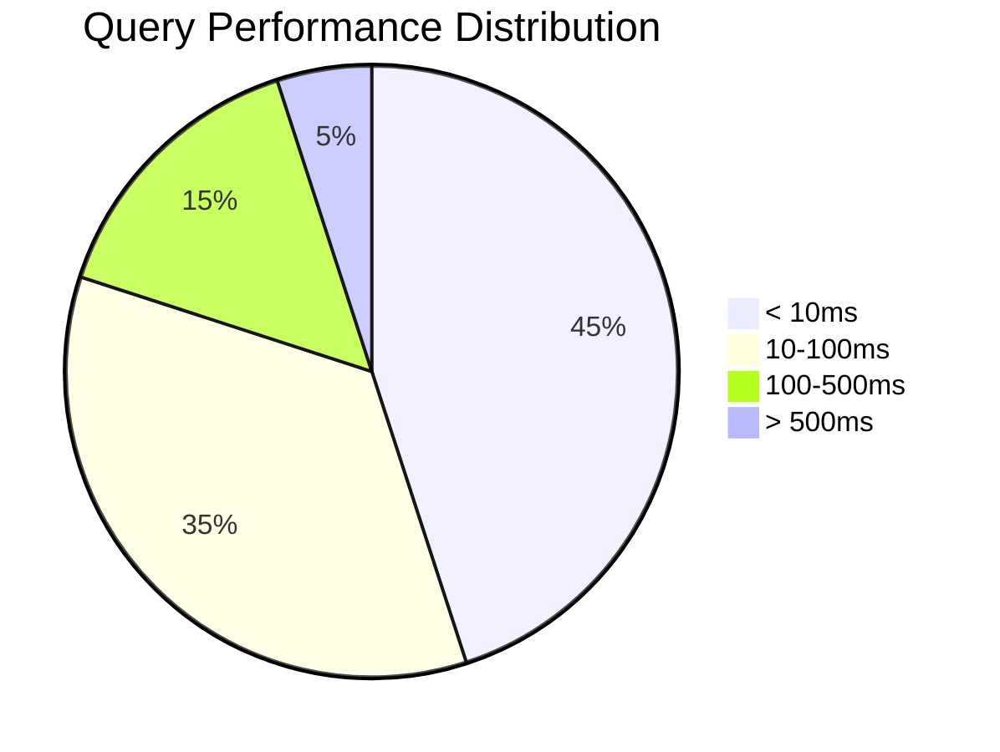

# Full-Stack Development in 2024: Architecture, Tools, and Best Practices

The landscape of full-stack development continues to evolve at a breathtaking pace. What was cutting-edge last year may be standard practice today, and entirely new paradigms emerge seemingly overnight. This comprehensive guide provides a complete overview of modern full-stack development, from architectural decisions to deployment strategies.

## System Architecture Overview

### Modern Web Architecture Stack



### Technology Selection Matrix

| Component | Option 1 | Option 2 | Option 3 | Best For |
|-----------|----------|----------|----------|----------|
| **Frontend Framework** | React | Vue | Svelte | React: Large teams, Vue: Flexibility, Svelte: Performance |
| **Backend Runtime** | Node.js | Python | Go | Node: Full-stack JS, Python: ML/AI, Go: High performance |
| **Database** | PostgreSQL | MongoDB | Redis | Postgres: Relational, Mongo: Documents, Redis: Cache |
| **API Style** | REST | GraphQL | gRPC | REST: Simple, GraphQL: Flexible, gRPC: Microservices |
| **Deployment** | Docker | Serverless | Kubernetes | Docker: Consistency, Serverless: Scale-to-zero, K8s: Complex apps |
| **Auth** | JWT | OAuth2 | Session | JWT: Stateless, OAuth2: Third-party, Session: Traditional |

### Request Processing Flow



### Scalability Formula

The scalability of a system can be approximated by:

```math
Throughput = N × (1 / Latency) × Efficiency
```

Where:
- `N` = Number of instances/nodes
- `Latency` = Average response time
- `Efficiency` = Resource utilization (0.0 to 1.0)

For horizontal scaling:

```math
Total Capacity = Σ(instance_capacity × availability)
```

## The Modern Full-Stack Landscape

### Understanding the Stack Evolution

The traditional LAMP stack (Linux, Apache, MySQL, PHP) and MEAN stack (MongoDB, Express, Angular, Node.js) have given way to more flexible, specialized architectures. Today's full-stack developers work with a rich ecosystem of specialized tools and services.

**Current Architecture Trends:**

1. **Serverless and Edge Computing** - Deploy functions globally without managing servers
2. **Jamstack and Static Site Generation** - Pre-render for performance, hydrate for interactivity
3. **Microservices and Service Mesh** - Decompose monoliths into independently deployable services
4. **API-First and Headless CMS** - Decouple frontend from backend for flexibility
5. **Real-time and Event-Driven** - Build reactive systems with WebSockets and message queues

### The Full-Stack Developer's Role

Modern full-stack developers are expected to:
- Design and implement complete systems
- Make informed architectural decisions
- Understand infrastructure and deployment
- Optimize for performance and scalability
- Ensure security and maintainability
- Collaborate across disciplines

## Frontend Architecture Deep Dive

### Modern JavaScript Frameworks

**React Ecosystem:**

React remains the dominant library, but the ecosystem has matured significantly:

- **Next.js (App Router)** - Server Components, streaming, and nested layouts
- **Remix** - Web standards-focused with excellent data loading patterns
- **Gatsby** - Static site generation for content-heavy sites
- **React Server Components** - Render components on the server for zero client JS

```jsx
// React Server Component example
async function BlogPosts() {
  const posts = await db.posts.findMany();
  
  return (
    <div>
      {posts.map(post => (
        <PostCard key={post.id} post={post} />
      ))}
    </div>
  );
}
```

**Vue.js Ecosystem:**

Vue 3 with Composition API brings reactivity improvements:

- **Nuxt 3** - Full-stack Vue framework with SSR/SSG
- **Pinia** - TypeScript-friendly state management
- **Vite** - Lightning-fast development server

```vue
<script setup>
import { ref, computed } from 'vue'

const count = ref(0)
const doubled = computed(() => count.value * 2)

function increment() {
  count.value++
}
</script>
```

**Svelte and SvelteKit:**

Compile-time framework for minimal runtime overhead:

- **No virtual DOM** - Direct DOM updates
- **Built-in animations** - Transition and motion primitives
- **SvelteKit** - Full-stack framework with filesystem routing

**Solid.js:**

Fine-grained reactivity with React-like syntax:

- Superior performance benchmarks
- No virtual DOM overhead
- Growing ecosystem

### State Management Strategies

**Local State:**

```javascript
// React hooks
const [count, setCount] = useState(0);

// Vue refs
const count = ref(0);

// Svelte writable
const count = writable(0);
```

**Global State Patterns:**

1. **Flux Architecture (Redux, Zustand)**
   - Single source of truth
   - Unidirectional data flow
   - Predictable state updates

2. **Proxy-based (MobX, Valtio)**
   - Automatic dependency tracking
   - Mutable syntax with immutable updates
   - Fine-grained reactivity

3. **Atomic State (Recoil, Jotai)**
   - Derived state from atoms
   - Concurrent mode safe
   - Minimal re-renders

**Server State Management:**

Libraries like React Query, SWR, and TanStack Query handle:
- Caching and cache invalidation
- Background refetching
- Optimistic updates
- Request deduplication
- Pagination and infinite loading

```javascript
const { data, isLoading, error } = useQuery({
  queryKey: ['posts', postId],
  queryFn: () => fetchPost(postId),
  staleTime: 5 * 60 * 1000, // 5 minutes
});
```

### Styling Architecture

**CSS-in-JS:**

- **Styled-components** - Component-scoped styles with theme support
- **Emotion** - High-performance CSS-in-JS with multiple patterns
- **Linaria** - Zero-runtime CSS-in-JS (extracts at build time)

**Utility-First CSS:**

- **Tailwind CSS** - Rapid UI development with pre-built utilities
  - JIT compiler for custom values
  - Plugin ecosystem
  - First-class dark mode support
  - Extensive configuration options

```jsx
<button className="px-4 py-2 bg-blue-600 hover:bg-blue-700 
                   text-white rounded-lg transition-colors">
  Click me
</button>
```

**CSS Modules:**

Scoped CSS with local-by-default:

```css
/* Button.module.css */
.button {
  padding: 0.5rem 1rem;
  background: var(--primary-color);
}
```

```jsx
import styles from './Button.module.css';

<button className={styles.button}>Click me</button>
```

### Frontend Performance Optimization

**Code Splitting:**

```javascript
// Route-based splitting
const Dashboard = lazy(() => import('./Dashboard'));

// Component-based splitting
const HeavyChart = lazy(() => import('./HeavyChart'));
```

**Resource Loading:**

```html
<!-- Preload critical fonts -->
<link rel="preload" href="/fonts/main.woff2" as="font" type="font/woff2" crossorigin>

<!-- Prefetch likely navigation targets -->
<link rel="prefetch" href="/about">

<!-- Preconnect to required origins -->
<link rel="preconnect" href="https://api.example.com">
```

**Image Optimization:**

- Use modern formats (WebP, AVIF)
- Implement responsive images with srcset
- Lazy load below-the-fold images
- Use blur-up placeholders
- Consider image CDNs

## Backend Architecture and API Design

### API Architecture Patterns

**RESTful APIs:**

Timeless principles for resource-based APIs:

```
GET    /api/users          # List users
GET    /api/users/123      # Get specific user
POST   /api/users          # Create user
PATCH  /api/users/123      # Partial update
PUT    /api/users/123      # Full update
DELETE /api/users/123      # Delete user
```

Best practices:
- Use proper HTTP status codes
- Implement consistent error responses
- Version your API (URL or header)
- Use pagination for collections
- Include HATEOAS links (optional)

**GraphQL:**

Query language for flexible data fetching:

```graphql
query GetUserWithPosts($userId: ID!) {
  user(id: $userId) {
    id
    name
    email
    posts(limit: 5) {
      title
      publishedAt
      comments {
        author
        content
      }
    }
  }
}
```

Advantages:
- Single endpoint for all operations
- Clients request exactly what they need
- Strong typing with schema
- Excellent developer experience with introspection

Challenges:
- Query complexity and depth limiting
- Caching strategies differ from REST
- File uploads require additional handling

**gRPC:**

High-performance RPC framework:

- Protocol Buffers for serialization
- HTTP/2 for transport
- Bidirectional streaming
- Strongly typed contracts
- Excellent for microservices

**tRPC:**

End-to-end typesafe APIs without schemas:

```typescript
// Server
const appRouter = router({
  user: router({
    getById: publicProcedure
      .input(z.object({ id: z.string() }))
      .query(({ input }) => {
        return db.user.findById(input.id);
      }),
  }),
});

// Client - fully typed!
const user = await trpc.user.getById.query({ id: '123' });
```

### Backend Frameworks

**Node.js Ecosystem:**

1. **Express.js** - Minimal, flexible, mature
   ```javascript
   const express = require('express');
   const app = express();
   
   app.get('/api/users', async (req, res) => {
     const users = await db.users.findAll();
     res.json(users);
   });
   ```

2. **Fastify** - High performance, schema-based
   ```javascript
   const fastify = require('fastify')();
   
   fastify.get('/api/users', async () => {
     return await db.users.findAll();
   });
   ```

3. **NestJS** - Enterprise-grade, Angular-inspired
   ```typescript
   @Controller('users')
   export class UsersController {
     @Get()
     findAll() {
       return this.usersService.findAll();
     }
   }
   ```

4. **Hono** - Lightweight, edge-compatible
   ```javascript
   import { Hono } from 'hono';
   
   const app = new Hono();
   app.get('/api/users', (c) => c.json({ users: [] }));
   ```

**Python:**

- **FastAPI** - Modern, fast, automatic OpenAPI docs
- **Django** - Batteries-included, mature ecosystem
- **Flask** - Micro framework, flexible

**Go:**

- **Gin** - High-performance web framework
- **Echo** - Minimalist with great middleware support
- **Standard library** - Excellent for simple services

**Rust:**

- **Actix-web** - Extremely fast, ergonomic
- **Axum** - Modular, Tower-based
- **Rocket** - Type-safe, expressive

### Authentication and Authorization

**Authentication Strategies:**

1. **Session-based (Cookies)**
   - Server maintains session state
   - HttpOnly cookies for security
   - CSRF protection required
   - Best for traditional server-rendered apps

2. **JWT (JSON Web Tokens)**
   - Stateless authentication
   - Signed and optionally encrypted
   - Short-lived access tokens + refresh tokens
   - Store securely (httpOnly cookie preferred)

3. **OAuth 2.0 / OpenID Connect**
   - Third-party identity providers
   - Authorization code flow for security
   - PKCE for mobile and SPA apps
   - Support for SSO

4. **Passkeys / WebAuthn**
   - Passwordless authentication
   - Public key cryptography
   - Phishing-resistant
   - Growing browser support

**Authorization Patterns:**

- **RBAC (Role-Based Access Control)** - Permissions based on roles
- **ABAC (Attribute-Based Access Control)** - Dynamic, context-aware permissions
- **ACL (Access Control Lists)** - Resource-specific permissions
- **Policy-based** - OPA (Open Policy Agent) for decoupled authorization

```javascript
// RBAC middleware example
function requireRole(role) {
  return (req, res, next) => {
    if (!req.user.roles.includes(role)) {
      return res.status(403).json({ error: 'Insufficient permissions' });
    }
    next();
  };
}

app.delete('/api/users/:id', 
  authenticate, 
  requireRole('admin'), 
  deleteUser
);
```

## Database Design and Management

### Database Architecture Patterns



### Database Selection Decision Matrix

| Database Type | Consistency | Scalability | Complexity | Best For |
|---------------|-------------|-------------|------------|----------|
| **PostgreSQL** | Strong | Vertical | Medium | Complex queries, ACID |
| **MongoDB** | Eventual | Horizontal | Low | Rapid prototyping, JSON |
| **Redis** | Strong | Vertical | Low | Caching, sessions, real-time |
| **Cassandra** | Eventual | Horizontal | High | Time-series, write-heavy |
| **Elasticsearch** | Eventual | Horizontal | Medium | Search, analytics |
| **Neo4j** | ACID | Vertical | Medium | Graph relationships |

### Query Performance Formula

```math
Query Time = Network Latency + Parse Time + Execution Time + Fetch Time
```

**Optimization Strategies Matrix:**

| Strategy | Impact | Effort | Risk |
|----------|--------|--------|------|
| Indexing | High | Low | Low |
| Query Rewrite | High | Medium | Medium |
| Denormalization | Medium | High | High |
| Caching | Very High | Low | Low |
| Sharding | Very High | Very High | High |

### Connection Pool Calculation

```math
Pool Size = (Core Count × 2) + Effective Spindle Count
```

For modern cloud databases:

```math
Recommended Pool = min(CPU Cores × 4, 100)
```

**Database Performance Monitoring:**



### Database Selection Guide

**Relational Databases (SQL):**

Best for:
- Complex relationships and transactions
- ACID compliance requirements
- Structured, consistent data
- Complex querying needs

**PostgreSQL** - Advanced open-source RDBMS:
- JSON/JSONB support for semi-structured data
- Full-text search capabilities
- PostGIS for geospatial data
- Excellent performance and reliability

**MySQL/MariaDB** - Widely supported:
- Great ecosystem and tooling
- Read replicas for scaling
- JSON support (MySQL 5.7+)

**NoSQL Databases:**

**Document Stores (MongoDB, Couchbase):**
- Flexible schema
- Nested documents reduce joins
- Horizontal scaling
- Good for rapidly evolving data

**Key-Value Stores (Redis, DynamoDB):**
- Lightning-fast lookups
- Caching and session storage
- Simple data models
- Massive scale

**Graph Databases (Neo4j, ArangoDB):**
- Complex relationship queries
- Network and connection analysis
- Pattern matching
- Recommendation engines

**Time-Series Databases (InfluxDB, TimescaleDB):**
- Optimized for time-stamped data
- Downsampling and retention policies
- IoT and monitoring use cases

**Search Databases (Elasticsearch, Algolia):**
- Full-text search
- Faceting and filtering
- Typo tolerance
- Relevance scoring

### ORM and Query Builders

**TypeScript/JavaScript:**

- **Prisma** - Next-generation ORM with type safety
  ```typescript
  const user = await prisma.user.create({
    data: {
      email: 'user@example.com',
      name: 'John',
      posts: {
        create: { title: 'Hello World' }
      }
    },
    include: { posts: true }
  });
  ```

- **Drizzle** - SQL-like, lightweight ORM
- **TypeORM** - Decorator-based, mature
- **Kysely** - Type-safe SQL query builder

**Python:**

- **SQLAlchemy** - Powerful, flexible ORM
- **Django ORM** - Integrated with Django
- **Peewee** - Lightweight alternative

**Query Optimization:**

1. Use EXPLAIN ANALYZE to understand query plans
2. Create appropriate indexes
3. Avoid N+1 queries with eager loading
4. Use pagination for large result sets
5. Consider materialized views for complex aggregations

## DevOps and Deployment

### Containerization and Orchestration

**Docker:**

```dockerfile
# Multi-stage build for optimization
FROM node:20-alpine AS builder
WORKDIR /app
COPY package*.json ./
RUN npm ci
COPY . .
RUN npm run build

FROM node:20-alpine AS runner
WORKDIR /app
COPY --from=builder /app/dist ./dist
COPY --from=builder /app/node_modules ./node_modules
EXPOSE 3000
CMD ["node", "dist/main.js"]
```

**Docker Compose for Development:**

```yaml
version: '3.8'
services:
  app:
    build: .
    ports:
      - "3000:3000"
    environment:
      - DATABASE_URL=postgres://user:pass@db:5432/app
    depends_on:
      - db
  
  db:
    image: postgres:15
    environment:
      POSTGRES_USER: user
      POSTGRES_PASSWORD: pass
    volumes:
      - postgres_data:/var/lib/postgresql/data
```

**Kubernetes:**

For production orchestration at scale:

```yaml
apiVersion: apps/v1
kind: Deployment
metadata:
  name: web-app
spec:
  replicas: 3
  selector:
    matchLabels:
      app: web-app
  template:
    metadata:
      labels:
        app: web-app
    spec:
      containers:
      - name: web
        image: myapp:latest
        ports:
        - containerPort: 3000
        resources:
          requests:
            memory: "256Mi"
            cpu: "250m"
          limits:
            memory: "512Mi"
            cpu: "500m"
```

### CI/CD Pipelines

**GitHub Actions Example:**

```yaml
name: CI/CD Pipeline

on:
  push:
    branches: [main]
  pull_request:
    branches: [main]

jobs:
  test:
    runs-on: ubuntu-latest
    steps:
      - uses: actions/checkout@v4
      
      - name: Setup Node.js
        uses: actions/setup-node@v4
        with:
          node-version: '20'
          cache: 'npm'
      
      - name: Install dependencies
        run: npm ci
      
      - name: Run linter
        run: npm run lint
      
      - name: Run tests
        run: npm test
      
      - name: Build
        run: npm run build
      
      - name: Deploy to staging
        if: github.ref == 'refs/heads/main'
        run: npm run deploy:staging
```

### Cloud Platforms and Serverless

**Platform Comparison:**

| Platform | Strengths | Best For |
|----------|-----------|----------|
| **Vercel** | Next.js optimization, edge functions | React/Next.js frontend |
| **Netlify** | Git-based workflow, edge functions | Jamstack sites |
| **AWS** | Comprehensive services, enterprise | Complex infrastructure |
| **Google Cloud** | ML/AI integration, Kubernetes | Data-intensive apps |
| **Azure** | Enterprise integration, .NET | Microsoft ecosystem |
| **Railway/Render** | Developer experience, simplicity | Small to medium projects |

**Serverless Functions:**

```javascript
// Vercel Edge Function
export default async function handler(request) {
  const { searchParams } = new URL(request.url);
  const name = searchParams.get('name') || 'World';
  
  return new Response(
    JSON.stringify({ message: `Hello, ${name}!` }),
    {
      headers: { 'Content-Type': 'application/json' }
    }
  );
}

export const config = {
  runtime: 'edge'
};
```

### Infrastructure as Code

**Terraform:**

```hcl
resource "aws_s3_bucket" "app_bucket" {
  bucket = "my-app-assets"
  
  tags = {
    Name        = "App Assets"
    Environment = "Production"
  }
}

resource "aws_cloudfront_distribution" "cdn" {
  origin {
    domain_name = aws_s3_bucket.app_bucket.bucket_regional_domain_name
    origin_id   = "S3-app-assets"
  }
  
  enabled = true
  
  default_cache_behavior {
    allowed_methods  = ["GET", "HEAD"]
    cached_methods   = ["GET", "HEAD"]
    target_origin_id = "S3-app-assets"
    
    forwarded_values {
      query_string = false
    }
    
    viewer_protocol_policy = "redirect-to-https"
  }
}
```

## Testing Strategies

### Testing Pyramid

**Unit Tests (70%):**

Test individual functions and components:

```javascript
import { describe, it, expect } from 'vitest';
import { calculateTotal } from './utils';

describe('calculateTotal', () => {
  it('should sum cart items correctly', () => {
    const items = [
      { price: 10, quantity: 2 },
      { price: 5, quantity: 3 }
    ];
    expect(calculateTotal(items)).toBe(35);
  });
  
  it('should apply discount', () => {
    const items = [{ price: 100, quantity: 1 }];
    expect(calculateTotal(items, 10)).toBe(90);
  });
});
```

**Integration Tests (20%):**

Test component interactions:

```javascript
import { describe, it, expect } from 'vitest';
import { render, screen, fireEvent } from '@testing-library/react';
import userEvent from '@testing-library/user-event';
import { Cart } from './Cart';

describe('Cart', () => {
  it('should add item to cart', async () => {
    render(<Cart />);
    
    await userEvent.click(screen.getByText('Add to Cart'));
    
    expect(screen.getByText('Item added')).toBeInTheDocument();
  });
});
```

**E2E Tests (10%):**

Test complete user flows with Playwright or Cypress:

```javascript
// Playwright test
test('user can complete purchase', async ({ page }) => {
  await page.goto('/products');
  
  await page.click('[data-testid="add-to-cart"]');
  await page.click('[data-testid="cart-icon"]');
  await page.click('[data-testid="checkout"]');
  
  await page.fill('[name="email"]', 'user@example.com');
  await page.click('[data-testid="continue-payment"]');
  
  await expect(page).toHaveURL('/success');
});
```

### Test-Driven Development (TDD)

The Red-Green-Refactor cycle:

1. **Red** - Write a failing test
2. **Green** - Write minimal code to pass
3. **Refactor** - Improve code while keeping tests green

Benefits:
- Better code design
- Living documentation
- Confidence in changes
- Reduced debugging time

### Testing Tools

- **Jest** - JavaScript testing framework
- **Vitest** - Fast, Vite-native testing
- **Testing Library** - User-centric testing utilities
- **Playwright** - Cross-browser E2E testing
- **Cypress** - Developer-friendly E2E
- **MSW** - API mocking for tests

## Security Best Practices

### OWASP Top 10 Mitigation

1. **Broken Access Control**
   - Deny by default
   - Implement proper authorization checks
   - Use framework middleware
   - Audit access controls regularly

2. **Cryptographic Failures**
   - Use HTTPS everywhere
   - Properly hash passwords (Argon2, bcrypt)
   - Encrypt sensitive data at rest
   - Don't roll your own crypto

3. **Injection Attacks**
   - Use parameterized queries
   - Validate and sanitize all inputs
   - Use ORM query builders
   - Implement Content Security Policy

4. **Insecure Design**
   - Threat modeling
   - Secure design patterns
   - Defense in depth
   - Least privilege principle

5. **Security Misconfiguration**
   - Harden default configurations
   - Remove unnecessary features
   - Regular security updates
   - Automated security scanning

6. **Vulnerable Components**
   - Dependency scanning (Snyk, Dependabot)
   - Software bill of materials (SBOM)
   - Regular updates
   - License compliance

7. **Authentication Failures**
   - Multi-factor authentication
   - Secure session management
   - Brute force protection
   - Secure password recovery

8. **Data Integrity Failures**
   - Digital signatures
   - Integrity checks
   - Secure deserialization
   - Dependency verification

9. **Logging Failures**
   - Comprehensive audit logging
   - Log integrity protection
   - Real-time monitoring
   - Incident response plans

10. **Server-Side Request Forgery**
    - Validate and sanitize URLs
    - Network segmentation
    - Allowlist validation
    - Disable unnecessary URL schemas

### Security Headers

```javascript
// Express security headers
const helmet = require('helmet');

app.use(helmet({
  contentSecurityPolicy: {
    directives: {
      defaultSrc: ["'self'"],
      styleSrc: ["'self'", "'unsafe-inline'"],
      scriptSrc: ["'self'"],
      imgSrc: ["'self'", "data:", "https:"],
    },
  },
  hsts: {
    maxAge: 31536000,
    includeSubDomains: true,
    preload: true
  }
}));
```

## Monitoring and Observability

### The Three Pillars

**Metrics:**

Track quantitative measurements:
- Request rates and latency
- Error rates
- Resource utilization (CPU, memory, disk)
- Business metrics (signups, purchases)

**Logs:**

Structured logging for debugging:

```javascript
const winston = require('winston');

const logger = winston.createLogger({
  format: winston.format.json(),
  transports: [
    new winston.transports.Console()
  ]
});

logger.info('User action', {
  userId: '123',
  action: 'purchase',
  productId: '456',
  amount: 99.99
});
```

**Traces:**

Distributed tracing for request flows:
- Request path through services
- Timing at each step
- Error propagation
- Bottleneck identification

### Tools and Platforms

**Monitoring:**
- Datadog - Comprehensive observability
- New Relic - Application performance monitoring
- Prometheus + Grafana - Open-source stack
- Honeycomb - Event-based observability

**Error Tracking:**
- Sentry - Real-time error tracking
- Rollbar - Continuous code improvement
- LogRocket - Session replay with logs

**Real User Monitoring (RUM):**
- Core Web Vitals tracking
- User journey analysis
- Performance correlation with business metrics

## Conclusion

Full-stack development in 2024 requires a broad and deep skill set. From frontend frameworks that optimize for both developer experience and user performance, to backend architectures that scale globally, to deployment pipelines that ensure reliability—the modern full-stack developer must be a generalist with the ability to go deep when needed.

The key principles that endure through technological change:

1. **User-centric design** - Technology serves people
2. **Simplicity over complexity** - Solve the problem at hand
3. **Automation** - Let computers handle repetitive tasks
4. **Continuous learning** - The field evolves constantly
5. **Security by design** - Build it in, don't bolt it on
6. **Observability** - You can't improve what you don't measure

As you build your full-stack applications, remember that the best code is often the code you don't write. Leverage managed services, use proven patterns, and focus your creativity on solving unique problems for your users.

> "Any sufficiently advanced technology is indistinguishable from magic." — Arthur C. Clarke

Build experiences that feel like magic, but are grounded in solid engineering.
