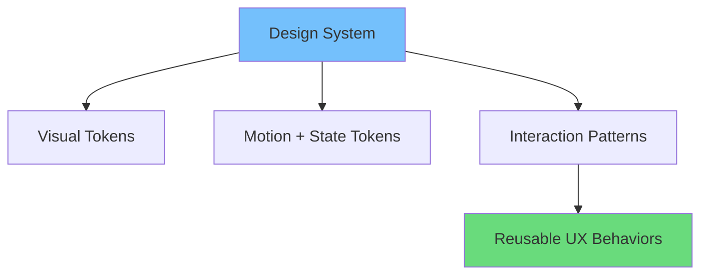
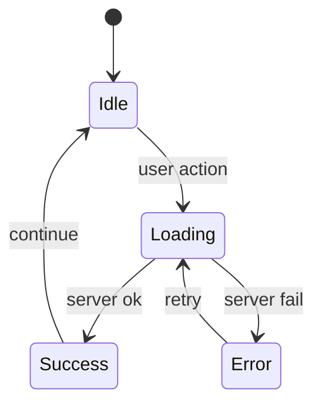

# The Future of Coding: How Vibe Coding is Changing the Landscape

User expectation rapidly change hocche. Aaj user wants:

- instant feedback
- smooth transitions
- highly polished micro-interactions
- personalization

In English: as software becomes commoditized, *experience quality* becomes the differentiator. That’s where vibe coding—interaction-first implementation—starts shaping the broader development landscape.

## Trend 1: Experience becomes a measurable KPI

আগে UI polish “nice to have” chilo. Ekhon metrics আছে:

- INP (interaction responsiveness)
- CLS (visual stability)
- conversion funnel drop-off
- retention

These metrics turn “vibe” into engineering work.

A simple framing:

```math
Business\ Impact \propto Clarity \times Responsiveness \times Trust
```

## Trend 2: Design systems are moving from static to dynamic

Traditional design system:

- colors
- typography
- components

Future design system adds:

- motion tokens
- state tokens
- interaction patterns
- accessibility behavior specs



Bangla note: component library thaklei enough na—component *behave* kora tao standardize korte hobe.

## Trend 3: AI-assisted UI generation raises the baseline

AI tools can generate layouts and code quickly.

So what becomes valuable?

- consistency
- interaction quality
- edge-case handling
- “product feel”

In English: AI can create UI faster, but humans still define meaning, constraints, and the emotional logic of interactions.

## Trend 4: Frontend engineering becomes more product-centric

Vibe coding pushes engineers toward:

- user journeys
- microcopy
- progressive disclosure
- error recovery

This is not “designer’s job only.” It becomes shared ownership.

## Trend 5: Motion and interactivity get more standardized

We will likely see:

- common motion token standards
- accessibility-first motion APIs
- performance-aware animation primitives

And more teams will adopt:

- reduced-motion defaults
- transition guidelines
- testing of interaction latency

## Trend 6: Better tooling for state + transitions

Modern apps are state machines. Tools are evolving:

- state chart libraries
- animation libraries with layout awareness
- server state tools with optimistic update patterns

Think of UI as a graph of transitions:



Bangla: state machine mental model use korle UI predictable hoy.

## Where this changes hiring and team structure

Teams may start valuing:

- UI engineering craft
- accessibility competence
- performance thinking
- design collaboration

New roles emerge/expand:

- design engineer
- UI platform engineer
- motion designer working with code

## Risks and misconceptions

### 1) Over-animating everything

More animation ≠ better vibe.

### 2) Prioritizing vibe over reliability

No amount of motion can hide broken flows.

### 3) Ignoring accessibility

A flashy UI with poor keyboard support is not modern.

## How to prepare your workflow

Practical steps:

1. Define interaction specs in PRDs
2. Add storybook/examples for states
3. Track Web Vitals in CI
4. Add visual regression + interaction tests
5. Establish “UI quality gates” (contrast, focus, CLS)

## Conclusion

Vibe coding is a response to a real shift: users judge software by how it *feels*, not just what it *does*.

The future belongs to teams that treat interactivity, state, motion, and accessibility as core architecture—so every feature ships with a consistent, trustworthy vibe.
