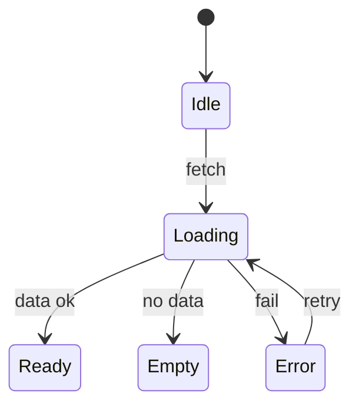
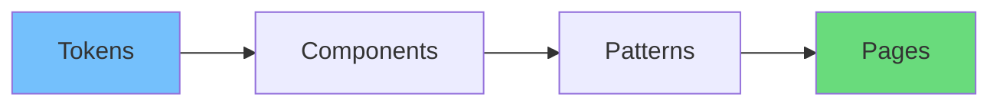
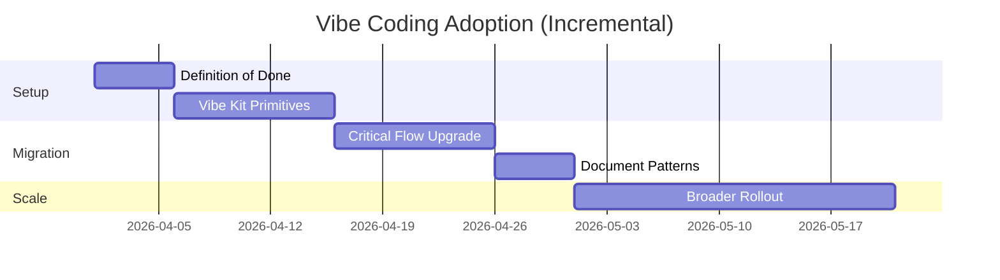

# Practical Guide to Integrating Vibe Coding in Your Development Workflow

Vibe coding jodi sudhu inspiration e thake, team scale korte pare na. Real value আসে jokhon vibe coding becomes **a workflow**—repeatable, reviewable, and testable.

In English: vibe coding should be treated like performance or security—part of the development lifecycle, not an optional final polish.

## 1) Start with a shared definition of “done”

Most teams ship features when:

- happy path works
- API returns correct data

Vibe coding adds:

- loading/error/empty states exist
- interactions have feedback
- motion is intentional
- accessibility is checked
- performance issues are avoided

A “Definition of Done” table you can paste into your workflow:

| Area | Minimum bar | Notes |
|------|-------------|-------|
| States | loading/error/empty/success | no blank screens |
| Feedback | buttons/forms give immediate response | no dead clicks |
| Motion | only meaningful transitions | respect reduced motion |
| A11y | keyboard + focus + labels | test 1 flow |
| Perf | no visible jank/CLS | verify in devtools |

## 2) Add an Interaction Spec step (before coding)

Before writing UI code, write a short **interaction spec**.

Bangla: feature spec e sudhu “ki banabo” na, “kibhabe behave korbe” ta lekho.

Template:

- User goal:
- Primary action:
- States:
  - Loading:
  - Error:
  - Empty:
  - Success:
- Feedback:
  - Instant feedback:
  - Confirmation:
- Motion:
  - Transition(s):
  - Reduced motion fallback:
- Accessibility:
  - Keyboard flow:
  - Announcements:

## 3) Use state maps as your UI blueprint

State map মানে: ekta screen e user ki ki dekhte pare.

In English: this turns UI work into predictable engineering.

## 4) Introduce tokens (spacing, color, motion)

Tokens reduce inconsistency.

Minimum set:

- spacing scale
- typography scale
- color roles (primary, surface, text)
- motion tokens (duration + easing)

A simple token-to-component flow:

## 5) Build a small “Vibe Kit” (reusable primitives)

Instead of re-implementing per page:

- `Skeleton` variants
- `EmptyState`
- `ErrorState` with retry
- `LoadingButton`
- `Toast` pattern

Bangla: 5 ta component banalei 50 ta screen e vibe consistent hoy.

## 6) Make vibe reviewable in PRs

Add a PR checklist section:

- [ ] states implemented (loading/error/empty)
- [ ] buttons have disabled/loading feedback
- [ ] focus states visible
- [ ] reduced motion respected (if animation)
- [ ] no layout shift for images

In English: if it’s not reviewable, it won’t scale.

## 7) Testing: not everything needs E2E, but key flows do

Testing strategy:

- Unit test: pure utils
- Component test: key interactions (click -> loading -> success)
- E2E: 1-2 mission-critical flows

A quick matrix:

| What | Test type | Why |
|------|-----------|-----|
| State transitions | component tests | confidence |
| Navigation flows | E2E | real user path |
| Visual regressions | snapshot/visual | detect drift |

## 8) Performance guardrails

Performance is a vibe dependency.

Practical guardrails:

- track INP/CLS
- limit bundle growth
- avoid heavy re-renders
- virtualize long lists

## 9) Rollout strategy (adopt gradually)

Don’t rewrite everything.

- pick 1 feature area
- build vibe kit primitives
- migrate 3–5 screens
- document patterns
- expand

## Conclusion

Vibe coding workflow e integrate korle team:

- faster ship kore (because patterns exist)
- less bugs pay (state chaos কমে)
- higher user satisfaction pায়

In English: you’re not adding fluff—you’re building a system for consistent, high-quality interactions.
