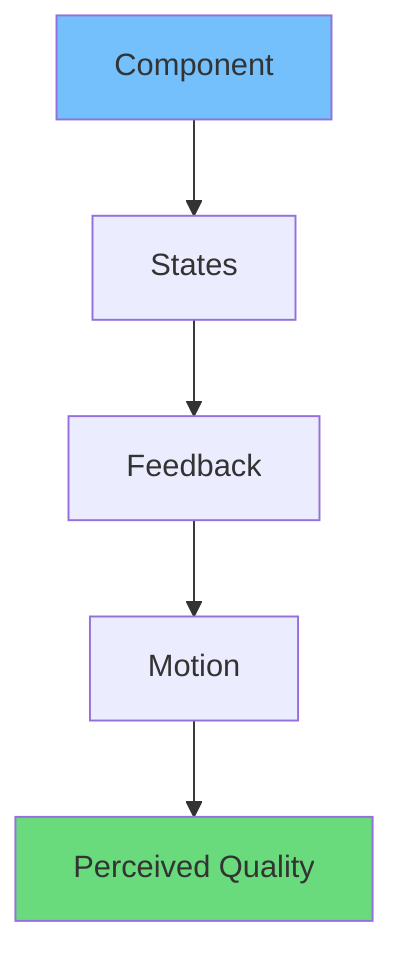

# Mastering Vibe Coding for Beautiful UI Designs

Beautiful UI মানে শুধু “nice colors” না। Beautiful UI মানে:

- easy to scan
- predictable interactions
- calm visual rhythm
- confident feedback

In English: beauty in product UI is often *the absence of friction*.

Vibe coding helps you create that by implementing a repeatable system of spacing, state, and motion.

## 1) Start with rhythm: spacing and typography

Bangla: UI te “beauty” often আসে **spacing** theke. Jodi spacing inconsistent hoy, UI instantly amateur feel দেয়.

Create a simple spacing scale:

- 4, 8, 12, 16, 24, 32, 48

And stick to it.

A typography guideline:

| Token | Size | Line height | Use |
|------|------|-------------|-----|
| `text-sm` | 14px | 1.5 | supporting copy |
| `text-base` | 16px | 1.6 | body |
| `text-xl` | 20px | 1.4 | section titles |
| `text-3xl` | 30–36px | 1.2–1.3 | page headline |

## 2) Design in states, not screens

Every component should have a state story:

- idle
- hover
- active
- disabled
- loading
- error

This is where vibe coding becomes practical.

## 3) Use motion to guide attention

Three motion rules that improve beauty:

1. **Animate only meaningful change**
2. Keep durations short and consistent
3. Prefer transform/opacity

A “motion palette” you can use:

| Intent | Pattern | Why it works |
|--------|---------|--------------|
| confirm click | press down + quick return | tactile feeling |
| open overlay | fade + slight slide | reduces surprise |
| reorder list | smooth layout shift | preserves mental model |

## 4) Build a component “finish checklist”

Before calling a component done:

- does it have a visible focus state?
- are disabled states clear?
- do loading states keep layout stable?
- do errors explain next steps?
- does it respect reduced motion?

In English: finish is a system, not a vibe you “add later.”

## 5) Micro-interactions that make UI feel premium

A few high-impact micro-interactions:

### A) Hover that communicates structure

- card lifts 1–2px
- shadow slightly increases
- image saturates minimally

### B) Press states that feel physical

- button compresses slightly
- subtle color change

### C) Inline validation

- error appears where user is looking
- message is specific

### D) Empty states that are helpful

Empty state should:

- explain why it’s empty
- show a next action

## 6) Beautiful UI is often “fewer things”

Bangla: UI te jodi too many borders, colors, and animations thake, user tired hoy.

Principles:

- use fewer colors
- use one primary accent
- reduce visual noise

## 7) Make transitions consistent across the product

Consistency creates confidence.

A simple product-wide transition guideline:

- hover transitions: 120–180ms
- modal open/close: 200–320ms
- page transitions: very subtle

## 8) Accessibility is part of beauty

Accessible UI often looks better:

- strong contrast
- clear hierarchy
- intentional focus styles

Checklist:

- contrast AA
- keyboard navigation
- semantic headings

## Conclusion

Mastering vibe coding means mastering the details that users don’t explicitly mention—but instantly feel.

If you want beautiful UI designs:

- design rhythm (spacing + type)
- code in states
- motion as communication
- accessibility as default

Do this consistently, and your product will look modern—and feel premium.
