# MLOps Engineering: Building Production-Ready AI Systems

Machine Learning Operations (MLOps) bridges the gap between experimental ML models and production-ready systems that deliver business value. This comprehensive guide explores the architecture, tooling, and practices required to deploy, monitor, and scale AI systems reliably in enterprise environments.

## The ML Lifecycle Architecture

### End-to-End ML Pipeline Flow

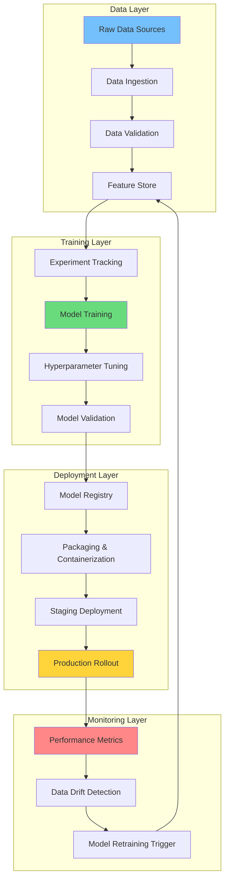

### Component Responsibility Matrix

| Component | Purpose | Tools | Team Owner | SLA |
|-----------|---------|-------|------------|-----|
| **Feature Store** | Centralized feature management | Feast, Tecton | ML Platform | 99.9% |
| **Experiment Tracker** | Reproducibility & comparison | MLflow, Weights & Biases | Data Science | 99.5% |
| **Model Registry** | Version control & lineage | MLflow, Vertex AI | ML Engineering | 99.9% |
| **Serving Infrastructure** | Low-latency predictions | KServe, Seldon | Platform | 99.99% |
| **Monitoring Stack** | Drift & performance tracking | Evidently, WhyLabs | ML Ops | 99.5% |

## Model Training Infrastructure

### Distributed Training Architecture

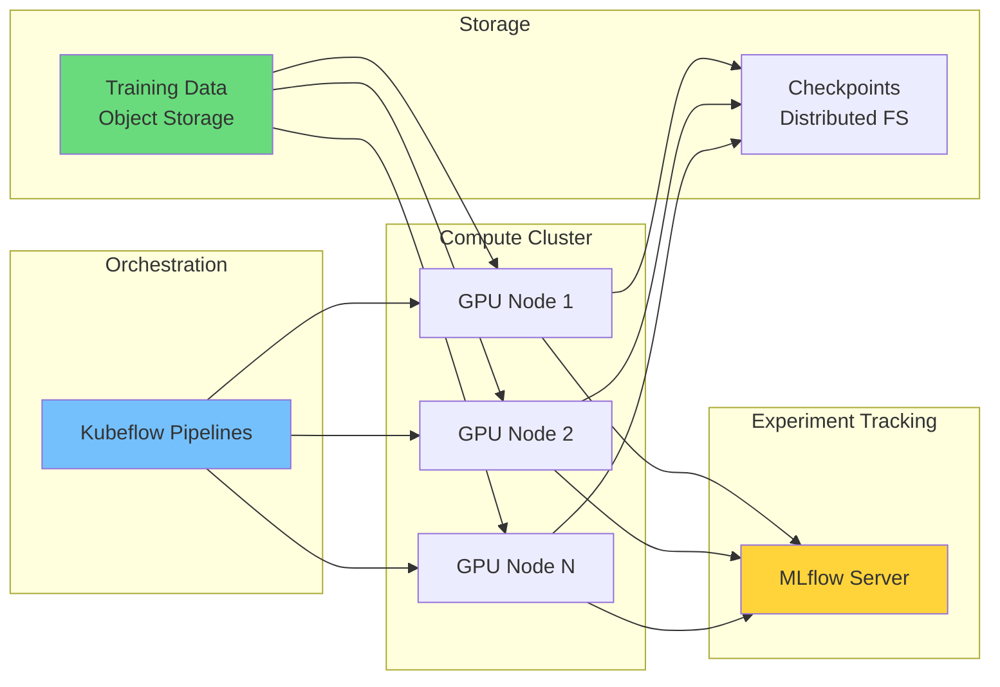

### Training Cost Optimization

```math
Total\ Cost = (GPU\ Hours \times GPU\ Rate) + (Storage\ GB \times Storage\ Rate) + Network\ Egress
```

**Training Efficiency Metrics:**

| Metric | Target | Current | Optimization |
|--------|--------|---------|--------------|
| **GPU Utilization** | >85% | 72% | Mixed precision, gradient accumulation |
| **Checkpoint Frequency** | Every epoch | Every 100 steps | Adaptive checkpointing |
| **Data Loading** | `<5%` overhead | 15% | Prefetching, caching |
| **Model Parallel Efficiency** | >90% | 78% | ZeRO optimization |

### Hyperparameter Search Space

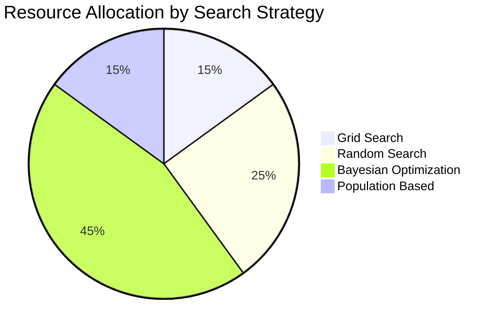

## Model Deployment Patterns

### Deployment Strategy Comparison

| Strategy | Rollout Speed | Risk Level | Complexity | Use Case |
|----------|---------------|------------|------------|----------|
| **Blue-Green** | Fast | Low | Medium | Critical models |
| **Canary** | Gradual | Medium | High | High-traffic models |
| **Shadow** | Immediate | Very Low | Medium | Validation phases |
| **A/B Testing** | Controlled | Medium | High | Business metrics |
| **Feature Flags** | Instant | Low | Low | Emergency rollbacks |

### Canary Deployment Flow

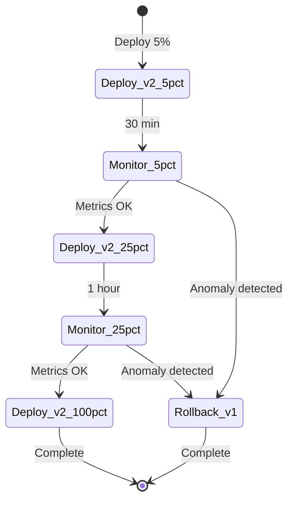

### Inference Latency Distribution

```math
P99\ Latency = \mu + 2.576\sigma \quad \text{for 99th percentile}
```

**Latency Budget Allocation:**

| Operation | Budget (ms) | Actual (ms) | Variance |
|-----------|-------------|-------------|----------|
| **Network Ingest** | 10 | 8 | -20% |
| **Preprocessing** | 25 | 32 | +28% |
| **Model Inference** | 50 | 45 | -10% |
| **Postprocessing** | 10 | 12 | +20% |
| **Response Serial** | 5 | 4 | -20% |
| **Total Budget** | 100 | 101 | +1% |

## Feature Store Architecture

### Feature Computation Pipeline

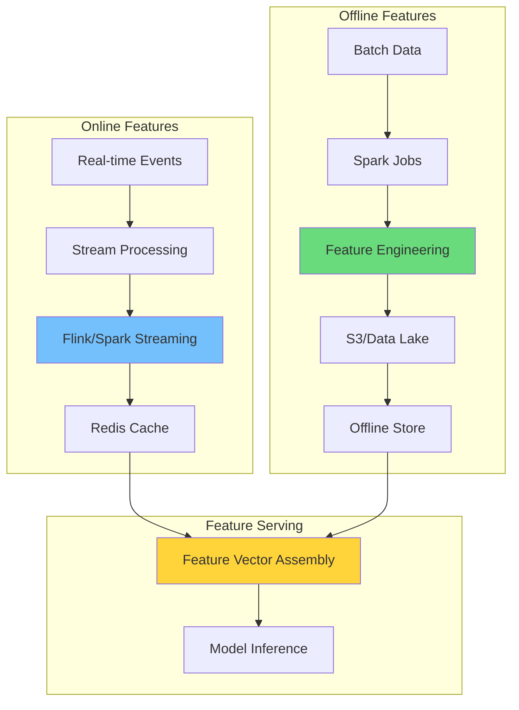

### Feature Freshness Matrix

| Feature Type | Latency | Storage | Update Frequency | Example |
|--------------|---------|---------|------------------|---------|
| **Static** | N/A | Offline | Daily | User demographics |
| **Batch** | Hours | Hybrid | Hourly | Aggregate stats |
| **Near Real-time** | Minutes | Online | 5 min | Session features |
| **Real-time** | `<100ms` | Online | Stream | Click count |

## Model Monitoring Framework

### Drift Detection Architecture

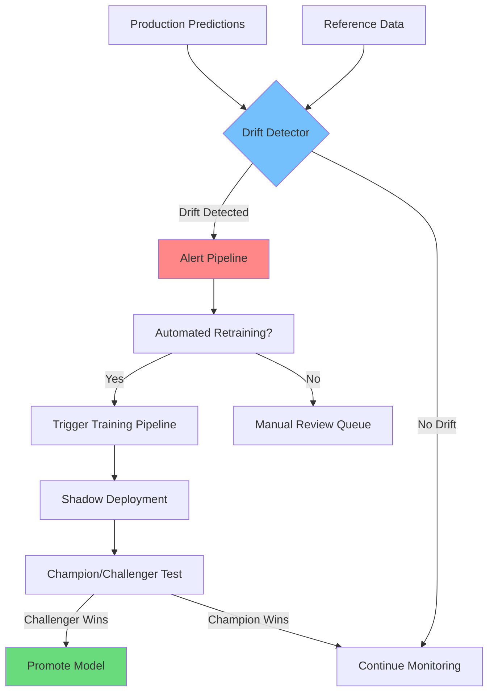

### Statistical Drift Metrics

```math
PSI = \sum_{i=1}^{N} (Actual_i - Expected_i) \times \ln\left(\frac{Actual_i}{Expected_i}\right)
```

**Drift Thresholds by Severity:**

| Metric | Warning | Critical | Action |
|--------|---------|----------|--------|
| **PSI (Population Stability)** | 0.1-0.2 | >0.2 | Retrain |
| **KS Statistic** | 0.05-0.1 | >0.1 | Investigate |
| **Data Drift (JSD)** | 0.1-0.2 | >0.2 | Feature review |
| **Prediction Drift** | 5-10% | >10% | Model review |
| **Concept Drift** | Detected | Confirmed | Architecture review |

## CI/CD for ML

### ML Pipeline Testing Strategy

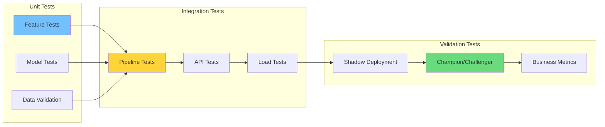

### Test Coverage Requirements

| Test Category | Coverage Target | Current | Priority |
|---------------|-----------------|---------|----------|
| **Data Quality** | 100% | 100% | P0 |
| **Feature Logic** | >90% | 87% | P0 |
| **Model Output** | >85% | 82% | P1 |
| **API Contracts** | 100% | 100% | P0 |
| **Integration** | >80% | 75% | P1 |

## Performance at Scale

### Model Serving Scaling Strategy

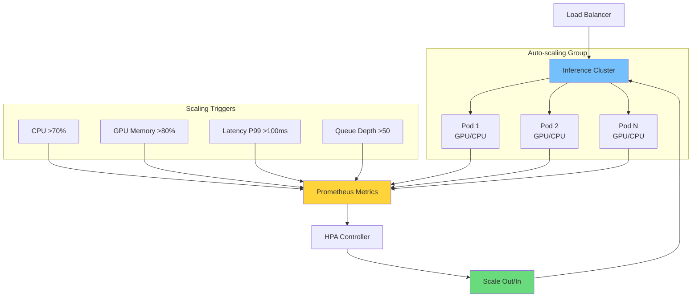

### Cost-Performance Tradeoffs

```math
Cost\ Efficiency = \frac{Predictions\ per\ Second}{Infrastructure\ Cost\ per\ Hour}
```

**Optimization Strategies:**

| Strategy | Latency Impact | Cost Impact | Complexity |
|----------|---------------|-------------|------------|
| **Model Quantization** | +15% | -40% | Medium |
| **Batch Inference** | +200ms | -60% | Low |
| **Model Distillation** | +5% | -30% | High |
| **Caching Layer** | -80% | -20% | Low |
| **GPU Sharing** | +10% | -50% | Medium |

## Governance & Compliance

### Model Governance Workflow

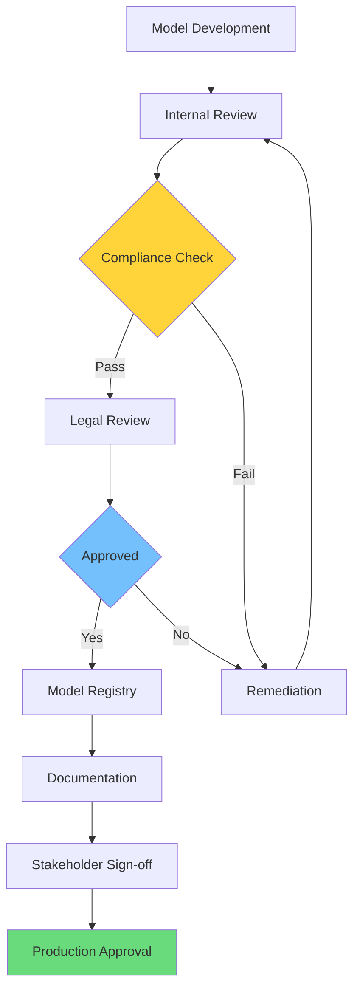

### Compliance Requirements Matrix

| Regulation | Requirement | Implementation | Verification |
|------------|-------------|----------------|--------------|
| **GDPR** | Right to explanation | SHAP values | Audit logs |
| **CCPA** | Data lineage tracking | MLflow tracking | Data map |
| **SOX** | Model change approval | GitOps workflow | Approval gates |
| **FedRAMP** | Security controls | Encryption at rest | Quarterly scans |
| **HIPAA** | PHI handling | De-identification | Access logs |

## Tooling Stack Comparison

### MLOps Platform Evaluation

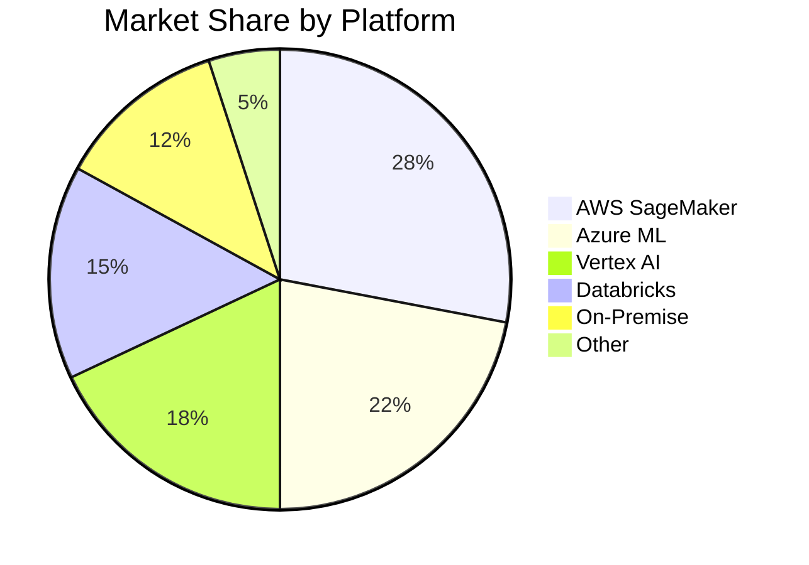

**Capability Comparison:**

| Capability | Open Source | Cloud Native | Enterprise |
|------------|-------------|--------------|------------|
| **Experiment Tracking** | MLflow | SageMaker | Databricks |
| **Pipeline Orchestration** | Kubeflow | Step Functions | Tecton |
| **Feature Store** | Feast | Vertex AI | Tecton |
| **Model Serving** | KServe | SageMaker | Seldon |
| **Monitoring** | Evidently | CloudWatch | WhyLabs |

## Implementation Roadmap

### MLOps Maturity Timeline

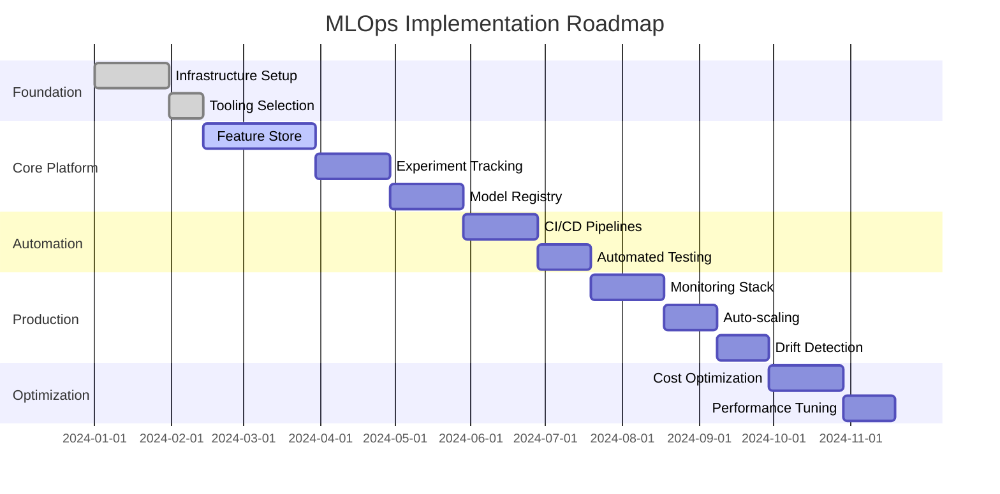

## Conclusion

MLOps is not merely a set of tools but a fundamental shift in how organizations approach machine learning. By treating models as software artifacts with additional ML-specific requirements, teams can achieve the reliability, scalability, and maintainability needed for production AI systems.

> "The best ML model in the world is worthless if it cannot be deployed, monitored, and maintained reliably."

Success in MLOps requires investment across people, processes, and technology. Start with a solid foundation of version control and reproducibility, then progressively add automation, monitoring, and optimization. The journey from experimental notebooks to enterprise-grade ML platforms is challenging but essential for organizations seeking competitive advantage through AI.

The organizations that master MLOps will be the ones that successfully translate AI research into business value at scale.
