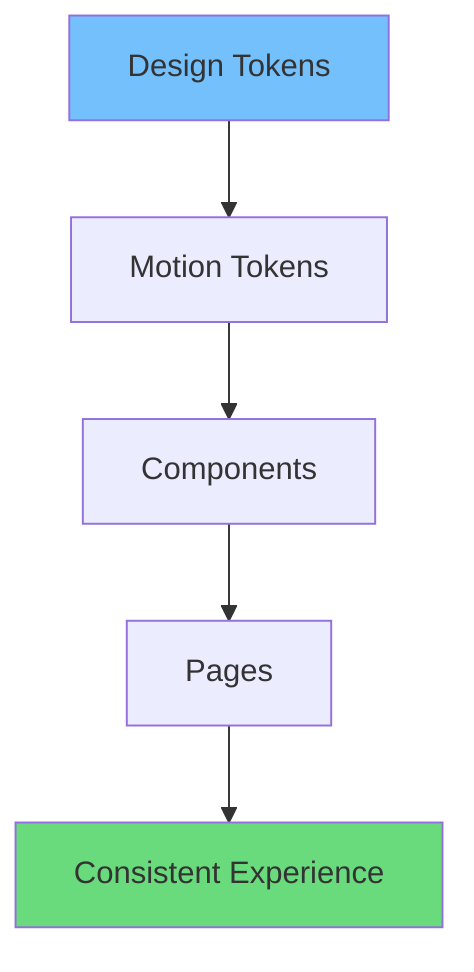
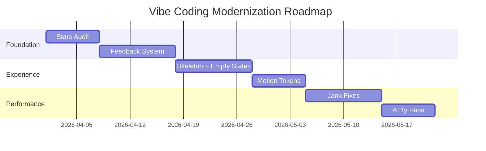

# Transforming Apps with Vibe Coding: Tips for a Modern, Sleek Experience

অনেক app “works” করে—কিন্তু modern feel দেয় না। UI responsive না লাগলে user ভাবে app slow, confusing, or outdated—even when backend fast.

In English: modern UX is largely about *perceived speed*, *clarity*, and *smooth transitions*. Vibe coding is the craft of turning “functional screens” into a cohesive, fluid experience.

## Step 0: Define what “sleek” means (এটা aesthetic না, experience)

Sleek experience usually has:

- **Consistent spacing + typography rhythm**
- **Predictable interaction feedback**
- **Clear state handling** (loading/error/empty/success)
- **Smooth navigation** (no jarring jumps)
- **Performance discipline** (no UI jank)

## Step 1: Fix the “state chaos” first

Most apps feel messy because state is messy.

Create a state map for each important screen:

| Screen | Empty | Loading | Error | Success | Partial |
|-------|-------|---------|-------|---------|---------|
| Feed | new user | initial fetch | retry CTA | list renders | cached list + refresh |
| Profile | no data | fetching | fallback view | profile view | sections load |
| Checkout | no items | price calc | payment fail | order success | validation warnings |

Bangla note: state map likhle tumi instantly bujhte parba UI te kothay gap.

## Step 2: Build a reusable feedback system

A vibe-first app has a consistent “feedback language”.

### A) Buttons

A modern button needs:

- pressed state
- loading state (disable + label change)
- success or failure indication when relevant

### B) Forms

Forms should:

- validate early (on blur)
- show errors near fields
- keep layout stable (avoid jumping)

### C) Notifications

Toasts should be:

- short
- actionable (Undo, Retry)
- consistent placement

## Step 3: Replace spinners with structured skeletons

Spinner মানে “wait”. Skeleton মানে “this is coming, here’s the shape.”

Implementation guidelines:

- Keep skeleton layout close to final layout
- Use subtle shimmer (or static, depending on brand)
- Avoid shifting content when data arrives

A quick decision matrix:

| Loading type | Best UI | Why |
|-------------|---------|-----|
| Small async action (like button save) | inline loader | keeps context |
| Page-level fetch | skeleton | reduces uncertainty |
| Background refresh | subtle indicator | don’t interrupt |

## Step 4: Introduce a motion system (not random animations)

Vibe coding motion should be systematic.

### Motion tokens (design + dev bridge)

Define a small set of motion tokens:

- `duration.fast` (120–160ms)
- `duration.base` (180–240ms)
- `duration.slow` (280–360ms)
- `ease.standard` (ease-in-out)
- `ease.entrance` (ease-out)
- `ease.exit` (ease-in)

Then use them consistently.



## Step 5: Make navigation feel continuous

Traditional approach: click -> hard page jump.

Vibe-first approach:

- preserve scroll position where appropriate
- prefetch likely routes
- animate page transitions lightly
- keep layout stable (avoid CLS)

English: continuity is a trust signal.

## Step 6: Performance polish—remove jank

A sleek experience is impossible without performance.

Practical checks:

- Avoid heavy re-render loops
- Use list virtualization for large lists
- Keep images optimized (proper sizes, modern formats)
- Avoid layout shift (reserve space for media)

A simple “jank risk” score:

```math
Jank\ Risk = (Main\ Thread\ Work) + (Layout\ Shift) + (Overdraw) + (Unbounded\ Lists)
```

## Step 7: Make accessibility part of the vibe

Accessible UI usually feels more “premium” because it’s deliberate.

Checklist:

- Visible focus ring
- Correct heading hierarchy
- ARIA only when needed
- `prefers-reduced-motion` support
- Sufficient contrast

## A practical modernization roadmap

If your app is already in production, refactor gradually:

1. Choose 1–2 critical flows (signup, checkout, search)
2. Add state map + skeletons
3. Create feedback patterns (buttons, forms, toasts)
4. Introduce motion tokens
5. Optimize performance bottlenecks



## Mini case study (quick transformation example)

Bangla: ধরো, profile screen e only spinner chilo. Tumi skeleton add korle user instantly structure pabe. Save button e optimistic UI + toast add korle user confidence barbe. Motion token diye modal open/close consistent hole app professional feel dibe.

In English: small changes compound.

## Conclusion

Vibe coding দিয়ে “costly redesign” ছাড়াও app ke modern করা যায়। Start with what users feel:

- feedback
- state clarity
- continuity
- smoothness

Then build a repeatable system so every new feature inherits the same vibe.
