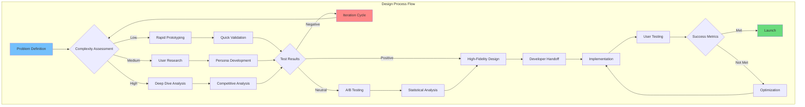
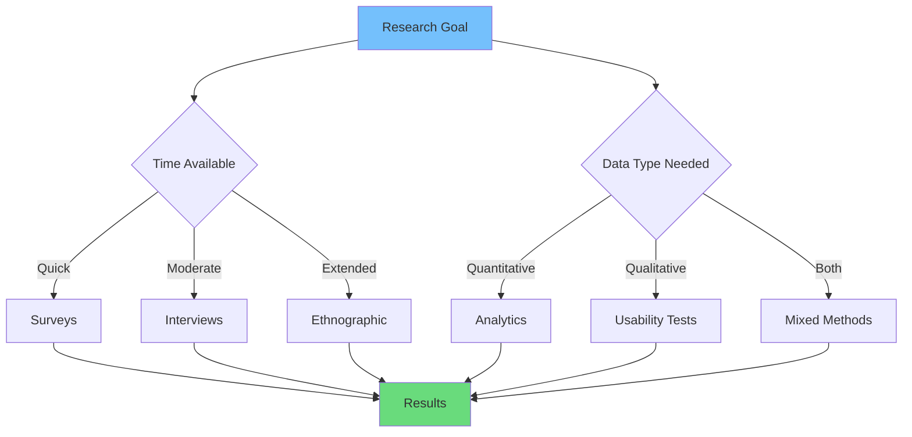

# Mastering UI/UX Design: From Fundamentals to Advanced Patterns

Great design is invisible. When users interact with a well-designed product, they don't notice the design—they simply accomplish their goals with ease and satisfaction. This comprehensive guide explores the principles, processes, and patterns that separate exceptional design from the mediocre.

## Design System Architecture

### Design Decision Matrix



### Color Contrast Calculation Matrix

The WCAG contrast ratio formula:

```math
Contrast Ratio = (L1 + 0.05) / (L2 + 0.05)
```

Where relative luminance is calculated as:

```math
L = 0.2126 × R + 0.7152 × G + 0.0722 × B
```

| Color Combination | Foreground | Background | Contrast Ratio | WCAG AA | WCAG AAA |
|-------------------|------------|------------|----------------|---------|----------|
| Black on White | #000000 | #FFFFFF | 21:1 | ✅ Pass | ✅ Pass |
| Dark Gray on White | #333333 | #FFFFFF | 12.6:1 | ✅ Pass | ✅ Pass |
| Blue on White | #0066CC | #FFFFFF | 5.1:1 | ✅ Pass | ❌ Fail |
| Light Gray on White | #AAAAAA | #FFFFFF | 2.3:1 | ❌ Fail | ❌ Fail |
| White on Dark Blue | #FFFFFF | #003D7A | 9.4:1 | ✅ Pass | ✅ Pass |

### Typography Scale Matrix

| Element | Size (px) | Line Height | Weight | Letter Spacing |
|---------|-----------|-------------|--------|----------------|
| H1 | 48 | 1.2 | 700 | -0.02em |
| H2 | 36 | 1.3 | 600 | -0.01em |
| H3 | 28 | 1.4 | 600 | 0 |
| H4 | 24 | 1.4 | 500 | 0 |
| Body Large | 18 | 1.6 | 400 | 0 |
| Body | 16 | 1.6 | 400 | 0 |
| Small | 14 | 1.5 | 400 | 0.01em |
| Caption | 12 | 1.4 | 500 | 0.02em |

## The Foundations of User-Centered Design

Before diving into pixels and prototypes, we must understand the philosophy that drives effective design.

### Understanding Your Users

The cornerstone of good design is deep empathy for the people who will use your product.

**User Research Sample Size Formula:**

```math
n = (Z^2 × p × (1-p)) / E^2
```

Where:
- `n` = Required sample size
- `Z` = Z-score (1.96 for 95% confidence)
- `p` = Expected proportion (0.5 for maximum variability)
- `E` = Margin of error (0.05 for 5%)

**Usability Testing Effectiveness Matrix:**

| Participants | Problems Found | Cost | Recommended |
|--------------|----------------|------|-------------|
| 5 | 85% | $500 | Small projects |
| 10 | 95% | $1,000 | Medium projects |
| 15 | 99% | $1,500 | Enterprise |

**User Satisfaction Score Calculation (CSAT):**

```math
CSAT = (Number of satisfied users / Total responses) × 100
```

**Net Promoter Score Formula:**

```math
NPS = %Promoters - %Detractors
```

| Score Range | Category | Action |
|-------------|----------|--------|
| -100 to 0 | Poor | Major improvements needed |
| 0 to 30 | Good | Continue monitoring |
| 30 to 70 | Great | Maintain strengths |
| 70 to 100 | Excellent | Industry leading |

**Research Methods Flowchart:**



**User Research Methods:**

1. **Qualitative Research**
   - User interviews (structured, semi-structured, unstructured)
   - Ethnographic studies and contextual inquiry
   - Diary studies for longitudinal insights
   - Focus groups for exploratory understanding

2. **Quantitative Research**
   - Surveys and questionnaires
   - Analytics and behavioral data analysis
   - A/B testing and multivariate testing
   - Card sorting for information architecture

3. **Mixed Methods**
   - Usability testing (moderated and unmoderated)
   - Tree testing for navigation validation
   - First-click testing for interface efficiency
   - Eye-tracking for visual attention analysis

**Creating User Personas:**

Personas are fictional representations of your user segments. Effective personas include:
- Demographic information
- Goals and motivations
- Pain points and frustrations
- Technical proficiency
- Context of use
- Quote that captures their attitude

**Journey Mapping:**

Visualize the complete user experience across time and touchpoints:
- Actions users take
- Thoughts and feelings
- Pain points and opportunities
- Touchpoints with your product
- Supporting evidence from research

### Design Thinking Methodology

The five-phase process for creative problem solving:

**1. Empathize**
- Immerse yourself in user context
- Conduct interviews and observations
- Challenge assumptions
- Build empathy through direct experience

**2. Define**
- Synthesize research findings
- Identify patterns and insights
- Frame problems as opportunities
- Create point-of-view statements

**3. Ideate**
- Generate diverse solutions
- Use brainstorming techniques
- Defer judgment during generation
- Build on others' ideas

**4. Prototype**
- Create tangible representations
- Start low-fidelity, increase fidelity
- Focus on specific aspects
- Build to think, not just to validate

**5. Test**
- Put prototypes in front of users
- Observe without leading
- Gather feedback iteratively
- Refine and repeat

## Visual Design Principles

The aesthetic layer of design follows established principles that create harmony, hierarchy, and meaning.

### Color Theory and Application

**Understanding Color Psychology:**

Colors evoke emotional responses and cultural associations:
- **Blue:** Trust, stability, professionalism (finance, healthcare)
- **Green:** Growth, health, sustainability (wellness, environment)
- **Red:** Urgency, passion, energy (sales, entertainment)
- **Purple:** Luxury, creativity, wisdom (beauty, education)
- **Orange:** Friendly, energetic, affordable (youth brands)
- **Yellow:** Optimism, clarity, warmth (food, communication)

**Building Color Systems:**

A robust color system includes:
- **Primary colors:** Brand identity colors
- **Secondary colors:** Supporting palette
- **Neutral colors:** Grayscale for text and backgrounds
- **Semantic colors:** Success, warning, error, info
- **Accessibility-tested combinations:** WCAG AA compliance minimum

**Color Accessibility:**

Ensure sufficient contrast ratios:
- Normal text: 4.5:1 minimum
- Large text: 3:1 minimum
- UI components and graphics: 3:1 minimum

Tools: WebAIM Contrast Checker, Stark, Contrast

### Typography Mastery

**Selecting Typefaces:**

Consider these factors when choosing fonts:
- Brand personality and voice
- Content type and length
- Technical requirements (character sets, features)
- Performance implications (file size, loading)
- Licensing and cost

**Type Scale and Hierarchy:**

Establish clear visual hierarchy:
- Use a modular scale (1.25, 1.5, or 1.618 ratios)
- Limit to 2-3 typefaces maximum
- Differentiate through size, weight, and color
- Maintain consistent vertical rhythm

**Readability Best Practices:**

- Line length: 45-75 characters ideal
- Line height: 1.5-1.7 for body text
- Paragraph spacing: 1.5-2x line height
- Adequate letter spacing for all caps
- Avoid justified text on the web

### Layout and Composition

**Grid Systems:**

Grids bring structure and consistency:
- **Column grids:** Magazines, newspapers, dashboards
- **Modular grids:** Complex layouts with strict alignment
- **Baseline grids:** Typography-focused vertical rhythm
- **Hierarchical grids:** Organic, content-driven layouts

**The Rule of Thirds and Golden Ratio:**

Classic composition techniques:
- Place focal points at intersection points
- Use asymmetrical balance for visual interest
- Apply golden ratio (1:1.618) for proportions
- Break rules intentionally for emphasis

**Whitespace (Negative Space):**

Space is an active design element:
- Creates visual breathing room
- Establishes relationships between elements
- Guides attention and reduces cognitive load
- Conveys elegance and sophistication

**Proximity and Grouping:**

Related elements belong together:
- Use consistent spacing to show relationships
- Separate unrelated elements
- Apply the Gestalt principle of proximity
- Create visual "chunks" for easier processing

### Visual Hierarchy and Attention

**Directing User Attention:**

Guide users through your interface:
1. **Size:** Larger elements attract more attention
2. **Color:** Contrasting colors draw the eye
3. **Contrast:** High contrast stands out
4. **Alignment:** Breaking alignment creates emphasis
5. **Whitespace:** Isolation highlights importance
6. **Movement:** Animation captures attention

**F-Pattern and Z-Pattern:**

Understanding natural reading patterns:
- **F-Pattern:** Text-heavy content (scan left edge, occasional right)
- **Z-Pattern:** Visual content (top left → top right → diagonal → bottom left → bottom right)
- Design for scanning, not just reading

## Interaction Design Principles

How users interact with your interface is as important as how it looks.

### Affordances and Signifiers

**Affordances:**
The properties of objects that suggest how they can be used:
- Buttons look pressable
- Inputs look typeable
- Links look clickable
- Sliders look draggable

**Signifiers:**
Visual cues that communicate affordances:
- Underlines for links
- Shadows for elevation
- Arrows for direction
- Icons for actions

**Digital vs. Physical:**

Screens lack physical affordances, so we rely on:
- Skeuomorphism (real-world metaphors)
- Flat design with clear signifiers
- Material Design's elevation system
- Neumorphism (subtle shadows and highlights)

### Feedback and Response

Users need to know their actions had effect:

**Types of Feedback:**

1. **Immediate feedback** - Instant response to input
2. **Progressive feedback** - Ongoing status updates
3. **Completion feedback** - Confirmation of success
4. **Error feedback** - Clear explanation of problems

**Feedback Mechanisms:**

- Visual changes (color, size, opacity)
- Motion and animation
- Haptic feedback (mobile)
- Sound (use sparingly)
- Text messages and toasts

### Consistency and Standards

**Types of Consistency:**

1. **Internal consistency** - Same patterns within your product
2. **External consistency** - Follow platform conventions
3. **Functional consistency** - Similar actions work similarly
4. **Visual consistency** - Unified aesthetic language

**Platform Guidelines:**

Follow established patterns:
- iOS Human Interface Guidelines
- Material Design (Android)
- Fluent Design (Windows)
- WCAG for accessibility

**When to Break Conventions:**

Innovate when:
- Current solutions are genuinely problematic
- You have strong evidence for improvement
- The change provides clear value
- You can educate users effectively

### Error Prevention and Recovery

**Preventing Errors:**

- Constraints that limit invalid input
- Defaults that guide correct choices
- Confirmations for destructive actions
- Undo functionality wherever possible

**Handling Errors Gracefully:**

- Clear, human-readable error messages
- Specific guidance for resolution
- Preserve user input when possible
- Offer alternative paths forward

## Information Architecture

Organizing and structuring content for findability and understanding.

### Navigation Systems

**Types of Navigation:**

1. **Global navigation** - Persistent, primary navigation
2. **Local navigation** - Context-specific, secondary navigation
3. **Contextual navigation** - Embedded within content
4. **Supplementary navigation** - Sitemaps, indexes, guides
5. **Social navigation** - Tags, popularity, recommendations
6. **Personal navigation** - History, favorites, recent items

**Navigation Patterns:**

- **Hamburger menu:** Space-efficient, discoverability concerns
- **Tab bar:** Highly visible, limited items
- **Drawer:** Flexible, can include rich content
- **Mega menu:** Deep hierarchies, many options
- **Breadcrumbs:** Orientation and quick backtracking
- **Search:** Essential for large content repositories

### Content Organization

**Organization Schemes:**

1. **Exact organization** - Alphabetical, chronological, geographical
2. **Ambiguous organization** - Topical, task-oriented, audience-specific
3. **Hybrid approaches** - Combine multiple schemes

**Card Sorting:**

Understand how users categorize content:
- **Open card sort:** Users create their own categories
- **Closed card sort:** Users sort into predefined categories
- **Remote tools:** Optimal Workshop, Maze, UserTesting

**Taxonomy and Metadata:**

Create robust classification systems:
- Controlled vocabularies
- Faceted classification
- Folksonomies (user-generated tags)
- Semantic markup and structured data

### Search Experience Design

**Search Interface Components:**

- Prominent, accessible search box
- Auto-suggestions and autocomplete
- Scoped search (filter by category)
- Advanced search options
- Recent and saved searches

**Search Results Design:**

- Clear, scannable result listings
- Rich snippets with relevant metadata
- Filtering and sorting options
- Empty states with helpful guidance
- Pagination or infinite scroll (choose wisely)

## Advanced UI Patterns and Components

### Form Design Excellence

Forms are critical conversion points—optimize them carefully.

**Form Structure:**

- Group related fields logically
- Use multi-step forms for complexity
- Show progress indicators for long forms
- Place action buttons at the end

**Input Design:**

- Use appropriate input types
- Provide clear, visible labels
- Use placeholder text sparingly
- Implement inline validation
- Show password requirements upfront
- Support autofill and password managers

**Validation and Error Handling:**

- Validate on blur for correction
- Validate on submit for completion
- Use inline messaging, not alerts
- Be specific about errors
- Suggest corrections when possible
- Celebrate successful completion

### Data Visualization

Present complex data clearly and beautifully.

**Chart Selection Guide:**

- **Comparisons:** Bar charts, column charts
- **Trends over time:** Line charts, area charts
- **Proportions:** Pie charts (use sparingly), donut charts, treemaps
- **Relationships:** Scatter plots, bubble charts
- **Distributions:** Histograms, box plots, violin plots
- **Geographic:** Maps, choropleths, cartograms

**Visualization Best Practices:**

- Start axes at zero for bar charts
- Use consistent color scales
- Label directly when possible
- Provide context and annotations
- Make interactive elements discoverable
- Ensure accessibility with patterns and labels

**Dashboard Design:**

- Prioritize information hierarchy
- Use consistent time ranges
- Enable drill-down for details
- Support customization
- Design for different screen sizes

### Complex Interface Patterns

**Data Tables:**

- Fixed headers for long tables
- Horizontal scroll for many columns
- Sortable and filterable columns
- Row actions and bulk operations
- Expandable rows for details
- Empty and loading states

**Filters and Faceted Search:**

- Show active filters clearly
- Allow multiple selections
- Display result counts
- Enable quick clearing
- Save filter combinations
- Adapt to mobile with bottom sheets

**Onboarding Flows:**

- Progressive disclosure of features
- Contextual tooltips and coach marks
- Interactive tutorials for complex tasks
- Skip options for experienced users
- Personalization based on role
- Celebrate early wins

## Mobile and Responsive Design

Designing for the full spectrum of devices and contexts.

### Responsive Design Strategies

**Approaches:**

1. **Mobile-first:** Design for smallest screens first
2. **Desktop-first:** Traditional approach, harder to simplify
3. **Content-first:** Let content determine breakpoints
4. **Device-agnostic:** Focus on content relationships

**Breakpoint Strategy:**

Common breakpoints (but always test with your content):
- 320px: Small mobile
- 375px: Mobile
- 768px: Tablet
- 1024px: Small desktop
- 1440px: Desktop
- 1920px: Large desktop

**Fluid Grids and Flexible Images:**

- Use relative units (%, em, rem, vw, vh)
- Implement max-width constraints
- Serve appropriately sized images
- Test at all intermediate sizes

### Mobile-Specific Considerations

**Touch Interface Design:**

- Minimum 44×44pt touch targets (Apple)
- Minimum 48×48dp touch targets (Material)
- Adequate spacing between targets
- Account for thumb zones
- Support gestures appropriately
- Provide visual feedback for touches

**Mobile Constraints:**

- Limited screen real estate
- Variable network conditions
- Battery considerations
- One-handed usage patterns
- Interrupted usage contexts
- Diverse input methods

**Mobile Navigation Patterns:**

- Bottom navigation bars
- Floating action buttons
- Pull-to-refresh
- Swipe gestures
- Bottom sheets for secondary content
- Full-screen modals for focus

### Cross-Platform Consistency

**Platform Adaptation:**

- Respect platform conventions
- Use native components when possible
- Adapt navigation patterns
- Follow platform gesture systems
- Match typography to platform
- Consider platform-specific features

**Brand Consistency:**

- Maintain core visual identity
- Use consistent color and imagery
- Unify interaction principles
- Sync content and data
- Create coherent experience across touchpoints

## Accessibility and Inclusive Design

Design for the full range of human diversity.

### WCAG Compliance

**Four Principles (POUR):**

1. **Perceivable** - Information must be presentable
2. **Operable** - Interface components must be navigable
3. **Understandable** - Information and operation must be clear
4. **Robust** - Content must work with assistive technologies

**Conformance Levels:**

- **A:** Minimum level (must have)
- **AA:** Standard level (should have) - legal requirement in many jurisdictions
- **AAA:** Enhanced level (nice to have)

### Designing for Screen Readers

**Semantic HTML:**

- Use correct heading hierarchy (h1-h6)
- Employ landmarks (main, nav, aside, footer)
- Label form inputs properly
- Provide alternative text for images
- Use tables for tabular data only

**ARIA When Needed:**

- Use native HTML elements first
- Add ARIA for custom components
- Keep ARIA attributes current
- Test with actual screen readers

### Visual Accessibility

**Color Independence:**

- Don't rely solely on color
- Use patterns, icons, and labels
- Provide text alternatives
- Test with color blindness simulators

**Motion and Animation:**

- Respect `prefers-reduced-motion`
- Avoid flashing or strobing effects
- Provide pause controls for auto-playing content
- Make animations optional

### Cognitive Accessibility

- Use plain language
- Break complex tasks into steps
- Provide clear instructions and help
- Offer multiple ways to complete tasks
- Support extended timeouts
- Avoid time-limited interactions

## Design Systems and Scalability

Creating sustainable design at scale.

### Design System Components

**Foundation Layer:**

- Color palette and usage rules
- Typography scale and styles
- Spacing and sizing scales
- Grid systems and breakpoints
- Iconography and imagery
- Motion and animation principles

**Component Library:**

- Buttons and actions
- Form elements
- Navigation components
- Data display components
- Feedback components
- Layout components

**Pattern Library:**

- Common page layouts
- User flow patterns
- Content patterns
- Empty states and error states
- Loading and skeleton states

### Design Tokens

Abstract design decisions into reusable values:

```json
{
  "color": {
    "primary": {
      "base": { "value": "#0066CC" },
      "hover": { "value": "#0052A3" },
      "active": { "value": "#003D7A" }
    }
  },
  "spacing": {
    "small": { "value": "8px" },
    "medium": { "value": "16px" },
    "large": { "value": "24px" }
  }
}
```

**Benefits:**

- Single source of truth
- Cross-platform consistency
- Theme support (light/dark modes)
- Easy maintenance and updates
- Developer handoff efficiency

### DesignOps and Workflow

**Tools and Integration:**

- Figma, Sketch, or Adobe XD for design
- Storybook for component documentation
- Zeroheight or Notion for design system docs
- Abstract or Git for version control
- Tokens Studio for design token management

**Governance Model:**

- Define contribution guidelines
- Establish review processes
- Create deprecation strategies
- Measure adoption and impact
- Maintain roadmaps and priorities

## Emerging Trends and Future of UI/UX

### AI and Machine Learning in Design

**Personalization:**

- Adaptive interfaces based on behavior
- Predictive content and actions
- Intelligent defaults and suggestions
- Dynamic difficulty adjustment

**Design Assistance:**

- AI-powered design tools (Galileo AI, Uizard)
- Automated accessibility checking
- Content generation and optimization
- Usability testing with synthetic users

**Ethical Considerations:**

- Transparency about AI involvement
- User control over personalization
- Avoiding manipulation and dark patterns
- Data privacy and consent

### Immersive Experiences

**Augmented Reality (AR):**

- Spatial interface design
- Contextual information overlay
- Gesture and voice interaction
- Real-world constraints and safety

**Virtual Reality (VR):**

- 3D spatial design principles
- Comfort and motion considerations
- Controller and hand tracking
- Social presence and avatars

**Mixed Reality:**

- Blending physical and digital
- Attention management across realities
- Seamless transitions between modes

### Voice and Conversational UI

- Natural language understanding
- Conversation flow design
- Multi-modal experiences
- Personality and tone of voice
- Error recovery strategies

### Sustainable and Ethical Design

- Digital carbon footprint awareness
- Dark mode for energy savings
- Minimal data collection
- Longevity and repairability
- Inclusive representation
- Ethical persuasion patterns

## Measuring Design Success

### Quantitative Metrics

**Engagement:**
- Time on task
- Task completion rate
- Feature adoption
- Return visit rate
- Net Promoter Score (NPS)

**Business Impact:**
- Conversion rate
- Revenue per user
- Customer acquisition cost
- Lifetime value
- Support ticket reduction

**System Performance:**
- Page load time
- Error rates
- Accessibility scores
- Design system adoption

### Qualitative Methods

**Usability Testing:**
- Moderated sessions
- Unmoderated remote testing
- Guerrilla testing
- Hallway testing
- Longitudinal studies

**Surveys and Feedback:**
- In-app feedback
- Customer satisfaction (CSAT)
- Customer effort score (CES)
- System usability scale (SUS)

### Continuous Improvement Process

1. **Define success metrics** aligned with business goals
2. **Establish baselines** through current state analysis
3. **Set targets** based on benchmarks and aspirations
4. **Implement tracking** for ongoing measurement
5. **Analyze regularly** to identify trends and issues
6. **Iterate based on insights** and test changes
7. **Report and communicate** findings to stakeholders

## Conclusion

UI/UX design is a discipline that combines creativity, psychology, technology, and business strategy. The best designers are perpetual students—constantly learning about users, technology, and the evolving landscape of digital experiences.

As you apply the principles and patterns in this guide, remember that guidelines are meant to inform, not constrain. Every project, every user base, and every context is unique. Use these foundations as a starting point, validate with real users, and evolve your approach based on evidence.

The future of design is increasingly complex—spanning multiple devices, contexts, and modalities. But the core principle remains unchanged: understand your users deeply, design with empathy, and never stop iterating toward better solutions.

> "Design is not just what it looks like and feels like. Design is how it works." — Steve Jobs

Create experiences that don't just work, but delight, empower, and make a meaningful difference in people's lives.
