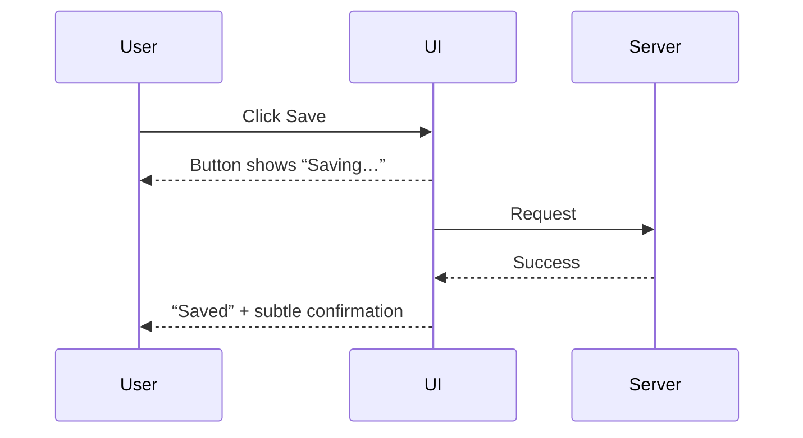
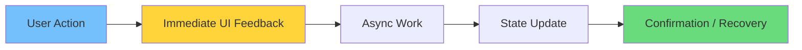

# Vibe Coding for Beginners: How to Get Started

Vibe coding shunle onekei vabe: “eta ki just animation?” Actually na. Vibe coding মানে UI ke **user-friendly, responsive, and clear** banানো—interaction + feedback + state design er মাধ্যমে।

In English: vibe coding is about building interfaces that *feel alive* and *reduce user uncertainty*.

এই পোস্টটা beginners der jonno—so heavy theory না, বরং practical, repeatable steps.

## What vibe coding is (simple version)

Vibe coding মানে:

- user action er instant feedback
- loading/error/empty state clear kora
- smooth transitions (subtle)
- consistent UI behavior

In English: vibe coding is interaction craftsmanship—small details done consistently.

## What vibe coding is NOT

- Only fancy animations
- Only gradients
- Only “cool UI”

If it looks cool but confusing, vibe fails.

## The beginner mindset: stop thinking “pages”, start thinking “states”

Bangla: page banano easy, but page-er state banano hard. Beginners ra mostly state ignore kore—then UI broken feel হয়.

In English: most UX bugs are state bugs.

### Common UI states you must learn

| State | Meaning | Example UI |
|------|---------|-----------|
| Idle | nothing happening | normal button |
| Hover/Focus | user is about to act | hover style / focus ring |
| Pressed | user acted | pressed feedback |
| Loading | work in progress | “Saving…” + disabled |
| Success | done | “Saved” confirmation |
| Error | failed | inline message + retry |
| Empty | nothing to show | empty state + CTA |

## The beginner mindset: design in states

Start with one component—like a button.

Button states:

- idle
- hover
- pressed
- disabled
- loading

Bangla: prothome 1 ta component e full state implement korlei vibe coding start.

## Your first “Vibe Spec” (copy/paste template)

Before coding, write this in 2 minutes:

1. User goal:
2. Primary action:
3. Loading state:
4. Error state:
5. Success confirmation:
6. Accessibility:
7. Performance risks:

In English: a tiny spec prevents random, inconsistent behavior.

## Your first vibe coding checklist

1. Add a visible focus ring
2. Add a pressed state
3. Add loading state that disables clicks
4. Show success confirmation
5. Handle error with a retry message

### Bonus checklist (when you’re comfortable)

6. Add an empty state with a next action
7. Prevent layout shift (reserve image space)
8. Respect `prefers-reduced-motion`

## A simple example flow (mentally)

In English: immediate feedback first, eventual truth after.

## A beginner-friendly architecture: feedback first, then data

Even if your backend is perfect, UI will feel broken if you don’t show feedback.

Bangla: UI first sign dibe, then backend result diye truth finalize hobe.

## Beginner tools you can use (optional)

You don’t need complex libraries.

Start with:

- CSS transitions
- good component structure
- small reusable UI primitives

Later you can explore:

- animation libraries
- server-state tools

## Your first set of reusable primitives (Vibe Kit)

Beginners der jonno best move: 4–5 ta reusable component বানানো.

Suggested “Vibe Kit”:

- `LoadingButton`
- `Skeleton`
- `EmptyState`
- `ErrorState` (with retry)
- `Toast` (optional)

In English: reuse creates consistency, consistency creates vibe.

## Common beginner mistakes

- Animating everything
- Ignoring accessibility
- No loading state
- Errors shown as generic alerts

More mistakes to watch:

- showing spinner but keeping the button clickable (double submit)
- using hover effects as the only affordance (mobile issue)
- adding animation that changes layout (causes jank)

## Practice exercises (hands-on)

### Exercise 1: Upgrade one button

Goal: a “Save” button that feels premium.

Requirements:

- pressed feedback
- loading disables repeated clicks
- success confirmation
- error with retry

### Exercise 2: Replace a page spinner with a skeleton

Goal: reduce uncertainty.

Rules:

- skeleton layout matches final UI
- avoid heavy shimmer

### Exercise 3: Add an empty state

Goal: user knows next step.

Include:

- explanation
- primary CTA

## A 7-day learning roadmap

Day 1: button + focus states

Day 2: form validation + errors

Day 3: skeleton loading

Day 4: toast notifications

Day 5: modal accessibility

Day 6: performance basics (avoid layout shift)

Day 7: build a small page with consistent patterns

### What to build on Day 7 (small project idea)

Build a “Todo + Save” page:

- list todos
- add todo
- show loading skeleton
- show empty state
- show errors and retry

This small project will teach you 80% of vibe coding fundamentals.

## FAQ

### 1) Vibe coding start korte Framer Motion lagbe?

Na. Start with simple CSS transitions + correct states.

### 2) Vibe coding মানে কি UI-only?

Mostly UI-focused, but it touches data flow: optimistic updates, retries, caching.

### 3) How do I know I’m improving?

You’ll see:

- fewer “confusing UI” issues
- fewer double submits
- users complete tasks faster

Also track:

- INP and CLS (Core Web Vitals)

### 4) Should I animate everything for modern feel?

No. Animate meaningful changes only.

## Conclusion

Vibe coding beginners der jonno best start holo small:

- one component
- clear states
- consistent feedback

In English: build a tiny system, then expand it.

Start today with just one improvement: upgrade one button’s state system. That single habit will change how your entire UI feels.
