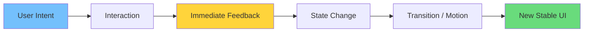
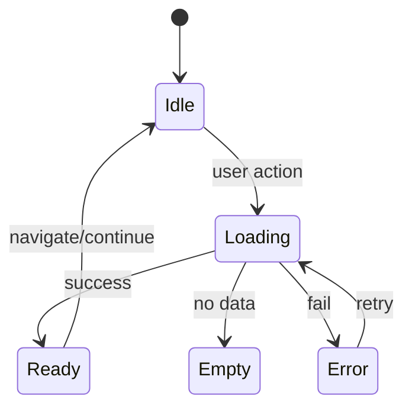

# Vibe Coding: A New Era of Interactive User Interfaces

Vibe coding bolte ami ekhane ekta **interaction-first mindset** bujhaite chai—jekhane UI ke “screen” na vebe **responsive, alive, and emotionally readable** ekta system hisebe treat করা হয়। Traditional UI implementation e amra onek shomoy *component বানাই*, pore interactivity add করি. Vibe coding e ul্টো: **interaction, motion, feedback, state** এগুলা first-class citizen.

In English: vibe coding is a practical approach to building UI that *feels* fast, smooth, and intentional—by designing motion, micro-interactions, and state transitions as part of the core architecture.

This article is a deep, practical overview—so you can apply vibe coding without turning your codebase into an animation playground.

## Why “vibe” matters (কেন feel important)

User ra usually code dekhe na; tara feel kore:

- **Responsiveness** (click korle immediately response)
- **Continuity** (navigation e “jump” na hoy)
- **Clarity** (loading, error, success—sob state understandable)
- **Delight** (subtle animation, good spacing, consistent visuals)

A good vibe is not decoration. It’s a usability multiplier.

In English: a good vibe is a *trust signal*. Users trust products that acknowledge their actions quickly and explain what’s happening.

## Vibe coding vs “pretty UI”

Vibe coding মানে শুধু gradient + animation না। এটা হলো:

- **State-driven motion** (state change => motion communicates meaning)
- **Predictable feedback loops** (hover/focus/press/disabled)
- **Accessible interactivity** (keyboard + screen reader friendly)
- **Performance-aware smoothness** (avoid jank, layout shift)

If your UI looks beautiful but doesn’t respond, users won’t call it premium. They’ll call it broken.

## The Vibe UI Loop: Think in feedback cycles

User action -> system reaction -> user confirmation.



Bangla explanation: user click/scroll/type kore. UI instantly “sign” দেয় (button press, ripple, skeleton). Then real state update hoy. Then UI smoothly new state e transition kore, jate user confuse na hoy.

## The mental model: UI as a state machine (শুধু “screen” না)

Most modern UIs are basically state machines. If you don’t model the states, you’ll ship invisible bugs:

- “double submit”
- stale data flicker
- error messages that disappear
- loading spinners that never stop

In English: vibe coding works best when you treat UI as a controlled set of states and transitions.



## Core pillars of vibe coding

### 1) Interaction-first component design

Instead of only:

- Props
- Markup
- CSS

Think:

- **States**: idle, hover, active, loading, error, success
- **Transitions**: how it moves between states
- **Boundaries**: what re-renders, what animates

A practical checklist:

| UI Element | Must-have states | Motion purpose | Accessibility |
|-----------|------------------|---------------|---------------|
| Button | idle/hover/pressed/disabled/loading | confirm action | focus ring, aria-busy |
| Form | normal/invalid/submitting/success | reduce anxiety | aria-invalid, error text |
| Card | idle/hover/selected | scanability | semantic headings |
| Modal | open/close | context switch | focus trap, ESC |

**Bangla tip:** prottek component er jonno “state story” likho. Eta code review e helpful hoy.

### 2) Fluid layout instead of rigid layout

Fluid design মানে screen size, content size, and user settings (like `prefers-reduced-motion`) respect করা।

In English: fluid design is a layout system that adapts *without breaking rhythm*.

Practical rules:

- Use **content-driven** spacing scales (rem-based)
- Avoid “magic numbers” for heights
- Embrace **max-width constraints** for readable lines
- Build a consistent **typography scale**

Common fluid-layout pitfalls:

- fixed heights for cards (content overflow)
- no space reserved for images (layout shift)
- giant line-length (hard to read)

### 3) Motion as communication

Animation মানে “wow” না—animation মানে **communication**.

- Open modal => user understands “new layer”
- Loading => user understands “work is happening”
- Success => user understands “done”

A motion guideline table:

| Motion type | When to use | Typical duration | Avoid when |
|------------|-------------|------------------|------------|
| Fade | small state change | 120–200ms | user needs spatial info |
| Slide | navigation/overlay | 200–320ms | causes layout shift |
| Scale | emphasis | 150–220ms | too many elements animate |
| Skeleton shimmer | fetching | continuous | reduced-motion preference |

**English reminder:** motion is a language. If you use random timing and easing, you’re basically speaking with inconsistent grammar.

### 4) Performance is part of the vibe

If your UI drops frames, the vibe breaks.

Key practical ideas:

- Prefer **transform/opacity** animations (GPU friendly)
- Avoid layout thrash (don’t animate `height` repeatedly)
- Keep expensive calculations out of render
- Use React patterns like memoization and virtualization when needed

A simple “smoothness” approximation:

```math
Perceived\ Smoothness \approx \frac{Frames\ Delivered}{Frames\ Expected} \times Feedback\ Clarity
```

### 5) Accessibility is not optional (A11y = premium feel)

Bangla: keyboard diye jodi app use করা না যায়, UI modern na—just shiny.

In English: accessibility improves vibe because it reduces uncertainty and adds clear structure.

Minimum bar:

- visible focus styles
- labels for inputs
- semantic headings
- no “hover-only” critical actions
- reduced motion support

## Design-to-code: turning “vibe” into implementation rules

To keep vibe consistent, define system-level rules.

### Feedback rules (simple but powerful)

| Situation | Immediate feedback | Ongoing feedback | Completion feedback |
|----------|---------------------|------------------|---------------------|
| Button triggers API | pressed state | label: “Saving…” | “Saved” or inline error |
| Page fetch | skeleton | subtle refresh indicator | content render |
| Form submit | disable submit | inline progress | success page or field errors |
| Search | input reacts instantly | debounce + loading indicator | results + empty state |

### Layout stability rules (CLS prevention)

CLS breaks the vibe because the UI “moves under the cursor.”

Practical fixes:

- reserve media dimensions
- don’t insert banners above content without space
- keep error messages from changing layout drastically

## UI/UX implementation patterns that create vibe

### Pattern A: “Instant feedback, eventual truth”

Bangla: user click korlei UI immediate feedback (pressed state) dey, kintu API call async vabe hoy. Success hole state finalize, error hole rollback.

English: optimistic UI with safe rollback.

When to use:

- Like/Bookmark
- Toggle settings
- Add to cart

**Risk management checklist (Bangla + English):**

- Only optimistic update idempotent actions
- Keep a rollback snapshot
- Provide a retry path
- Show error that explains what happened

### Pattern B: Skeletons instead of spinners

Spinners user ke wait koray. Skeleton user ke **structure** dey.

Best practices:

- Skeleton shape should match real content layout
- Don’t animate too aggressively
- Replace progressively (partial data shows early)

When a spinner is fine:

- tiny actions (e.g., button saving)
- background sync (don’t block UI)

### Pattern C: Microcopy + motion pair

A small text + subtle motion = high clarity.

Example:

- “Saving…” + subtle pulse
- “Saved” + check icon pop
- “Couldn’t save” + shake + retry

**Microcopy rules:**

- be specific (“Couldn’t save settings” > “Error”)
- offer next step (“Retry” / “Check connection”)
- keep tone consistent

### Pattern D: Empty states that push action

Empty state মানে “nothing” না। Empty state মানে “next action”.

| Empty state type | What it means | Best UI |
|------------------|---------------|---------|
| New user empty | nothing created yet | explain + primary CTA |
| No results | filter too strict | suggest relaxing filters |
| Permission empty | user can’t see data | explain access + contact |
| Error empty | something failed | retry + status info |

### Pattern E: Progressive disclosure

Bangla: shob info ekbar e dile UI heavy hoy. Step-by-step dile user calm thake.

In English: show the minimum needed for the next decision.

## Tooling (stack-agnostic, but modern web friendly)

You can implement vibe coding with many stacks. In a typical Next.js + Tailwind setup:

- **CSS transitions** + Tailwind utilities
- **Framer Motion** for complex gestures
- **React Aria** / headless UI patterns for accessibility
- **TanStack Query** for server-state and optimistic updates

Important note: tools are optional—mindset is primary.

## A practical “Vibe Spec” you can write before coding

Before building a screen, write a short spec:

1. **User goal**: what’s the primary outcome?
2. **Critical actions**: click, type, scroll, drag?
3. **States**: loading/error/empty/success
4. **Feedback**: what happens instantly?
5. **Motion**: where is motion needed for clarity?
6. **A11y**: keyboard flow, focus order, announcements
7. **Perf budget**: what’s the target device and FPS?

This tiny spec prevents random animations and inconsistent behaviors.

## Common mistakes (যা vibe নষ্ট করে)

- Over-animating everything
- Loading states hidden (user unsure what’s happening)
- Hover-only interactions (mobile ignores it)
- Inconsistent spacing/typography
- “Fast machine bias” (dev PC smooth, low-end phone janky)
- Using motion to hide poor information architecture

## FAQ

### 1) Vibe coding কি শুধু frontend animation?

না। Animation vibe coding er ekta part. মূল বিষয় হলো **feedback + state clarity + consistency**.

In English: motion is optional; interaction quality is not.

### 2) Vibe coding implement korte ki heavy library lagbe?

Na. CSS transitions + disciplined state handling diye onekটা vibe পাওয়া যায়.

### 3) Vibe coding কি performance খারাপ করে?

Badly done vibe coding performance খারাপ করে. But real vibe coding is performance-aware: fewer, lighter, meaningful transitions.

### 4) How do I measure vibe?

You can proxy it with metrics:

- INP (responsiveness)
- CLS (stability)
- task completion rate
- support tickets about “confusing UI”

## Conclusion

Vibe coding is not a trendy label—it’s a reminder: **interactions are the product**. When you treat motion, feedback, and states as core architecture, your UI becomes easier to use, more trustworthy, and more memorable.

If you want to adopt vibe coding in your projects, start small:

- Upgrade one button’s state system
- Replace one spinner with a skeleton
- Add one meaningful transition

Then scale the approach into a repeatable UI engineering practice.
