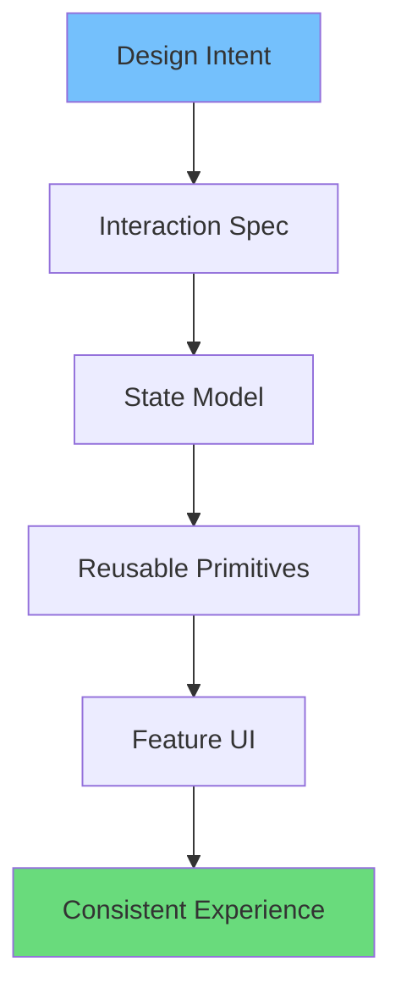
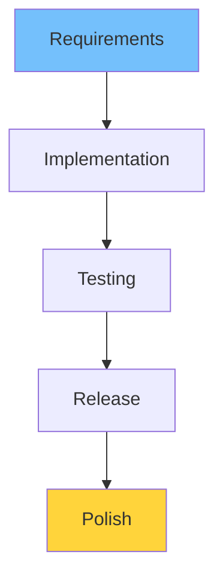
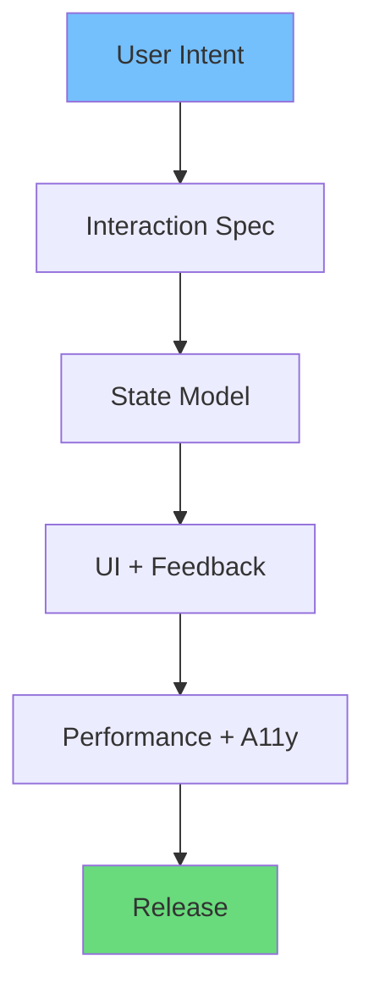
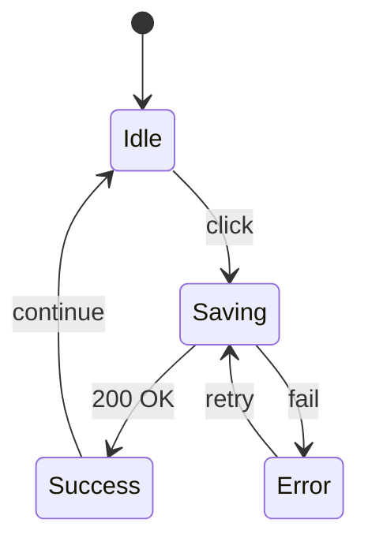

# Vibe Coding vs Traditional Coding: What’s the Difference?

Traditional coding e amra usually feature complete করি—UI dekhe “thik ache” mone hole ship করি। Kintu user experience এর বড় অংশ আসে **how it behaves**: click korle koto fast response, transitions kemon, state clear kina.

In English: vibe coding is a shift from “build screens” to “build interactions and feedback systems.”

This post will help you decide when to use which approach, what tradeoffs exist, and how to adopt vibe coding without losing maintainability.

## Quick definition (২ লাইনে)

- **Traditional coding**: requirements -> UI -> functionality -> polish (sometimes)
- **Vibe coding**: requirements -> user intent -> interaction + state + feedback -> UI as a system

## The core difference: what you optimize for

Traditional coding optimizes for:

- correctness
- feature completeness
- maintainability

Vibe coding optimizes for:

- perceived speed
- clarity of state
- emotional friction reduction
- consistency across interactions

Both matter. Vibe coding doesn’t replace engineering fundamentals—it adds a UX-centric layer.

## The “same feature” in two mindsets (a concrete framing)

Bangla: ekta feature—like “Save settings”—duibhabe implement kora jay.

### Traditional mindset

- Backend endpoint banano
- UI te button
- click -> request -> done

### Vibe mindset

- user intent: “I want to feel safe that my change saved”
- interaction spec: pressed, saving, success, error + retry
- state model: prevent double submit, handle offline
- motion + microcopy for clarity

In English: vibe coding starts with the user’s anxiety, not the server’s correctness.

## Comparison matrix

| Area | Traditional coding | Vibe coding | Practical outcome |
|------|--------------------|------------|-------------------|
| Starting point | UI layout | user intent + interaction | better task flow |
| Success criteria | feature works | feature feels smooth + clear | higher retention |
| Loading states | spinner | skeleton + progressive render | less anxiety |
| Motion | optional polish | communication tool | better comprehension |
| Errors | generic alerts | inline guidance + recovery | fewer drop-offs |
| Accessibility | later | part of definition | inclusive quality |
| Performance | “optimize later” | perceived performance first | less jank |

## What changes in your codebase architecture

Traditional UI code often becomes:

- “render data” components
- a few loading flags
- ad-hoc error handling

Vibe-oriented UI code tends to have:

- explicit state transitions
- reusable feedback primitives
- consistent motion rules
- shared empty/error/loading patterns



## Workflow difference: where decisions live



Traditional approach often treats polish as the end.

Vibe coding flips it:



Bangla note: interaction spec মানে “click করলে কী হবে”, “error হলে কী হবে”, “loading এ layout কেমন থাকবে”—এগুলো আগে decide করা।

## Tradeoffs (honest) — vibe coding costs something

Vibe coding usually increases:

- upfront thinking time
- number of states to implement
- QA scenarios

But it decreases:

- support tickets (“button কাজ করে না”)
- user drop-off
- future inconsistency cost

In English: vibe coding is an investment in UX debt reduction.

## A decision framework: when should you apply vibe coding?

Use vibe coding heavily when:

- the flow is revenue-critical (checkout, booking)
- the action is irreversible (delete, payment)
- the user repeats the task frequently (dashboards)
- latency is noticeable (slow APIs)

Use lighter vibe coding when:

- internal admin tools
- prototypes
- simple static pages

Decision matrix:

| Factor | Low | High |
|--------|-----|------|
| Frequency of use | rare | daily |
| Risk of mistakes | low | high |
| User anxiety | low | high |
| Latency | negligible | noticeable |
| Brand importance | low | high |

If 3+ factors are “High”, vibe coding pays off quickly.

## Where vibe coding is most useful

### 1) Consumer-facing products

- ecommerce
- social apps
- fintech
- booking/travel

Because experience directly impacts conversion.

### 2) Tools with repeated workflows

- dashboards
- admin panels
- analytics tools

Repeated tasks benefit massively from predictable feedback.

### 3) Apps with complex state

- real-time feeds
- collaborative editing
- multi-step forms

Vibe coding helps avoid “state confusion.”

## When traditional coding is enough

Not every UI needs heavy vibe work.

Examples:

- internal scripts and one-off tools
- prototypes where speed > polish
- backend-focused services

But even then, a tiny vibe layer (clear errors + stable layout) helps.

## Concrete example: a “Save” button

Traditional version:

- click
- disable
- show spinner
- done

Vibe coding version:

- immediate pressed feedback
- optimistic label (“Saving…”) with inline progress
- success micro-feedback (“Saved”) + subtle icon
- error with recovery (“Retry”)

This doesn’t require huge engineering. It requires intentional design.

### Extended example: mapping states (Bangla + English)

| State | UI | Why it matters |
|------|----|----------------|
| Idle | “Save” enabled | clear action |
| Pressed | button compress + immediate feedback | prevents double click |
| Saving | label “Saving…” + disable | sets expectation |
| Success | “Saved” + subtle confirmation | closure |
| Error | inline message + retry | recovery |



## The hidden cost: inconsistency

Traditional coding e jodi prottek dev আলাদা style e interactions implement করে, app e inconsistent feel আসে:

- some buttons animate, some don’t
- some errors show toasts, some inline
- some pages use skeleton, some spinner

Vibe coding pushes you toward systems:

- motion tokens
- feedback patterns
- reusable state components

## Measuring outcomes (SEO-friendly practical metrics)

Vibe improvements can be tracked with:

- **INP**: interaction responsiveness
- **CLS**: layout stability
- **Task completion rate**: fewer abandoned flows
- **Error recovery rate**: how many users retry and succeed

Simple relationship:

```math
Engagement \propto Responsiveness \times Clarity \times Recovery
```

## A practical adoption plan

Start small:

1. Define a standard for `loading` / `error` / `empty` states
2. Create a consistent button + form feedback library
3. Add motion guidelines and honor reduced motion
4. Track Web Vitals (CLS/INP) and fix visible issues

## FAQ

### 1) Vibe coding কি মানে extra animation?

না। Vibe coding মানে primarily **state clarity + feedback loops**. Motion only supports communication.

### 2) Vibe coding কি maintainability কমায়?

Ad-hoc vibe work maintainability কমাতে পারে। But system-based vibe coding (tokens + primitives + patterns) maintainability বাড়ায়.

### 3) Traditional coding কি “wrong”?

না। Traditional coding often perfect for low-risk, low-frequency flows. Vibe coding is about prioritization.

### 4) How do we avoid over-design?

Define a minimum bar (loading/error/empty + basic feedback), and only add motion where it improves comprehension.

## Conclusion

Vibe coding is not “more CSS” or “more animation.” It’s better product thinking inside code.

Traditional coding gives you a working product.

Vibe coding gives you a product that feels fast, confident, and modern—without sacrificing maintainability.
