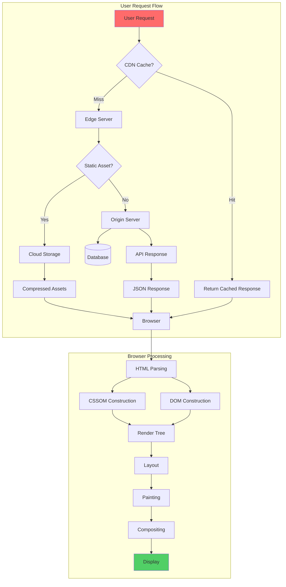
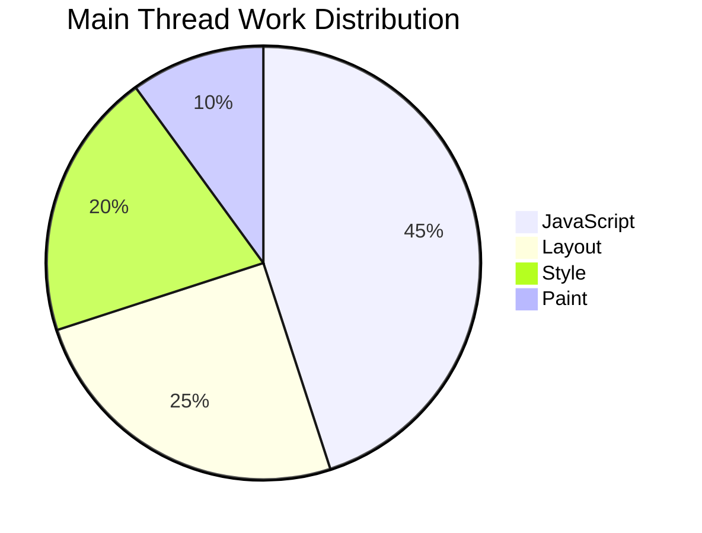
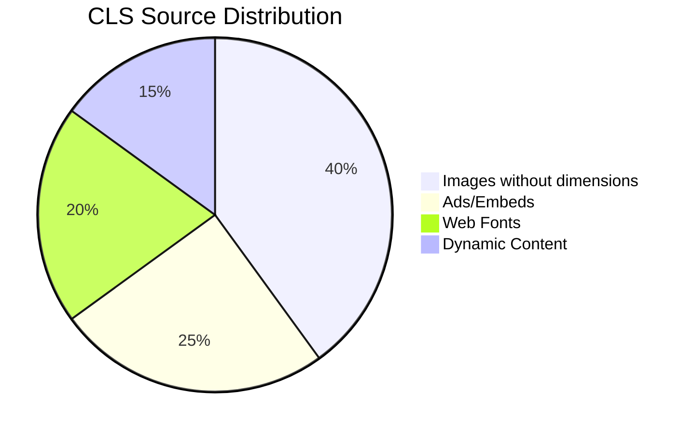

# The Complete Guide to Modern Web Performance Optimization

In today's digital landscape, web performance isn't just a technical metric—it's a fundamental business requirement. Studies consistently show that every second of load time can impact conversion rates, user satisfaction, and search engine rankings. This comprehensive guide will walk you through everything you need to know about building blazing-fast web applications.

## Performance Metrics Overview

### The Performance Equation

The relationship between performance metrics and business outcomes can be expressed as:

```math
R = R_0 × e^(-λt)
```

Where:
- `R` = Conversion rate
- `R_0` = Baseline conversion rate
- `λ` = Decay constant (typically 0.1-0.3)
- `t` = Load time in seconds

### Web Performance Architecture Flow



### Performance-ROI Matrix

| Metric | < 1s | 1-2s | 2-3s | 3-5s | > 5s |
|--------|------|------|------|------|------|
| Conversion Rate | 100% | 92% | 78% | 54% | 31% |
| Bounce Rate | 8% | 12% | 24% | 42% | 65% |
| User Satisfaction | 95% | 88% | 72% | 48% | 22% |
| SEO Ranking | Excellent | Good | Fair | Poor | Critical |

## Why Performance Matters More Than Ever

The digital ecosystem has evolved dramatically over the past decade. Users now access the web from diverse devices, networks, and contexts. From high-end desktops on fiber connections to budget smartphones on 3G networks in emerging markets, your application needs to perform well everywhere.

### The Business Case for Performance

Let's look at the numbers that make performance a board-level priority:

- **Amazon found that every 100ms of latency cost them 1% in sales**
- **Google discovered that 53% of mobile users abandon sites that take longer than 3 seconds to load**
- **Pinterest increased search engine traffic and sign-ups by 15% when they reduced perceived wait times by 40%**
- **AutoAnything cut load times in half and saw revenue increase by 13%**

These aren't isolated cases. The correlation between performance and business metrics is consistent across industries and company sizes.

### The Technical Reality

Modern web applications have grown increasingly complex. Single Page Applications (SPAs), rich media content, real-time features, and third-party integrations all compete for resources. Without deliberate optimization, applications can easily become bloated and sluggish.

## Core Web Vitals: The New Standard

Google's Core Web Vitals have become the industry benchmark for measuring user experience. These three metrics focus on loading, interactivity, and visual stability:

### Largest Contentful Paint (LCP)

LCP measures loading performance. It marks the point in the page load timeline when the largest content element becomes visible within the viewport.

**Target:** 2.5 seconds or less

**Key factors affecting LCP:**
- Server response times
- Resource load times (images, videos, iframes)
- Render-blocking JavaScript and CSS
- Client-side rendering architecture

**Optimization strategies:**

1. **Optimize your server** - Use caching, CDNs, and efficient database queries
2. **Preload critical resources** - Use `<link rel="preload">` for fonts and hero images
3. **Optimize images** - Serve modern formats (WebP, AVIF), implement responsive images
4. **Eliminate render-blocking resources** - Inline critical CSS, defer non-critical JavaScript
5. **Upgrade hosting** - Consider edge computing solutions for global audiences

### First Input Delay (FID) / Interaction to Next Paint (INP)

FID measures interactivity—the time from when a user first interacts with your page to when the browser begins processing event handlers. INP is the emerging successor that provides a more comprehensive view of responsiveness.

**Target:** 100 milliseconds or less

**Interactivity Score Calculation:**

```math
INP = max(T1, T2, T3, ..., Tn)
```

Where each interaction duration is:

```math
Tinteraction = Tpresentation_delay + Tprocessing_time + Tpresentation_time
```

**Long Task Calculation Matrix:**

| Task Type | Threshold | Penalty | Weight |
|-----------|-----------|---------|--------|
| Script Execution | >50ms | 1.5x | 40% |
| Layout | >30ms | 2.0x | 25% |
| Style Calculation | >20ms | 1.2x | 20% |
| Paint | >15ms | 1.0x | 15% |

**Thread Work Distribution:**



**Key factors affecting interactivity:**
- Long-running JavaScript tasks
- Heavy computation on the main thread
- Inefficient event handlers
- Large component trees in frameworks

**Optimization strategies:**

1. **Break up long tasks** - Use `scheduler.yield()` or break work into smaller chunks
2. **Defer non-critical JavaScript** - Load analytics, ads, and widgets after interaction
3. **Use web workers** - Offload heavy computations to background threads
4. **Minimize main thread work** - Audit and optimize your JavaScript bundles
5. **Implement code splitting** - Load only what the user needs, when they need it

### Cumulative Layout Shift (CLS)

CLS measures visual stability—the sum of all unexpected layout shifts that occur during the entire lifespan of the page.

**Target:** 0.1 or less

**CLS Mathematical Formula:**

```math
CLS = Σ(Impact Fraction × Distance Fraction)
```

Where:
- `Impact Fraction` = Area of viewport affected by shift / Total viewport area
- `Distance Fraction` = Distance moved / Viewport dimension

**Example Calculation:**

```math
Impact Fraction = 0.5 (half the screen)
Distance Fraction = 0.1 (10% movement)
Layout Shift Score = 0.5 × 0.1 = 0.05
```

**CLS Score Matrix:**

| Score Range | Rating | User Impact |
|-------------|--------|-------------|
| 0 - 0.1 | Good | No noticeable disruption |
| 0.1 - 0.25 | Needs Improvement | Minor annoyance |
| > 0.25 | Poor | Significant frustration |

**Common Layout Shift Sources:**



**Common causes of layout shifts:**
- Images without dimensions
- Ads, embeds, and iframes without reserved space
- Dynamically injected content
- Web fonts causing FOIT/FOUT

**Optimization strategies:**

1. **Always include size attributes on images** - Use `width` and `height` or aspect-ratio
2. **Reserve space for dynamic content** - Set min-height on containers
3. **Optimize font loading** - Use `font-display: swap` and preload critical fonts
4. **Avoid inserting content above existing content** - Prefer placing new content below the fold
5. **Use CSS transforms for animations** - Avoid triggering layout recalculations

## Advanced Image Optimization

Images typically account for the largest portion of page weight. Proper optimization can dramatically improve load times without sacrificing visual quality.

### Modern Image Formats

**WebP** offers 25-35% smaller file sizes compared to JPEG and PNG while maintaining quality. It's now supported by all modern browsers.

**AVIF** represents the next generation, providing 50% smaller files than JPEG with better quality. Support is growing rapidly.

**Implementation approach:**

```html
<picture>
  <source srcset="image.avif" type="image/avif">
  <source srcset="image.webp" type="image/webp">
  
</picture>
```

### Responsive Images

Serve appropriately-sized images based on device characteristics:

```html

```

### Lazy Loading

Defer offscreen images to prioritize critical content:

```html

```

### Content Delivery Networks (CDNs)

Image CDNs like Cloudinary, Imgix, or Cloudflare Images can automatically:
- Convert formats on-the-fly
- Resize and crop images
- Apply compression
- Serve from edge locations

## JavaScript Optimization Techniques

JavaScript is often the biggest contributor to poor interactivity metrics. Here's how to keep it lean and efficient.

### Bundle Analysis and Code Splitting

Start by understanding what you're shipping:

1. **Analyze your bundles** - Use tools like webpack-bundle-analyzer or @vite/bundle-analyzer
2. **Identify duplicates** - Look for multiple versions of the same library
3. **Find large dependencies** - Consider lighter alternatives
4. **Implement route-based splitting** - Load code only for the current route
5. **Use dynamic imports** - Defer non-critical functionality

### Tree Shaking and Dead Code Elimination

Modern bundlers can eliminate unused code, but you need to help them:

- Use ES modules (`import`/`export`) instead of CommonJS
- Import specific functions rather than entire libraries
- Avoid side-effect-heavy imports that prevent tree shaking
- Use `sideEffects: false` in your package.json when appropriate

### Third-Party Script Management

Third-party scripts are performance killers. Be ruthless:

1. **Audit every script** - Question if each one provides sufficient value
2. **Load asynchronously** - Use `async` or `defer` attributes
3. **Implement lazy loading** - Load non-critical scripts after user interaction
4. **Self-host when possible** - Avoid DNS lookups and additional connections
5. **Use facades** - Load lightweight placeholders that load heavy scripts on interaction

### Framework-Specific Optimizations

**React:**
- Use React.memo for pure components
- Implement useMemo and useCallback judiciously
- Code split with React.lazy and Suspense
- Consider Server Components in Next.js App Router

**Vue:**
- Use keep-alive for component caching
- Implement lazy loading with defineAsyncComponent
- Leverage Vue's automatic tree shaking

**Svelte:**
- Benefit from compile-time optimizations
- Use the Svelte compiler to eliminate unused code

## CSS Optimization Strategies

While CSS is typically less impactful than JavaScript, poor CSS architecture can still hurt performance.

### Critical CSS Extraction

Identify and inline the CSS needed for above-the-fold content:

1. **Analyze your critical path** - Use tools like Critical or Penthouse
2. **Inline critical styles** - Include them in your HTML head
3. **Load remaining CSS asynchronously** - Use `media="print"` with onload handler

### CSS Containment

Use `contain` property to limit browser work:

```css
.card {
  contain: layout style paint;
}
```

This tells the browser that changes within `.card` won't affect the rest of the page.

### Modern Layout Methods

CSS Grid and Flexbox are more performant than older layout methods. They reduce the need for JavaScript-based layouts and enable GPU acceleration.

## Server-Side Rendering and Edge Computing

The architecture of your application significantly impacts performance.

### Static Site Generation (SSG)

For content that doesn't change frequently, pre-render at build time:

**Advantages:**
- Fastest possible delivery from CDN
- Minimal server processing
- Excellent cacheability
- Great for SEO

**Tools:** Next.js, Astro, Eleventy, Hugo, Jekyll

### Server-Side Rendering (SSR)

Render on the server for dynamic content:

**Advantages:**
- Fresh content on every request
- Faster Time to First Byte than client-side rendering
- Better SEO than pure SPAs
- Can personalize content

### Edge Rendering

Deploy your rendering logic to edge locations near your users:

**Platforms:** Vercel Edge, Cloudflare Workers, Netlify Edge

**Benefits:**
- Sub-50ms response times globally
- Reduced origin server load
- Dynamic content at static speeds

### Streaming Architecture

Modern frameworks support streaming HTML:

1. **Progressive enhancement** - Ship critical HTML immediately
2. **Lazy loading boundaries** - Stream non-critical components as they resolve
3. **Suspense boundaries** - Show fallbacks while data loads

## Caching Strategies

Effective caching can make returning visits lightning fast.

### HTTP Caching

Configure proper cache headers:

```
Cache-Control: public, max-age=31536000, immutable
```

For versioned assets (with content hashes), use long-term caching. For HTML and API responses, use shorter times or stale-while-revalidate.

### Service Workers

Implement offline-first strategies:

1. **Cache static assets** - Store CSS, JS, and images locally
2. **Implement network strategies** - Cache-first, network-first, or stale-while-revalidate
3. **Background sync** - Queue requests for when connectivity returns
4. **Workbox** - Use Google's library to simplify service worker implementation

### State Management Caching

Cache application state to avoid unnecessary API calls:

- Use SWR or React Query for data fetching
- Implement optimistic updates for better perceived performance
- Persist state to localStorage or IndexedDB for instant hydration

## Performance Monitoring and Measurement

You can't improve what you don't measure.

### Real User Monitoring (RUM)

Collect performance data from actual users:

**Metrics to track:**
- Core Web Vitals
- Time to First Byte (TTFB)
- First Contentful Paint (FCP)
- Time to Interactive (TTI)
- Custom business metrics

**Tools:**
- Google Analytics 4
- Web Vitals library
- New Relic
- Datadog

### Synthetic Testing

Run controlled tests in consistent environments:

**Tools:**
- Lighthouse CI
- WebPageTest
- GTmetrix
- Pingdom

**Best practices:**
- Test from multiple locations
- Test on various device types
- Establish performance budgets
- Fail builds that exceed budgets

### Performance Budgets

Set and enforce limits on your application's weight:

```json
{
  "budgets": [
    {
      "type": "bundle",
      "name": "app",
      "maximumWarning": "250kb",
      "maximumError": "500kb"
    }
  ]
}
```

## Emerging Technologies and Future Trends

Stay ahead of the curve with these emerging approaches.

### Speculation Rules API

Pre-render likely next navigations:

```html
<script type="speculationrules">
{
  "prerender": [
    {"source": "list", "urls": ["/about", "/contact"]}
  ]
}
</script>
```

### View Transitions API

Create smooth page transitions:

```javascript
document.startViewTransition(() => {
  // Update DOM
});
```

### Compression Dictionary Transport

Share compression dictionaries across requests for better compression ratios on repeated content.

### Priority Hints

Use `fetchpriority` to guide resource loading:

```html


```

## Building a Performance Culture

Technical optimizations matter, but sustainable performance requires organizational commitment.

### Performance Champions

Designate performance owners who:
- Review performance impacts of new features
- Maintain performance monitoring
- Educate team members on best practices
- Advocate for performance in planning meetings

### Performance in the Development Lifecycle

1. **Design phase** - Consider performance implications of new features
2. **Development** - Profile code before merging
3. **Code review** - Include performance checks in review criteria
4. **Testing** - Run automated performance tests in CI/CD
5. **Deployment** - Monitor metrics after releases
6. **Post-release** - Analyze real user data for regressions

### Continuous Improvement

Performance is not a one-time project:

- Regularly audit and update dependencies
- Monitor competitor performance
- Stay current with new optimization techniques
- Revisit assumptions as technology evolves

## Conclusion

Web performance optimization is a multifaceted discipline that touches every aspect of application development. From server configuration to CSS architecture, from image formats to JavaScript bundling, every decision impacts the user experience.

The most successful teams treat performance as a feature—not an afterthought. By implementing the strategies in this guide and fostering a culture of performance awareness, you'll build applications that are not only fast but also scalable, maintainable, and successful.

Remember: every millisecond counts, but the goal isn't just speed—it's creating delightful experiences that keep users coming back.

> "Performance is a feature, not an add-on. Build it in from the start, measure it continuously, and never stop optimizing."

Start with the fundamentals, measure everything, and iterate. Your users—and your business metrics—will thank you.
