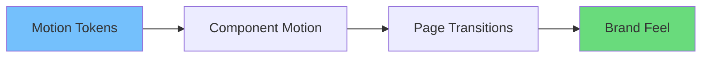

# How to Make Your Website Stand Out with Vibe Coding

Website standout korar jonno shobai color palette, animation, and fancy hero section niye kotha bole. Kintu real difference আসে **how it feels to use**.

In English: the most memorable websites are not just visually attractive—they are responsive, coherent, and emotionally readable.

## 1) Build a strong first impression (without heavy JS)

First impression is about:

- fast loading
- clear hierarchy
- confident motion

Bangla: website slow hole best design o worthless.

Practical:

- optimize hero image
- avoid blocking scripts
- reserve layout space to avoid CLS

## 2) Use micro-interactions as a signature

Micro-interactions are small, repeatable moments:

- button press feedback
- nav hover underline
- card lift
- input focus glow

A micro-interaction checklist:

| Element | Micro-interaction | Purpose |
|--------|-------------------|---------|
| CTA button | press + color shift | confirms click |
| Nav link | underline slide | improves scanning |
| Card | lift + shadow | indicates clickability |
| Input | clear focus ring | accessibility + clarity |

## 3) Make scrolling feel like a story

Standout websites often guide attention through scroll.

Use:

- section transitions
- progressive reveal
- sticky highlights

But keep it subtle.

## 4) Create a consistent motion language

Random animations feel cheap.

Vibe coding approach:

- define durations + easing
- animate only meaningful changes
- keep motion consistent across pages

## 5) Use “delight” where it supports usability

Delight ideas that help users:

- copy-to-clipboard feedback
- saved state confirmation
- gentle empty states

Avoid:

- autoplay animations
- distracting parallax everywhere

## 6) Nail the boring parts: forms, errors, loading

Many sites lose users at forms.

Vibe coding upgrades:

- inline validation
- clear error recovery
- loading skeletons

## 7) Make your website feel personal

Personalization doesn’t need ML.

Simple:

- remember theme
- keep user preferences
- show “recently viewed”

## 8) Performance is the ultimate differentiator

In English: performance is a UX feature.

Checklist:

- image optimization
- reduce bundle size
- avoid layout shift
- keep interactions responsive

## 9) Quick examples you can implement this week

- Add a `LoadingButton`
- Replace spinner with skeleton on landing sections
- Add focus-visible ring to all interactive elements
- Add consistent hover states for cards
- Add subtle page transition

## Conclusion

Standout websites are built with intent.

Vibe coding helps you build that intent into code:

- interaction-first
- motion as communication
- performance + accessibility as default

Result: a website that looks modern—and feels unforgettable.
